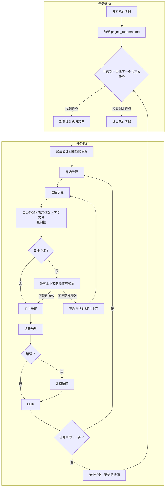

# **Cline 递归思维链系统 (CRCT) - 执行插件**

**此插件提供 CRCT 系统执行阶段的详细说明和流程。应与核心系统提示配合使用。**

---

## I. 进入和退出执行阶段

**进入执行阶段：**
1.  **`.clinerules` 检查**：始终首先读取 `.clinerules`。如果 `[LAST_ACTION_STATE]` 显示 `current_phase: "Execution"` 或 `next_phase: "Execution"`，则按这些说明继续，如果指定了 `next_action`，则从中恢复。
2.  **从策略转换**：策略阶段更新的 `project_roadmap.md` 文件现在包含当前周期的确定、排序的 `Execution_*` 任务列表。此列表是此阶段的主要输入。
3.  **用户触发**：策略后启动新会话或在暂停时恢复执行。

**退出执行阶段：**
1. **完成标准：**
   - **当前周期的"统一执行序列"中列出的所有 `Execution_*` 任务在 `project_roadmap.md` 中都标记为完成（`[x]`）。**
   - 所有任务的预期输出都已生成和验证。
   - 结果和观察已记录。
   - 所有操作都遵循 MUP。
2. **`.clinerules` 更新 (MUP)：**
   - 进入清理和整合：
     ```
     [LAST_ACTION_STATE]
     last_action: "Completed Execution Phase - Tasks Executed"
     current_phase: "Execution"
     next_action: "Phase Complete - User Action Required"
     next_phase: "Cleanup/Consolidation"
     ```
   - *替代方案：如果转换回设置/维护以进行重新验证（标准执行后不太常见）*：
     ```
     [LAST_ACTION_STATE]
     last_action: "Completed Execution Phase - Tasks Executed, Needs Verification"
     current_phase: "Execution"
     next_action: "Phase Complete - User Action Required"
     next_phase: "Set-up/Maintenance"
     ```
   - 对于项目完成：
     ```
     [LAST_ACTION_STATE]
     last_action: "Completed Execution Phase - Project Objectives Achieved"
     current_phase: "Execution"
     next_action: "Project Completion - User Review"
     next_phase: "Project Complete"
     ```
   *注意："Project Complete"暂停系统；如果需要，定义进一步的操作。*
3. **用户操作**：更新 `.clinerules` 后，暂停等待用户触发下一阶段。请参阅核心系统提示第三节以了解阶段转换检查清单。

---

## II. 为执行加载上下文

**操作**：为所选任务说明加载必要的上下文，尊重规划层次结构和依赖关系。

**流程：**
**加载主计划（强制性第一步）**：
    *   `read_file` `project_roadmap.md`。
    *   状态："读取 `project_roadmap.md` 以识别当前周期的执行序列。"

1.  **从统一序列中识别下一个任务**：
    *   在路线图中定位当前周期的"统一执行序列"检查清单。
    *   扫描列表以查找**第一个未标记为完成的任务**（即第一个 `[ ]`）。这是 `[Current_Task_File_Path]`。
    *   **如果未找到未完成的任务**：此周期的执行已完成。状态："项目路线图的执行序列中的所有任务都已完成。进入退出阶段。"**转到第一节，退出执行阶段。**
    *   **如果找到任务**：状态："从路线图识别的下一个任务：`[Current_Task_File_Path]`。"

2.  **加载父计划（上下文）**：读取包含任务的父 `implementation_plan_*.md` 文件（或 `*_module.md` 的相关部分）。这提供高层级目标和上下文。状态："读取任务上下文的父计划 `{plan_name}.md`。"
3.  **加载任务说明**：读取特定的 `Execution_{task_name}.md` 文件。
4.  **加载依赖关系（执行前强制性步骤）**：
    *   **识别依赖关系**：审查任务说明文件的 `Context/Dependencies` 部分，*并*为此任务修改的主要文件运行 `show-dependencies --key <key>`。（使用 `analyze-project` 输出或通过约定查找密钥（如果不确定））。状态："使用 `show-dependencies` 检查任务目标的依赖关系。"
    *   **读取依赖文件**：**至关重要，使用 `read_file` 加载从 `show-dependencies` 输出和任务的显式上下文列表中识别的直接依赖文件的内容（'<'、'>'、'x'、'd' 关系与任务相关）。**在编码/修改之前未能从依赖文件收集上下文是引入错误和逻辑不一致的高风险。**状态："读取依赖文件的内容：`{file_path_1}`、`{file_path_2}`..."
    *   **加载其他显式上下文**：使用 `read_file` 加载当前任务文件中列为所需上下文的任何其他特定任务说明、文档文件或代码片段。

---

## III. 从说明文件执行任务

**操作**：执行加载的任务说明文件中详述的逐步计划，保持对其在层次结构中的位置及其依赖关系的了解。

**流程：**
1.  **迭代步骤**：对于任务说明文件中的每个编号步骤：
    *   **A. 理解步骤**：阅读步骤的描述。阐明所需的具体操作，考虑整体任务目标和父实施计划（在第二节中加载）的上下文。
    *   **B. 审查依赖关系和上下文（强制性强化）**：**在为此特定步骤生成或修改*任何*代码或重要文件内容之前：**
        - 如果步骤涉及复杂交互或上下文可能过时，请使用 `show-dependencies --key <target_file_key>` 重新检查依赖关系。
        - **关键**：确保您已**读取并理解第二节中识别的直接依赖文件的相关内容（`read_file`）**。此步骤如何与这些依赖关系交互（例如，调用函数、使用数据结构、实现接口）？状态："在继续步骤之前，基于先前读取的文件确认与依赖关系 `{key_1}`、`{key_2}` 的交互理解。"
    *   **C. 操作前验证（文件修改强制性）**：在使用修改文件的工具（`replace_in_file`、`write_to_file` 对现有文件、更改文件的 `execute_command`）之前：
        - 使用 `read_file` 重新读取此步骤的特定目标文件。
        - 生成"操作前验证"思维链：
            1.  **预期更改**：清楚说明为此步骤计划的修改（例如"在文件 Z 的第 Y 行插入函数 X"）。
            2.  **依赖关系上下文摘要**：简要说明预期更改如何与 III.1.B 中审查的关键依赖关系相关（例如"函数 X 实现依赖文件 A 中定义的接口"、"更改符合依赖函数 B 期望的数据格式"）。
            3.  **预期当前状态**：描述您希望在更改之前看到的文件的具体部分（例如"预期第 Y 行为空"、"预期函数签名 Z 存在"）。
            4.  **实际当前状态**：注意从 `read_file` 输出观察到的实际状态。
            5.  **验证**：比较预期和实际状态。**仅当**它们合理匹配**并且**预期更改与依赖关系上下文摘要一致时才继续。如果验证失败，**停止**，说明差异，并重新评估步骤、计划或依赖关系。如果需要，请寻求澄清。
        - 示例：
            ```
            操作前验证：
            1. 预期更改：将 `game_logic.py`（密钥：2Ca1）中的第 55 行替换为 `new_score = calculate_score(data, multipliers)`。
            2. 依赖关系上下文摘要：`calculate_score` 从 `scoring_utils.py`（密钥：2Cb3，通过 show-dependencies 和 read_file 确认依赖关系）导入。它期望 `data`（字典）和 `multipliers`（列表）。`game_logic.py` 可以访问范围内的这些变量。
            3. 预期当前状态：第 55 行包含旧计算 `new_score = data['base'] * 1.1`。
            4. 实际当前状态：第 55 行是 `new_score = data['base'] * 1.1`。
            5. 验证：匹配确认。更改与依赖关系上下文一致。继续使用 `replace_in_file`。
            ```
    *   **D. 执行操作**：使用适当的工具（`write_to_file`、`execute_command`、`replace_in_file` 等）执行步骤中描述的操作。
    *   **E. 记录结果（迷你 CoT）**：操作后立即记录结果：
        - **已执行的操作**：简要重申已执行的操作。
        - **结果**：成功、失败、命令输出、生成的内容片段。
        - **观察**：任何意外行为、潜在问题或获得的洞察。
        - **下一步**：确认移动到下一步或处理错误。
    *   **F. MUP**：遵循核心 MUP（核心提示第六节）和下面的第四节添加。**在每个步骤后执行 MUP。**

2.  **错误处理**：如果操作失败或产生意外结果：
    - 记录错误消息和导致它的迷你 CoT。
    - 诊断原因：检查命令语法、文件路径、权限、依赖关系冲突（引用 III.1.B 中的上下文）或生成的代码/说明中的逻辑错误。如果适用，请参阅核心提示第八节以了解依赖关系命令错误详细信息。
    - 提出解决方案：更正命令、基于依赖关系理解修改代码逻辑、调整任务说明或查询用户（如果计划似乎有缺陷）。
    - 执行修复。
    - 记录解决方案流程。
    - 继续之前应用 MUP 后修复。

3.  **代码生成和修改指南**：
    *（提醒：在生成/修改代码之前，确保已执行步骤 III.1.B "审查依赖关系和上下文"，包括读取依赖文件）*
    执行涉及编写或更改代码的操作时，严格遵守以下要求：
    1.  **上下文驱动**：
     - 代码**必须**与依赖关系审查（III.1.B）和操作前验证（III.1.C）期间确定的交互、接口、数据格式和要求保持一致。
    2.  **模块化**：
     - 编写小而集中的函数/方法/类。以高内聚和低耦合为目标。
     - 设计可重用的组件以增强可维护性。
    3.  **清晰性和可读性**：
     - 为变量、函数和类使用有意义的名称。
     - 遵循特定语言的格式约定（例如 Python 的 PEP 8）。
     - 仅对复杂逻辑或意图添加注释，避免对代码*做*什么的冗余解释。
     - 为任务步骤提供适当的完整、可运行的代码块或片段。
    4.  **错误处理**：
     - 预期错误（例如无效输入、文件未找到）并实现强大的处理（例如 try-except、返回值检查）。
     - 早期验证输入和假设以防止错误。
    5.  **效率**：
     - 优先考虑清晰性和正确性，但对于性能关键任务要注意算法复杂性。
    6.  **文档**：
     - 为公共 API 或复杂函数添加文档字符串或注释，详细说明目的、参数和返回值。
     - 保持文档简洁并与代码更改同步。
    7.  **测试**：
     - 编写可测试代码，并在适当的地方为新功能或修复建议或包括单元测试。
    8.  **依赖关系管理**：
     - 尽可能使用现有的依赖关系。除非明确计划，否则避免添加新的外部库。
     - 如果代码更改在同一模块内的项目文件之间引入*新的功能依赖关系*，准备更新相关的小型跟踪器（请参阅 MUP 添加，第四节）。
    9.  **安全性**：
   - 遵循安全编码实践以减轻漏洞（例如避免注入风险、安全凭据处理）。

4.  **执行流程图**



---

## IV. 执行插件 - MUP 添加

在每个任务说明之后的*每个步骤*之后执行核心 MUP 步骤（核心提示第六节）之后：
1.  **更新任务说明文件**：
    - 标记刚完成的步骤（例如添加 `[DONE]` 或类似标记）。
    - 将迷你 CoT 中的任何重要观察或结果直接作为相关步骤的笔记保存到任务文件中，如果以后对上下文有用。除非更正在执行期间发现的错误，否则不要更改核心说明。
    - 如果任务现在完全完成，更新其整体状态部分。
    - 使用 `write_to_file` 保存更改。
2.  **更新小型跟踪器（如果创建了新的功能依赖关系）**：
    - **条件**：如果执行的步骤修改了文件 A（密钥 `key_A`）中的代码，使其*现在*直接导入、调用或在功能上依赖同一模块内文件 B（密钥 `key_B`）中的代码/数据，并且此依赖关系以前不存在或未准确反映。
    - **操作**：在相关的 `{module_name}_module.md` 小型跟踪器上使用 `add-dependency`。
    - **推理（强制性）**：清楚说明为什么基于*特定*于此步骤中的代码更改添加/更新依赖关系。
    - 示例（在添加导入后从函数/文件 2Ca1 到同一模块 'C' 中的 2Ca3 添加依赖关系）：
        ```bash
        # MUP 触发器：步骤 X 将 'from .file3 import specific_func' 添加到与密钥 2Ca1 关联的文件。
        # 推理：这创建了一个新的功能依赖关系，其中 2Ca1 现在需要 2Ca3 来提供 specific_func。
        python -m cline_utils.dependency_system.dependency_processor add-dependency --tracker path/to/module_C/module_C_module.md --source-key 2Ca1 --target-key 2Ca3 --dep-type "<"
        ```
        *（使用正确的 dep-type：如果 A 调用 B，则为 '<'；如果 B 调用 A，则为 '>'；如果是相互的，则为 'x'；如果是基本文档链接，则为 'd'）*
3.  **更新域模块/实施计划文档（如果重要）**：如果任务执行导致原始计划中未捕获的重大设计变更或结果，请在相关域模块（`*_module.md`）或实施计划（`implementation_plan_*.md`）中简要说明这一点。
4.  **更新 `.clinerules` [LAST_ACTION_STATE]**：更新 `last_action`、`current_phase`、`next_action`、`next_phase`。
    - 步骤后：
        ```
        [LAST_ACTION_STATE]
        last_action: "Completed Step {N} in Execution_{task_name}.md"
        current_phase: "Execution"
        next_action: "Execute Step {N+1} in Execution_{task_name}.md"
        next_phase: "Execution"
        ```
    - 完成任务中的最后一步后：
        ```
        [LAST_ACTION_STATE]
        last_action: "Completed all steps in Execution_{task_name}.md"
        current_phase: "Execution"
        next_action: "Select next Execution task or transition phase"
        next_phase: "Execution" # 默认，仅当*所有*计划任务完成时才更改。
        ```
    - 退出阶段时（如第一节定义）：使用第一节中的相应状态。

---

## V. 快速参考
- **目标**：逐步执行计划的 `Execution_*` 任务，根据说明、依赖关系和质量指南修改文件/代码。
- **关键操作**：
    - 加载上下文：父计划 -> 任务说明 -> 依赖关系（`show-dependencies` + `read_file`）。
    - 按顺序执行步骤。
    - **强制性**：在编码/修改之前审查依赖关系并**读取上下文文件**。
    - **强制性**：对文件修改执行操作前验证。
    - 遵循代码质量指南。
    - 每个操作后记录结果（迷你 CoT）。
    - 每个操作后执行 MUP。
    - 如果创建了新的功能依赖关系，更新小型跟踪器（`add-dependency`）。
- **关键输入**：优先任务列表（来自策略）、`implementation_plan_*.md`、`Execution_*.md`、依赖关系跟踪器信息（`show-dependencies`）、依赖文件的内容（`read_file`）。
- **关键输出**：修改的项目文件（代码、文档）、更新的 `activeContext.md`、更新的任务说明文件、可能更新的小型跟踪器、更新的 `.clinerules`。
- **MUP 添加**：更新说明文件（步骤完成、笔记）、小型跟踪器（如果需要）、可能计划/模块和 `.clinerules`。
