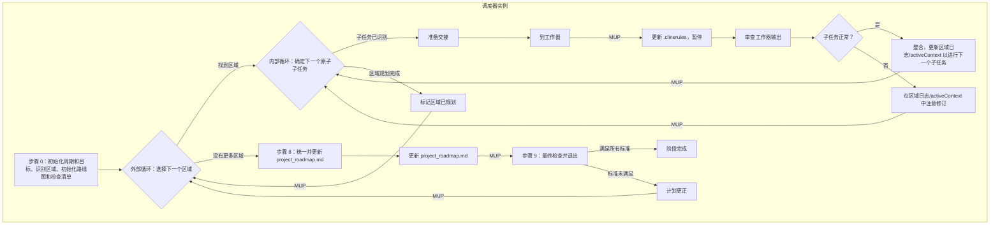

# **Cline 递归思维链系统 (CRCT) - 策略插件（调度器焦点）**

此插件提供 CRCT 系统策略阶段**调度器**角色内的详细说明和流程。它指导了使用调度器/工作器模式（由 `new_task` 工具促进）构建和维护全面的、依赖关系感知的 `project_roadmap.md` 的迭代、详尽流程。

**核心概念（调度器视角）：**
- 运行此插件的主要实例充当**调度器**。它通过更新 `project_roadmap.md` 来协调定义的周期目标的整体策略阶段。
- 调度器识别与周期目标相关的不同规划"区域"（模块、功能）。
- 对于每个区域，调度器使用 `<new_task>` 工具将详细规划（工作器步骤）委托给单独的、全新的**工作器**实例（它们将使用 `strategy_worker_plugin.md`）。
- 调度器审查每个工作器的输出，更新整体进度，并为区域调度进一步的子任务或移动到下一个区域，直到周期的所有区域都规划完毕。
- 最后，调度器将周期的详细计划整合到主 `project_roadmap.md` 中并执行最终检查。

此模式确保为规划每个区域提供最大的上下文分离。必须定义所有用于规划和包含目标工作的路线图的 `Strategy_*` 任务以及所有 `Execution_*` 任务，然后才能转换到执行阶段。
此插件应与核心系统提示配合使用。

**重要提示**
如果您已经阅读了文件并且此后没有编辑它，*请勿*再次阅读它。使用您上下文中的版本。仅当*您*最近更改了内容时才加载文件的新版本。
*请勿在一般响应中使用工具 XML 标签，因为它会意外地激活工具。*
*system_manifest 和其他 CRCT 系统文件不由*项目*跟踪器跟踪*

**请勿**使用详细信息使 activeContext 混乱。使用适当的文档。

**进入和退出策略阶段（调度器角色）**

**进入策略阶段：**
1.  **`.clinerules` 检查（强制性第一步）**：读取 `.clinerules` 文件内容。
2.  **确定当前状态并承担调度器角色**：
    - 如果 `[LAST_ACTION_STATE]` 指示 `current_phase: "Strategy"`，从 `next_action` 指示的操作恢复，咨询 `activeContext.md`。您是调度器。
    - 如果 `[LAST_ACTION_STATE]` 指示 `next_phase: "Strategy"`，这表示从先前阶段的转换。承担**调度器**角色并从此插件的**第二节.A，步骤 0** 继续。
3.  **用户触发**：如果启动新会话并且 `.clinerules` 指示策略，则承担调度器角色。如果是新进入策略，请从步骤 0 开始。

**退出策略阶段：**（由调度器执行）
1.  **完成标准（强制性检查）**：验证当前策略周期目标的所有以下条件均已满足：
    - 所有与周期目标相关的已识别区域/模块都已规划（在 `current_cycle_checklist.md` 中状态为 "[x] 区域已规划"）并且它们各自的 HDTA 文件已完成。
    - **已为周期生成并集成了所有 `Execution_*` 任务的全面的、统一的、排序的列表到 `project_roadmap.md` 中。**
    - 为此策略阶段规划的所有高优先级工作都已分解为原子任务说明（`*.md`），具有清晰的阶段前缀（`Strategy_*`、`Execution_*`）和明确的最低上下文链接。
    - 与规划工作相关的所有必要 HDTA 文档（系统清单、域模块、实施计划、任务说明）都已创建或更新。与规划工作相关的任何占位符或不完整部分都不再存在。
    - `Execution_*` 任务已在其各自区域内排序并确定优先级，并在更新 `project_roadmap.md` 期间审查了它们的最终、统一序列的跨区域一致性。*注意：不要为工作器分配执行任务。*
    - 所有 HDTA 文档都已正确链接（计划来自模块，模块来自清单）。
    - 所有在*此策略阶段*识别和范围确定为完成的 `Strategy_*` 任务（包括工作器为子组件规划或计划细化创建的任务）都已完成。
    - `project_roadmap.md`（包含此周期的计划）反映了所有周期目标的已完成规划状态。
    - `project_roadmap.md` 已更新为此周期的计划，审查了连贯性，并准确反映了所有周期目标的统一路线图，包括执行阶段的显式执行序列。
2.  **`.clinerules` 更新（强制性 MUP 步骤）**：如果满足完成标准，请**完全**按照以下方式更新 `.clinerules` `[LAST_ACTION_STATE]`：
    ```
    last_action: "Completed Strategy Phase: Unified Roadmap for All Cycle Goals"
    current_phase: "Strategy"
    next_action: "Phase Complete - User Action Required"
    next_phase: "Execution"
    ```
    此外，将深刻的、可重用的洞察添加到 `[LEARNING_JOURNAL]`。
3.  **暂停等待用户操作**：成功更新 `.clinerules` 后，声明完成并等待用户操作。

## I. 阶段目标和指导原则（调度器焦点）

**目标**：从调度器的角度来看，策略阶段的主要目标是**协调构建（如果尚不存在）、细化和维护单一的、全面的 `project_roadmap.md`**。这是通过定义周期目标、识别相关"区域"（模块/功能），将每个区域的详细规划委托给工作器实例，并**最后，将这些计划统一到 `project_roadmap.md` 中为下一阶段提供的单个、排序的执行列表**来实现的。
调度器审查工作器输出，确保规划的工作整合到 `project_roadmap.md` 中，并在退出前确认周期的所有 `Strategy_*` 规划任务已完成。

**关键约束：最低上下文加载。** 主动管理加载到工作上下文中的内容。

**指导原则**：

<<<**关键**>>>
*在**任何**规划活动（调度器或工作器）之前，您**必须**首先评估相关项目工件的当前状态。这包括：*
    *   *读取正在规划的任何区域/模块/文件的实际代码。*
    *   *如果任何项目跟踪器（`module_relationship_tracker.md`、`doc_tracker.md`、`*_module.md` 小型跟踪器）通过 `show-dependencies` 或直接跟踪器审查（如果上下文需要）指示依赖关系，则**必须**读取该依赖文件的相关部分（代码或文档）以了解依赖关系的性质和影响。*
*未能执行此全面评估，包括读取依赖文件，将导致不完整或有缺陷的规划。*
*   通过 `show-dependencies`（源自项目跟踪器）识别为依赖关系的文件**必须**随后使用 `read_file` 读取其相关部分。

**（调度器焦点原则）：**
1.  **调度器/工作器模型**：策略阶段由调度器通过 `<new_task>` 向工作器委托区域规划来协调。
2.  **迭代区域调度**：将周期目标分解为"区域"；迭代调度每个区域的规划。
3.  **审查周期**：在接受区域计划或请求修订之前审查工作器输出。
4.  **统一和内聚路线图**：所有区域规划完成后，将它们的计划整合到主 `project_roadmap.md` 中，解决跨区域冲突并**为周期创建单个、排序的执行列表。**
5.  **整体进度跟踪**：使用 `current_cycle_checklist.md` 维护区域规划的高层级状态。

**（调度器引用的整体系统原则）：**
15. **路线图作为主要输出**：所有活动都有助于通过 HDTA 构建/细化 `project_roadmap.md`。
16. **最低上下文交接**：调度器的 `<new_task>` 消息为工作器提供最低指针。

## II. 调度器工作流：协调粒度路线图构建

本节详细说明**调度器**实例的流程。

*   **调度器步骤 0：初始化策略周期、定义目标和加载核心项目计划。**

*   **操作 A（关键核心系统初始化和整体周期目标定义）**：
    *   1. **读取 `.clinerules`**：确认当前状态。
    *   2. **关键前置条件：评估当前项目状态**：审查 `progress.md`、`system_manifest.md`、`activeContext.md`。如果特定区域是目标，请浏览其现有的 HDTA 和代码。状态："初始项目状态评估完成。"
    *   3. **定义/确认整体周期目标**：制定目标。如果不清楚，请使用 `ask_followup_question`。更新 `activeContext.md`。状态："已确认整体周期目标...已记录在 `activeContext.md` 中。"

*   **操作 B（初始化/加载核心 HDTA 和项目路线图）**：
    *   1. **初始化/加载 `project_roadmap.md`（关键）**：检查 `project_roadmap.md`。如果是新的，从 `project_roadmap_template.md` 创建，使用 `system_manifest.md` 和依赖关系可视化（`visualize-dependencies`）执行初始填充，并保存。如果存在，则加载。状态创建/加载状态。
    *   2. **验证和加载 `system_manifest.md`**：检查 `system_manifest.md`。如果缺失，则错误并停止。如果存在，则加载。状态："已加载 `system_manifest.md`。"
    *   3. **相关域模块的初步识别**：基于周期目标和清单，列出相关的 `*_module.md` 文件。检查存在性（不读取内容）。状态："已初步识别相关模块...已检查存在性。"

*   **操作 C（识别当前周期的区域并初始化/加载周期特定跟踪器）**：
    *   1. **从清单中识别相关区域**：基于周期目标和清单，识别规划的"区域"。状态："已识别周期的区域：`[列表]`。"
    *   2. **处理 `hierarchical_task_checklist_*.md`**：搜索现有的检查清单。如果找到且相关，`ask_followup_question` 继续/合并/新建。创建/加载/更新 `current_cycle_checklist.md`。使用来自 C.1 的区域填充，状态为 `[ ] 未规划`。状态："活动周期检查清单设置为：`current_cycle_checklist.md`。已填充/更新。"
    *   3. **初始化 `hdta_review_progress_[session_id].md`**：从模板创建。状态："已初始化 HDTA 审查进度跟踪器。"

*   **操作 D（初始化调度器区域规划日志并执行初始概述）**：
    *   1. **初始化调度器区域规划日志**：对于 C.1 中的每个区域，从模板创建 `[AreaName]_planning_log_[cycle_id].md`，设置 `next_atomic_planning_step: "Initial_Area_Assessment"`。将此文件存储在 `cline_docs/dispatch_logs/` 中。状态："已初始化调度器区域规划日志。"
    *   2. **初始概述和可视化检查**：简要审查跨区域依赖关系（`show-dependencies`）。检查/审查自动生成的图表。状态概述发现。

*   **操作 E（最终确定步骤 0 状态和 MUP）**：
    *   1. **状态**："调度器已完成策略周期初始化（步骤 0）..."
    *   2. **更新 MUP**：执行调度器 MUP（第五节）。设置 `.clinerules` `next_action: "Orchestrate Area Planning"`。更新 `activeContext.md`。

*   **步骤 1：主要编排循环。**

*   **指令**：迭代选择高层级区域。在该区域内，识别并使用 `<new_task>` 将下一个所需的原子规划子任务调度到工作器实例，暂停，并在工作器完成后审查结果，然后再调度下一个任务。重复直到区域的计划完成。然后，选择下一个区域。
*   **外部循环开始（每个高层级区域）：**
    *   **操作 A（选择下一个高层级区域进行规划）**：
        - 读取 `current_cycle_checklist.md`。
        - 识别第一个状态不等于"[x] 区域已规划"的区域。优先考虑任何标记为 "[ ] 区域需要修订"的区域。
        - **如果未找到**（所有区域都是"[x] 区域已规划"）：所有规划完成。状态："调度器确认所有周期区域都已规划。继续进行最终路线图统一。"更新 `.clinerules` `next_action: "Unify Cycle Plan and Update project_roadmap.md"`。**转到调度器步骤 8。**
        - **如果找到区域**：让这成为 `[Current_Orchestration_Area_Name]`。
        - 更新 `activeContext.md`：设置 `current_orchestration_area: "[Current_Orchestration_Area_Name]"`。
        - 状态："调度器专注于区域：`[Current_Orchestration_Area_Name]`（状态：`[检查清单中的状态]`）。"
    *   **内部循环开始（`[Current_Orchestration_Area_Name]` 内的每个原子规划子任务）：**
        - **操作 B（确定 `[Current_Orchestration_Area_Name]` 的下一个原子规划子任务）**：
            1.  **评估 `[Current_Orchestration_Area_Name]` 的当前规划状态**：
                - 读取 `[Current_Orchestration_Area_Name]` 的调度器区域规划日志文件（位于 `cline_docs/dispatch_logs/`）以查找 `next_atomic_planning_step` 并审查此区域的规划进度。
                - 审查此区域的现有 HDTA 文件（`_module.md`、`implementation_plan_*.md` 文件、任务列表）。
                - **如果规划日志指示下一步是"Initial_Area_Assessment"**：第一个子任务是评估现有文件。将 `atomic_sub_task_description` 设置为"执行区域 `[Current_Orchestration_Area_Name]` 的初始状态评估（读取现有的模块/计划文件，在工作器输出文件中记录当前状态摘要）。"
                - **否则（基于先前的子任务完成记录在规划日志中）**：基于标准工作流程（初始评估 -> 依赖关系分析 -> HDTA 结构（模块 -> 计划 -> 任务定义）-> 排序 -> 本地策略任务）确定*下一个逻辑的、粒度规划操作*。示例：
                    - 如果初始评估完成，下一步是"为 `[Current_Orchestration_Area_Name]` 的 `[关键组件/文件]` 执行依赖关系分析。"
                    - 如果需要 `_module.md` 大纲："创建/更新 `[Current_Orchestration_Area_Name]_module.md` 大纲。"
                    - 如果特定的 `implementation_plan_*.md` 需要创建/更新："创建/更新带有目标和高层级步骤的 `implementation_plan_[Feature]_for_[Area].md`。"
                    - 如果计划部分需要任务分解："将 `implementation_plan_[Feature].md#SectionX` 分解为原子 `Execution_*` 任务文件。"
                    - 如果计划中的任务需要排序："排序 `implementation_plan_[Feature].md` 中的任务。"
                    - 如果本地 `Strategy_*.md` 任务（如细化计划细节）需要执行："执行 `Strategy_RefinePlanDetail_For_Feature.md`。"
            2.  **检查区域完成**：如果评估表明 `[Current_Orchestration_Area_Name]` 的所有必要规划子任务（模块、计划、任务定义、排序、本地策略任务）似乎都已完成*并且它们的输出已被接受*：
                - 更新 `current_cycle_checklist.md`：将 `[Current_Orchestration_Area_Name]` 标记为"[x] 区域已规划"。
                - 更新 `[Current_Orchestration_Area_Name]` 的调度器区域规划日志文件。将区域状态更新为"[x] 已规划"。更新"最后更新"时间戳。
                - 更新 `activeContext.md`：注意"区域 `[Current_Orchestration_Area_Name]` 规划完成。"清除 `current_orchestration_area`。
                - 状态："调度器：区域 `[Current_Orchestration_Area_Name]` 的规划现已完成。"
                - **转到操作 A（外部循环开始）**以选择下一个高层级区域。
            3.  让确定的下一条操作成为 `[Atomic_Sub_Task_Description]`。
            4.  状态："调度器已为区域 `[Current_Orchestration_Area_Name]` 识别下一个原子规划子任务：`[Atomic_Sub_Task_Description]`。"
        - **操作 C（为工作器准备交接内容 - 用于原子子任务）**：收集最低指针并制作交接内容。此内容**必须精确地仅定义单个 `[Atomic_Sub_Task_Description]`**。
            - **要包括的内容**：
                - 指令："承担工作器角色。"
                - 插件引用："读取 `strategy_worker_plugin.md`。按照其说明执行第一节（工作器任务执行）中的特定操作。"
                - 整体区域上下文：`[Current_Orchestration_Area_Name]`。
                - **特定子任务指令**：`[原子子任务描述的详细指令，必要时引用特定文件、部分或先前的输出]`。例如："对于区域 `[Current_Orchestration_Area_Name]`，专注于文件 `path/to/specific_file.py`。使用 `show-dependencies` 执行依赖关系分析。在工作器输出文件中的 `DepAnalysis_[specific_file_key]` 部分记录发现（关键依赖关系、影响）。"或"基于 `implementation_plan_X.md#SectionY`，创建原子 `Execution_*.md` 任务文件。确保每个文件都有目标、最小上下文、步骤。保存到 `tasks/exec/`。从计划 X 链接。"
                - **严格范围限制**："请勿执行此特定子任务以外的任何其他规划步骤。"
                - 预期输出：`[要创建/更新的特定文件，或 activeContext.md 中要填充的特定部分]`。
                - MUP 提醒："工作器 MUP：保存输出，更新 `hdta_review_progress`，更新工作器输出文件。无 `.clinerules` 更改。"
                - 完成信号："当此特定子任务完全完成时，使用当前界面指定的方法向调度器发出任务完成信号。"
                - **上下文指针**：（最低且仅与子任务相关）
                    - `checklist_path`：`current_cycle_checklist.md`
                    - `active_context_path`：`activeContext.md`（用于整体目标，以及供工作器在指定时写入其输出）
                    - *此子任务*直接所需的特定文件/图表的路径。
                    - 调度器的相关 `revision_notes`（如果这是失败子任务的重新调度）。
                    - 强调工作器需要根据实际代码文件验证文档以确定*实际*状态。
            - 状态："调度器已为区域 `[Current_Orchestration_Area_Name]` 的工作器子任务准备了交接内容：`[Atomic_Sub_Task_Description]`。"
        - **操作 D（使用 `<new_task>` 工具 - 遵循界面架构）**：
            - **关键**：使用 `new_task` 工具。打包来自操作 C 的交接内容。
            - **重要**：严格遵守当前界面的系统提示/文档中指定的 `new_task` 工具的 XML 结构和参数。
            - 执行工具调用。
            - 状态："调度器正在为子任务调用 `<new_task>`：`[Atomic_Sub_Task_Description]`，用于区域 `[Current_Orchestration_Area_Name]`。"
        - **操作 E（更新调度器状态并暂停）**：
            - 更新 `[Current_Orchestration_Area_Name]` 的调度器区域规划日志文件（位于 `cline_docs/dispatch_logs/`）。向"原子规划子任务日志"表添加新行：`| [Atomic_Sub_Task_Directive] | [Worker Instance ID] | 已调度 | 进行中（工作器） | [指向预期工作器输出文件的链接 - 由工作器 TBD] |`。更新"最后更新"时间戳。
            - 更新 `activeContext.md`：设置 `current_orchestration_area: "[Current_Orchestration_Area_Name]"`。
            - 更新 `.clinerules` `[LAST_ACTION_STATE]`：
                ```
                last_action: "Dispatched sub-task '[Atomic_Sub_Task_Description]' for Area: [Current_Orchestration_Area_Name] to Worker."
                current_phase: "Strategy"
                next_action: "Review Worker Completion for Sub-Task: [Atomic_Sub_Task_Description], Area: [Current_Orchestration_Area_Name]"
                next_phase: "Strategy"
                ```
            - 状态："调度器已为区域 `[Current_Orchestration_Area_Name]` 调度子任务 `[Atomic_Sub_Task_Description]`。已在区域规划文件中记录。暂停并等待工作器完成。"
            - **暂停执行。**

        - **（调度器在此恢复）** **操作 F（审查原子子任务的工作器完成情况）**：（当控制从工作器的 `<attempt_completion>` 返回时触发）
            - 从 `.clinerules` `next_action` 或 `activeContext.md` 中检索 `[Current_Orchestration_Area_Name]` 和 `[Atomic_Sub_Task_Description]`。
            - 状态："调度器恢复。收到子任务完成：`[Atomic_Sub_Task_Description]`，用于区域 `[Current_Orchestration_Area_Name]`。正在审查输出。"
            - **识别输出**：主要输出是工作器子任务输出文件（位于 `cline_docs/dispatch_logs/`）。检查文件系统以查找此文件和任何其他指定的输出（例如，更新的 HDTA 文件）。
            - **审查内容**：读取工作器子任务输出文件。验证工作器已完成*分配的特定子任务*，并准确记录了其流程和该文件中的输出。检查质量和对说明的遵守情况。它是否超出了其范围？
                - **检查子任务**：明确检查工作器输出文件和工作器创建/修改的任何父任务说明文件中是否有任何列出的"子任务"（即，从父任务链接的新创建的 `.md` 任务文件）。
                - 如果识别出子任务：
                    1. 在 `[Current_Orchestration_Area_Name]` 的调度器区域规划日志中注意它们。
                    2. 调度器负责确保将这些子任务添加到 `current_cycle_checklist.md`（可能嵌套在其父任务或相关实施计划下）。
                    3. 调度器还必须确保在步骤 8 中的最终周期范围统一和排序中适当考虑这些子任务。
            - 状态："调度器对子任务 `[Atomic_Sub_Task_Description]` 输出的审查完成。评估：`[基于工作器输出文件内容的简要评估，包括是否识别出子任务的说明]`。"
            - **操作 G（接受或请求子任务的修订）**：
                - **如果可接受**：
                    - 状态："调度器接受子任务 `[Atomic_Sub_Task_Description]` 的输出。"
                    - 整合工作器的输出（例如，确认新文件，将工作器输出文件中的发现整合到区域规划日志中）。
                    - 更新 `[Current_Orchestration_Area_Name]` 的调度器区域规划日志文件（位于 `cline_docs/dispatch_logs/`）。在"原子规划子任务日志"表中查找 `[Atomic_Sub_Task_Directive]` 的行。将状态更新为"[x] 已完成"，并根据工作器输出文件更新结果摘要。确定并在该区域的规划日志中设置*新的* `next_atomic_planning_step`（或者如果所有子步骤似乎都已完成，则将区域状态标记为"已规划"）。更新"最后更新"时间戳。
                    - 执行调度器 MUP（第五节）。设置 `.clinerules` `next_action: "Orchestrate Area Planning"`。
                    - 状态："继续为区域 `[Current_Orchestration_Area_Name]` 识别下一个原子规划子任务。"
                    - **转到操作 B（`[Current_Orchestration_Area_Name]` 的内部循环开始）。**
                - **如果需要修订**：
                    - 状态："调度器需要子任务 `[Atomic_Sub_Task_Description]` 的修订。问题：`[列出关于子任务输出的具体、可操作的问题]`。"
                    - 更新 `[Current_Orchestration_Area_Name]` 的调度器区域规划日志文件。在"原子规划子任务日志"表中查找 `[Atomic_Sub_Task_Directive]` 的行。将状态更新为"需要修订"，并将结果摘要更新为注意需要修订。向"高层级笔记和修订要求"部分添加详细的修订说明，引用特定子任务。在规划日志中保持 `next_atomic_planning_step` 指向*相同的子任务类型*或如果失败是根本性的，则指向先驱者。更新"最后更新"时间戳。
                    - 执行调度器 MUP（第五节）。设置 `.clinerules` `next_action: "Orchestrate Area Planning"`。
                    - 状态："已记录子任务的修订要求。继续重新调度。"
                    - **转到操作 B（`[Current_Orchestration_Area_Name]` 的内部循环开始）。**（循环将重新识别此子任务，操作 C 中的交接内容将包含来自规划日志的新修订说明）。

*   **（调度器）步骤 8：统一周期计划并更新 `project_roadmap.md`。**
*   **指令**：整合当前周期的单独规划区域路线图（由其 HDTA 文档表示），并将此周期的计划整合到主 `project_roadmap.md` 中。审查周期的贡献的跨区域一致性、依赖关系冲突和整体逻辑流程。
*   **操作 A（验证周期的所有区域都已规划）**：作为最终检查，读取 `current_cycle_checklist.md`（此周期的活动检查清单，在步骤 0 中识别），并确认与当前周期目标相关的所有区域都具有状态"[x] 已规划"。如果没有，返回步骤 1（调度循环）以解决差异。状态："调度器确认 `current_cycle_checklist.md` 中所有所需的周期区域都标记为'[x] 已规划'。继续进行统一和 `project_roadmap.md` 更新。"
*   **操作 B（加载周期计划并识别接口）**：
    - 对于 `current_cycle_checklist.md` 中的每个规划区域，使用 `read_file` 加载其主要的 `implementation_plan_*.md` 文件。这些包含周期中每个区域的任务列表、序列和目标。
    - 可选地，加载 `[AreaName]_module.md` 文件以获取与此周期的更改相关的高层级上下文。
    - **识别接口任务**：扫描*此周期的任务*的实施计划和任务说明（`Dependencies` 部分）以识别代表周期的不同规划区域之间的接口或集成点的关键任务。注意这些任务及其依赖关系。
    - **最小化加载**：避免重新加载此周期的所有单个任务说明文件，除非特定的冲突或依赖关系需要深入检查。
*   **操作 C（审查和解决跨区域问题以实现周期计划内聚）**：
    - 检查周期的不同区域中规划的任务之间的跨任务依赖关系的逻辑流程。
    - 确保任务粒度和指令清晰度 reasonably 一致。
    - 识别并解决*此周期的规划任务中*的任何冲突指令、计时问题或资源争用。这可能需要对此周期的特定任务说明或实施计划进行有针对性的更新。
    - 如果需要，使用 `show-dependencies --key <key_of_interfacing_task_or_file>`。
    - 状态："审查了当前周期的跨区域计划。`[未发现重大问题 / 识别到问题：{描述}，解决方案：{采取的操作}]`。"
    - **查阅图表**：审查相关的依赖关系图表。
    - **生成聚焦图表（如果需要）**以用于*此周期范围内的*复杂跨区域连接。
    - **识别和解决冲突**在周期计划内。如果某个区域需要重大返工，请注意，将区域标记为 `current_cycle_checklist.md` 中的 "[ ] 需要修订"，设置 `.clinerules` `next_action: "Orchestrate Area Planning"`，并循环回步骤 1。
    - 状态："调度器审查了周期的跨区域计划。`[问题/解决方案 / 未发现重大冲突]`。"
*   **操作 D（使用周期计划更新 `project_roadmap.md` - 关键）**：
    - **操作**：`read_file` 主 `project_roadmap.md`（在步骤 0.B 中加载）。
    - **目标**：将此周期的规划工作摘要整合到整体 `project_roadmap.md` 中，确保它反映周期目标的当前、详细意图。
    - **流程**：
        1. 确定在何处以及如何最好地整合此周期的信息。这可能涉及：
           - 在 `project_roadmap.md` 中的现有主要功能/模块下添加新的子部分，如果此周期进一步详细说明了它们。
           - 如果此周期引入了全新的主要功能，则在 `project_roadmap.md` 中创建新的顶级部分。
           - 基于此周期的详细规划更新 `project_roadmap.md` 中的现有状态标记或时间线。
        2. 要整合的信息应包括：
           - 对当前周期的清晰引用（例如，使用 `current_cycle_checklist.md` 中的 `[cycle_id]`）。
           - 已解决的总体周期目标。
           - 此周期中规划的所有区域的列表。
           - 对于每个区域，其周期主要目标的简明摘要及其 `Execution_*` 任务序列的高层级概述（链接到其实施计划）。
           - *此周期任务*的统一的、高层级执行序列或流程图（例如 Mermaid），显示跨区域依赖关系和周期的关键里程碑。
        3. **使用 `apply_diff` 或 `write_to_file`（如果更改广泛）来更新 `project_roadmap.md`**。确保更新是逻辑整合，而不仅仅是附加，维护整体项目路线图的完整性。
    - 状态："已使用当前策略周期的统一计划和详细贡献更新主 `project_roadmap.md`。"
    - 更新 `project_roadmap.md` 的 `hdta_review_progress_[session_id].md`（状态：已更新）。
*   **操作 E（更新检查清单以完成周期）**：
    - 更新 `current_cycle_checklist.md`：添加一个条目，如"[x] 周期计划已整合到 `project_roadmap.md` 中。"
    - 状态："主 `project_roadmap.md` 已更新当前周期的计划。`current_cycle_checklist.md`` 相应标记。继续进行最终阶段检查。"
    - **更新 `.clinerules` `[LAST_ACTION_STATE]`**：`next_action: "Final Checks and Exit Strategy Phase"`。更新 `activeContext.md` 以注意步骤 8 的完成和 `project_roadmap.md` 已更新。

*   **（调度器）步骤 8.5：排序执行阶段任务列表。**
*   **指令**：将周期的所有规划工作整合到单个、排序的执行列表中。将此统一计划整合到主 `project_roadmap.md` 中，为执行阶段创建权威的交接。
*   **操作 A（验证周期的所有区域都已规划）**：作为最终检查，读取 `current_cycle_checklist.md` 并确认与当前周期目标相关的所有区域都具有状态"[x] 区域已规划"。如果没有，返回步骤 1。状态："调度器确认所有所需的周期区域都标记为'[x] 已规划'。继续进行统一和 `project_roadmap.md` 更新。"
*   **操作 B（收集周期的所有 `Execution_*` 任务）**：
    - 迭代 `current_cycle_checklist.md` 中的每个规划区域。
    - 对于每个区域，`read_file` 其 `implementation_plan_*.md` 文件。
    - 从每个计划的"任务分解"部分提取 `Execution_*.md` 任务文件列表。
    - 编译整个周期的所有 `Execution_*.md` 任务文件路径的平面列表。
*   **操作 C（分析跨任务依赖关系并创建统一序列）**：
    - **目标**：创建尊重所有依赖关系（区域内和区域之间）的 `Execution_*` 任务的单一排序列表。
    - **流程**：
        1. 从一个空的 `final_sequence` 列表开始。
        2. 对于编译列表中的每个任务，使用 `show-dependencies --key <key_for_task_or_its_main_target>` 来了解它的依赖关系。
        3. 使用拓扑排序方法或类似的依赖关系感知方法对任务进行排序。一个简单的迭代方法：
           - 找到所有没有未完成依赖关系的任务。将它们添加到 `final_sequence`。
           - 将它们从"待办"列表中删除。
           - 重复直到"待办"列表为空。
        4. 如果遇到循环依赖关系，则停止，记录冲突任务，并计划纠正操作（例如，调度 `Strategy_` 任务以解决冲突）。这可能需要循环回步骤 1。
    - 状态："已为周期创建了统一任务序列，尊重跨区域依赖关系。总任务：`[N]`。"
*   **操作 D（使用周期计划和统一执行序列更新 `project_roadmap.md` - 关键）**：
    - **操作**：`read_file` 主 `project_roadmap.md`。
    - **流程**：
        1. 为当前周期查找或创建主部分（例如 `## Cycle [cycle_id] Plan`）。
        2. 在此部分下，添加周期目标摘要和已规划的区域。
        3. **关键**：添加一个新的子部分，标题为 `### Unified Execution Sequence`。
        4. 使用来自操作 C 的排序 `Execution_*` 任务文件列表填充此子部分，格式化为检查清单。这是对执行阶段的直接交接。
            ```markdown
            ### Unified Execution Sequence

            - [ ] `path/to/tasks/area_B/Execution_Setup_Database.md`
            - [ ] `path/to/tasks/area_A/Execution_Implement_Core_Logic.md`
            - [ ] `path/to/tasks/area_A/Execution_Refine_Helper_Functions.md`
            - [ ] `path/to/tasks/area_B/Execution_Connect_API_to_DB.md`
            - [ ] `path/to/tasks/area_C/Execution_Build_UI_Component.md`
            ```
        5. **使用 `apply_diff` 或 `write_to_file` 来更新 `project_roadmap.md`**。
    - 状态："已使用周期摘要和统一的、排序的执行任务列表更新主 `project_roadmap.md`。"
    - **更新 `.clinerules` `[LAST_ACTION_STATE]`**：`next_action: "Final Checks and Exit Strategy Phase"`。更新 `activeContext.md` 以注意步骤 8.5 的完成

*   **（调度器）步骤 9：最终检查并退出策略阶段。**
*   **指令**：作为调度器，验证退出*整个*策略阶段的所有条件都已满足，确保当前周期目标的路线图已完成、一致且可操作。
*   **操作 A（执行完成标准检查）**：细致地审查**所有**在本插件文档开头的"退出策略阶段"部分中列出的点。根据当前项目文件、HDTA 文档、检查清单和 `project_roadmap.md` 的状态验证每个点。特别注意：
    - 所有规划区域的完整性。
    - `project_roadmap.md` 内容的存在性和完整性，反映此周期的计划和执行阶段的排序列表。
    - 相关 HDTA 中没有占位符。
    - 所有 HDTA 层级之间的正确链接。
    - 所有在*此整个阶段*识别的 `Strategy_*` 任务的完成（包括工作器创建的任何可能被遗漏的任务）。
    - `current_cycle_checklist.md` 的准确性。
*   **操作 B（决策和退出/纠正）**：
    - **如果满足所有标准**：
        1. 状态："调度器确认所有策略阶段完成标准都已满足。"
        2. 执行最终调度器 MUP（第四节）：
           - 更新 `activeContext.md` 以注意阶段完成。
           - 将任何新的、可重用的洞察添加到 `.clinerules` `[LEARNING_JOURNAL]`。
           - 更新 `.clinerules` `[LAST_ACTION_STATE]` **完全**按照"退出策略阶段"部分（第一节前言）中的指定，其中包括：
            ```
            last_action: "Completed Strategy Phase: Unified Roadmap for All Cycle Goals"
            current_phase: "Strategy"
            next_action: "Phase Complete - User Action Required"
            next_phase: "Execution"
            ```
        3. 状态："策略阶段完成。所有周期目标的统一路线图已创建、验证和记录。所有完成标准都已满足。等待用户操作以继续执行。"
        4. **暂停执行。** 等待用户触发下一阶段。
    - **如果任何标准未满足**：
        1. 清楚地说明："策略阶段完成标准**未**完全满足。缺失/问题：`[列出特定的未满足标准和详细信息，例如在 implementation_plan_X.md 中发现占位符，计划 Y 的任务链接不完整，未完成 Strategy_TaskZ，project_roadmap.md 需要基于冲突 Z 进行细化]`。"
        2. 确定所需的纠正操作。这可能涉及：
           - 返回步骤 8（统一）以修复 `project_roadmap.md` 或解决遗漏的冲突。
           - 循环回步骤 1（调度循环）以调度特定区域的 HDTA 修订任务。
           - 手动（作为调度器）完成遗漏的 `Strategy_*` 任务或修复链接问题（如果足够简单）。
        3. 更新 `activeContext.md`，详细说明识别的问题和解决它们的计划/下一步。
        4. 执行调度器 MUP（第四节）。更新 `.clinerules` `[LAST_ACTION_STATE]` 以反映当前未完成状态（例如，`last_action: "Dispatcher: Strategy Phase Final Check Failed - [Specific Issue Summary]."）并将 `next_action` 设置为所需的纠正步骤（例如，`"Unify Cycle Plan and Update project_roadmap.md"`、`"Orchestrate Area Planning"`或特定操作，如`"Complete Final Linking"`）。
        5. 状态："退出策略阶段前需要纠正操作。继续进行 `[Corrective Step]`。"
        6. **继续执行**基于确定的纠正步骤。

## V. 强制更新协议 (MUP) 添加（策略插件 - 调度器焦点）

*   **（调度器步骤 0 - 初始化后）**：保存/更新 `hdta_review_progress` 和 `current_cycle_checklist.md`。更新 `activeContext.md`。`.clinerules` `last_action: "Dispatcher: Completed Strategy Cycle Initialization (Step 0).", next_action: "Orchestrate Area Planning"`。
*   **（调度器步骤 1.E - 调度原子子任务后）**：`.clinerules` `last_action: "Dispatcher: Dispatched sub-task...", next_action: "Review Worker Completion..."`。
*   **（调度器步骤 1.G - 审查工作器输出后）**：更新 `current_cycle_checklist.md`。更新区域规划日志。更新 `activeContext.md`。`.clinerules` `last_action: "Dispatcher: Reviewed Worker...", next_action: "Orchestrate Area Planning"`。
*   **（调度器步骤 1.A - 区域规划完成后）**：更新 `current_cycle_checklist.md`。更新 `activeContext.md`。`.clinerules` `last_action: "Dispatcher: Completed all planning for Area...", next_action: "Orchestrate Area Planning"`。
*   **（调度器步骤 8 - 统一后）**：确保 `project_roadmap.md` 已保存。更新 `hdta_review_progress`。更新 `current_cycle_checklist.md`。`.clinerules` `last_action: "Dispatcher: Completed Roadmap Unification (Step 8).", next_action: "Final Checks and Exit Strategy Phase"`。
*   **（调度器步骤 9 - 最终检查后）**：如果退出：更新 `activeContext.md`、学习日志、`.clinerules` 用于执行。如果未退出：更新 `activeContext.md`、`.clinerules` 用于纠正步骤。

## VI. 快速参考（调度器焦点）

**主要目标**：通过定义周期目标、识别区域、将区域规划委托给工作器、审查输出以及**将所有工作统一到 `project_roadmap.md` 中的排序执行列表**来协调构建/细化 `project_roadmap.md`。

**调度器工作流大纲：**
*   **步骤 0：初始化策略周期和整体目标**：定义周期目标。识别区域。初始化 `project_roadmap.md`、`current_cycle_checklist.md`。输出：目标、区域、跟踪器。下一步操作：`Orchestrate Area Planning`。
*   **步骤 1：主要编排循环**：外部循环（每个区域）：选择区域。内部循环（每个子任务）：确定子任务。准备交接。`<new_task>` 到工作器。暂停。审查工作器。接受/拒绝。如果区域完成，在检查清单中标记。输出：为区域构建的 HDTA。
*   **步骤 8：统一周期计划并更新 `project_roadmap.md`**：（所有区域规划完成后）。整合区域计划。审查跨区域依赖关系。更新 `project_roadmap.md`。输出：更新的 `project_roadmap.md`。下一步操作：`Final Checks...`。
*   **步骤 9：最终检查并退出**：验证完成标准。如果正常：MUP 用于执行。暂停。如果不正常：计划更正，MUP 用于纠正步骤。输出：验证的路线图、更新的 `.clinerules`。

**关键跟踪器和文件（调度器视角）：**
*   `current_cycle_checklist.md`：跟踪周期的高层级区域规划状态。
*   `activeContext.md`：整体周期目标、当前编排区域、子任务交接详细信息、修订说明。
*   `hdta_review_progress_[session_id].md`：跟踪调度器对 `project_roadmap.md` 的审查。
*   `.clinerules`：由调度器管理的 `[LAST_ACTION_STATE]`。
*   `project_roadmap.md`：项目范围路线图，在步骤 0 中初始化，在步骤 8 中更新。
*   `cline_docs/dispatch_logs/`：包含调度器区域规划日志和工作器子任务输出日志（由调度器读取）。
*   HDTA 文件（由工作器创建/更新，由调度器审查）。

## VII. 流程图（调度器焦点）

*注意：从调度器的角度来看，这种迭代的策略阶段专注于通过管理周期目标和工作器委托来创建详细和可操作的项目路线图，确保主 `project_roadmap.md` 持续更新。*
