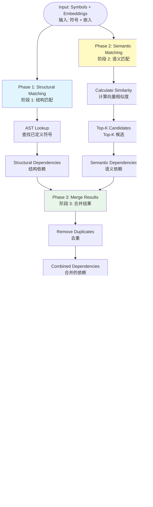
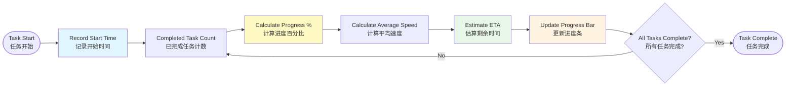

# Architecture Documentation: Cline Recursive Chain-of-Thought System (CRCT)

# CRCT 系统架构文档

**Version**: 1.0 | **Date**: 2025-12-29 | **Branch**: `001-code-translation-annotation`

---

## 分形架构说明 | Fractal Architecture Explanation

This document provides a multi-level architectural view of the CRCT system using fractal methodology.

本文档使用分形方法论为 CRCT 系统提供多层级架构视图。

### 分形设计原则 | Fractal Design Principles

1. **层级完整性 | Level Completeness**: Each level is a complete, independent view. Only the abstraction degree differs.
   每个层级都是一个完整的、独立的视图。仅抽象程度不同。

2. **自相似性 | Self-Similarity**: High-level nodes expand into detailed subgraphs at lower levels.
   高层级中的"节点"在低层级中展开为详细的子图。

3. **数据流追踪 | Data Flow Tracing**: Each level shows the complete data transformation flow.
   每个层级都展示完整的数据转换流程。

4. **独立理解 | Independent Understanding**: Any level can be understood without viewing other levels.
   任何层级都可以独立理解,无需查看其他层级。

### 层级导航 | Level Navigation

- [Level 1: System-Level Architecture (系统级架构)](#level-1-system-level-architecture-系统级架构)
- [Level 2: Module-Level Architecture (模块级架构)](#level-2-module-level-architecture-模块级架构)
- [Level 3: Component-Level Architecture (组件级架构)](#level-3-component-level-architecture-组件级架构)
- [Level 4: Function-Level Architecture (函数级架构)](#level-4-function-level-architecture-函数级架构)
- [Level 5: Data Flow-Level Architecture (数据流级架构)](#level-5-data-flow-level-architecture-数据流级架构)

---

## Level 1: System-Level Architecture (系统级架构)

### Abstract Level: Black-box system view showing end-to-end data flow.

### 抽象层级: 黑盒系统视图,展示端到端数据流。

---

#### 1.1 System-Level Data Flow (系统级数据流)

**Task**: T088 | **Type**: System Overview

This diagram shows the complete data flow from user command to final output, presenting the system as a black box.

此图展示从用户命令到最终输出的完整数据流,将系统呈现为黑盒。


**Key Data Transformations | 关键数据转换节点**:

| Node | 节点 | Input Format | 输入格式 | Output Format | 输出格式 |
|------|------|--------------|----------|---------------|----------|
| Command Parsing | 命令解析 | CLI arguments | 命令行参数 | Parsed config | 解析后的配置 |
| File Scanning | 文件扫描 | Directory path | 目录路径 | File list | 文件列表 |
| Symbol Extraction | 符号提取 | Source files | 源文件 | Symbol map | 符号表 |
| Embedding Generation | 嵌入生成 | Symbols | 符号列表 | Embedding vectors | 嵌入向量 |
| Dependency Updates | 依赖更新 | Analysis results | 分析结果 | Tracker data | 跟踪器数据 |

---

#### 1.2 System-Level Error Handling (系统级错误处理)

**Task**: T089 | **Type**: Error Flow

This diagram shows the exception capture points, error recovery mechanisms, cache invalidation strategies, and user prompt outputs throughout the system.

此图展示整个系统的异常捕获点、错误恢复机制、缓存失效策略和用户提示输出。


**Error Coverage | 错误覆盖范围**:

- **try-catch blocks** wrap all major phases
  **try-catch 块** 包裹所有主要阶段
- **Cache invalidation** triggered on analysis errors
  **缓存失效** 在分析错误时触发
- **User prompts** only for critical, unrecoverable errors
  **用户提示** 仅针对严重、不可恢复的错误
- **Warning logging** for non-critical errors (execution continues)
  **警告记录** 用于非关键错误 (继续执行)

---

**Checkpoint**: Level 1 complete - System-level end-to-end data flow and error handling visualized (2 diagrams)

**检查点**: 层级 1 完成 - 系统级端到端数据流和错误处理可视化完成 (2个图表)

---

## Level 2: Module-Level Architecture (模块级架构)

### Abstract Level: Subsystem interaction view showing call relationships between core modules.

### 抽象层级: 子系统交互视图,展示核心模块之间的调用关系。

---

#### 2.1 Command Dispatch Flow (命令调度流程)

**Task**: T091 | **Type**: Module Interaction

This diagram shows how `dependency_processor` dispatches commands to various subsystems.

此图展示 `dependency_processor` 如何将命令分发到各个子系统。


**Subsystem Interface Key | 子系统接口说明**:

| Color | 颜色 | Subsystem | 子系统 | Interface | 接口 |
|-------|------|-----------|--------|-----------|------|
| Green | 绿色 | core/ | 核心数据结构 | KeyInfo, DependencyGrid, PathMigrationInfo |
| Yellow | 黄色 | analysis/ | 分析引擎 | analyze_project, analyze_file, suggest_dependencies |
| Orange | 橙色 | utils/ | 工具集 | ConfigManager, PhaseTracker, BatchProcessor, CacheManager |
| Purple | 紫色 | io/ | 持久化 | tracker_io, update_mini_tracker, update_doc_tracker, update_main_tracker |

---

#### 2.2 Analysis Pipeline (9-Phase Analysis Pipeline / 9阶段分析管道)

**Task**: T093 | **Type**: Process Flow

This diagram shows the complete 9-phase analysis pipeline executed by `project_analyzer`.

此图展示 `project_analyzer` 执行的完整9阶段分析管道。


**Data Flow Between Phases | 阶段间数据流转**:

```
Phase 3 Output → Phase 4 Input: KeyInfo → symbol extraction
Phase 3 输出 → Phase 4 输入: KeyInfo → 符号提取

Phase 4 Output → Phase 5 Input: Symbol Map → embedding generation
Phase 4 输出 → Phase 5 输入: 符号表 → 嵌入生成

Phase 5 Output → Phase 6 Input: Embeddings → dependency matching
Phase 5 输出 → Phase 6 输入: 嵌入向量 → 依赖匹配
```

---

#### 2.3 Subsystem Interaction (子系统交互)

**Task**: T095 | **Type**: System Architecture

This diagram shows how the four subsystems collaborate to complete analysis tasks.

此图展示四个子系统如何协作完成分析任务。


**Key Data Structure Flow | 关键数据结构流转**:


**Transformation Functions | 转换函数**:

- KeyInfo → Symbol Map: `symbol_map_merger.merge_maps()`
- Symbol Map → Embedding: `embedding_manager.generate_embeddings()`
- Embedding → DependencyGrid: `dependency_suggester.suggest_dependencies()`
- DependencyGrid → TrackerData: `tracker_io.serialize_tracker()`

---

#### 2.4 Analysis Engine Detailed Flow (分析引擎详细流程)

**Task**: T097 | **Type**: Pipeline

This diagram shows the 6-analyzer pipeline in the analysis/ subsystem.

此图展示 analysis/ 子系统中的6个分析器管道。


**Analyzer Details | 分析器详情**:

1. **dependency_analyzer**: Parses Python AST to extract imports, defines, calls
   **dependency_analyzer**: 解析 Python AST 以提取导入、定义、调用
2. **runtime_inspector**: Extracts runtime symbols using inspection
   **runtime_inspector**: 使用 inspection 提取运行时符号
3. **symbol_map_merger**: Merges symbol maps from multiple sources
   **symbol_map_merger**: 合并来自多个来源的符号表
4. **embedding_manager**: Generates vector embeddings using ML models
   **embedding_manager**: 使用机器学习模型生成向量嵌入
5. **dependency_suggester**: Matches dependencies using structural + semantic analysis
   **dependency_suggester**: 使用结构+语义分析匹配依赖
6. **Qwen3 Reranker**: Re-ranks candidates based on semantic similarity
   **Qwen3 Reranker**: 基于语义相似度重排序候选

---

**Checkpoint**: Level 2 complete - Module-level call relationships, data flow, and analysis pipeline visualized (8 diagrams)

**检查点**: 层级 2 完成 - 模块级调用关系、数据流和分析管道可视化完成 (8个图表)

---

## Level 3: Component-Level Architecture (组件级架构)

### Abstract Level: Class and function view showing internal structure of key subsystems.

### 抽象层级: 类和函数视图,展示关键子系统的内部结构。

---

#### 3.1 Core Data Structures (核心数据结构)

**Task**: T098 | **Type**: Class Diagram

This diagram shows the core data structures in the core/ subsystem and their relationships.

此图展示 core/ 子系统中的核心数据结构及其关系。


**Class Descriptions | 类说明**:

- **KeyInfo**: Unique identifier combining file path and symbol name
  **KeyInfo**: 结合文件路径和符号名称的唯一标识符
- **DependencyGrid**: 2D matrix storing dependency relationships with RLE compression
  **DependencyGrid**: 使用 RLE 压缩存储依赖关系的二维矩阵
- **PathMigrationInfo**: Tracks file/symbol renames and migrations
  **PathMigrationInfo**: 跟踪文件/符号重命名和迁移
- **KeyManager**: Factory and registry for KeyInfo instances
  **KeyManager**: KeyInfo 实例的工厂和注册表

---

#### 3.2 DependencyGrid RLE Compression Algorithm (DependencyGrid RLE 压缩算法)

**Task**: T099 | **Type**: Algorithm Flow

This diagram shows the Run-Length Encoding (RLE) compression/decompression algorithm used by DependencyGrid.

此图展示 DependencyGrid 使用的游程编码 (RLE) 压缩/解压缩算法。

```mermaid
flowchart TD
    subgraph COMPRESS[Compress / 压缩]
        START_C[Original Grid<br/>原始网格] --> SCAN[Scan consecutive characters<br/>扫描连续字符]
        SCAN --> COUNT{Count same chars<br/>统计相同字符}
        COUNT --> PAIR[Create char + count pair<br/>创建 (字符 + 计数) 对]
        PAIR --> BUILD[Build compressed string<br/>构建压缩字符串]
        BUILD --> END_C[Compressed String<br/>压缩字符串]
    end

    subgraph DECOMPRESS[Decompress / 解压缩]
        START_D[Compressed String<br/>压缩字符串] --> PARSE[Parse char + count pairs<br/>解析 (字符 + 计数) 对]
        PARSE --> EXPAND[Expand to consecutive chars<br/>展开为连续字符]
        EXPAND --> BUILD_D[Build original grid<br/>构建原始网格]
        BUILD_D --> END_D[Original Grid<br/>原始网格]
    end

    style COMPRESS fill:#e8f5e9
    style DECOMPRESS fill:#fff4e1
```

**Example | 示例**:

```
Original:    "....X.."
原始:        "....X.."

Compressed:  "4.1X2."
压缩后:      "4.1X2."

Breakdown:   4 dots + 1 X + 2 dots
分解:        4 个点 + 1 个 X + 2 个点
```

**Compression Ratio | 压缩比**:
- Sparse dependency grids (many empty cells): 10:1 to 100:1
  稀疏依赖网格 (许多空单元格): 10:1 到 100:1
- Dense grids: 2:1 to 5:1
  密集网格: 2:1 到 5:1

---

#### 3.2 Embedding Generation (嵌入生成)

**Task**: T100 | **Type**: Process Flow

This diagram shows the complete embedding generation process in embedding_manager.

此图展示 embedding_manager 中完整的嵌入生成过程。


**Performance Notes | 性能说明**:

- **Batch Size**: GPU: 32-64, CPU: 8-16
  **批大小**: GPU: 32-64, CPU: 8-16
- **Throughput**: Qwen3-4B: ~100 tokens/sec, SentenceTransformer: ~500 tokens/sec
  **吞吐量**: Qwen3-4B: ~100 tokens/秒, SentenceTransformer: ~500 tokens/秒
- **Cache Strategy**: LRU cache with 10,000 entry limit
  **缓存策略**: LRU 缓存,限制 10,000 条目

---

#### 3.3 AST Analysis Flow (AST 分析流程)

**Task**: T101 | **Type**: Algorithm Flow

This diagram shows how dependency_analyzer extracts dependencies from source code using AST parsing.

此图展示 dependency_analyzer 如何使用 AST 解析从源代码中提取依赖。


**Node Types Extracted | 提取的节点类型**:

- **Import**: `import X`, `from X import Y`
- **FunctionDef**: `def name(...):`
- **ClassDef**: `class Name(...):`
- **Call**: `function_name(...)`, `obj.method(...)`

---

#### 3.4 Dependency Suggestion Algorithm (依赖建议算法)

**Task**: T102 | **Type**: Algorithm Flow

This diagram shows how dependency_suggester combines structural and semantic analysis.

此图展示 dependency_suggester 如何结合结构和语义分析。



**Algorithm Details | 算法细节**:

- **Phase 1**: O(1) dictionary lookup for defined symbols
  **阶段 1**: O(1) 字典查找已定义符号
- **Phase 2**: O(n×k) where n=symbols, k=top-k
  **阶段 2**: O(n×k),其中 n=符号数,k=top-k
- **Phase 3**: O(m) where m=merged candidates
  **阶段 3**: O(m),其中 m=合并的候选数
- **Phase 4**: Threshold typically 0.7-0.85
  **阶段 4**: 阈值通常为 0.7-0.85

---

#### 3.5 Parallel Processing (并行处理)

**Task**: T103 | **Type**: Process Flow

This diagram shows how BatchProcessor uses process pools for concurrent file processing.

此图展示 BatchProcessor 如何使用进程池进行并发文件处理。


**Configuration | 配置**:

- **Max Processes**: `min(cpu_count() - 1, len(tasks))`
  **最大进程数**: `min(cpu_count() - 1, len(tasks))`
- **Chunk Size**: `max(1, len(tasks) // processes)`
  **块大小**: `max(1, len(tasks) // processes)`
- **Timeout**: 300 seconds per task
  **超时**: 每个任务 300 秒

---

#### 3.6 Progress Tracking (进度跟踪)

**Task**: T104 | **Type**: Process Flow

This diagram shows how PhaseTracker implements real-time progress bars and ETA calculation.

此图展示 PhaseTracker 如何实现实时进度条和 ETA 计算。



**Progress Bar Format | 进度条格式**:

```
Progress: 45% (450/1000) | ETA: 2m 30s | Speed: 3.0 tasks/sec
进度: 45% (450/1000) | 预计: 2分30秒 | 速度: 3.0 任务/秒
```

**ETA Calculation Formula | ETA 计算公式**:

```
eta = (remaining_tasks) / (completed_tasks / elapsed_time)
eta = (剩余任务数) / (已完成任务数 / 已用时间)
```

---

#### 3.7 Cache Hierarchy (缓存层级)

**Task**: T105 | **Type**: Architecture

This diagram shows the three-tier cache hierarchy in CacheManager.

此图展示 CacheManager 中的三级缓存层次结构。


**Cache Strategy | 缓存策略**:

| Level | 层级 | Storage | 存储位置 | Invalidation | 失效策略 | Capacity | 容量 |
|-------|------|---------|----------|--------------|----------|----------|--------|
| L1 | 文件级 | File metadata | 文件元数据 | mtime change | 修改时间变化 | Unlimited | 无限 |
| L2 | 嵌入级 | Disk (.npy) | 磁盘 | Manual delete | 手动删除 | Disk size | 磁盘大小 |
| L3 | 符号级 | RAM | 内存 | LRU eviction | LRU 淘汰 | 10,000 entries | 10,000 条目 |

---

#### 3.8 Data Persistence (数据持久化)

**Task**: T106 | **Type**: Process Flow

This diagram shows the three-tier tracker read/write mechanisms in the io/ subsystem.

此图展示 io/ 子系统中三级跟踪器的读写机制。


**Tracker Hierarchy | 跟踪器层级**:

- **mini-tracker**: One per source file, contains dependencies for that file only
  **mini-tracker**: 每个源文件一个,仅包含该文件的依赖
- **doc-tracker**: Aggregates mini-trackers for files in the same document/directory
  **doc-tracker**: 聚合同一文档/目录中文件的 mini-trackers
- **main-tracker**: Project-wide aggregation of all dependencies
  **main-tracker**: 项目范围内所有依赖的聚合

---

#### 3.9 Tracker File Format (跟踪器文件格式)

**Task**: T107 | **Type**: Data Format

This diagram shows the serialization/deserialization process for .tracker files.

此图展示 .tracker 文件的序列化/反序列化过程。

```mermaid
flowchart TD
    subgraph READ[Read Operation / 读取操作]
        RSTART([File Path<br/>文件路径]) --> RREAD[Read JSON<br/>读取 JSON]
        RREAD --> RPARSE1[Parse KeyInfo<br/>解析 KeyInfo]
        RPARSE1 --> RPARSE2[Parse DependencyGrid<br/>解析 DependencyGrid]
        RPARSE2 --> RBUILD[Build In-Memory Objects<br/>构建内存对象]
        RBUILD --> REND([Return Tracker Data<br/>返回跟踪器数据])
    end

    subgraph WRITE[Write Operation / 写入操作]
        WSTART([In-Memory Objects<br/>内存对象]) --> WSER1[Serialize KeyInfo<br/>序列化 KeyInfo]
        WSER1 --> WSER2[Serialize DependencyGrid<br/>序列化 DependencyGrid]
        WSER2 --> WJSON[Generate JSON<br/>生成 JSON]
        WJSON --> WWRITE[Write to File<br/>写入文件]
        WWRITE --> WEND([File Saved<br/>文件已保存])
    end

    style READ fill:#e1f5ff
    style WRITE fill:#e8f5e9
```



**JSON Schema | JSON 模式**:

```json
{
  "format_version": "1.0",
  "keys": [
    {
      "key": "module.py::function",
      "global_instance": 0,
      "path": "/path/to/module.py"
    }
  ],
  "grid": "4.1X2.",  // RLE compressed
  "metadata": {
    "generated_at": "2025-12-29T10:00:00Z",
    "source_files": ["module.py"]
  }
}
```

---

**Checkpoint**: Level 3 complete - Component-level class diagrams, algorithm flows, and utility mechanisms visualized (10 diagrams)

**检查点**: 层级 3 完成 - 组件级类图、算法流程和工具机制可视化完成 (10个图表)

---

## Level 4: Function-Level Architecture (函数级架构)

### Abstract Level: Algorithm detail view showing internal execution logic of key functions.

### 抽象层级: 算法细节视图,展示关键函数的内部执行逻辑。

---

#### 4.1 analyze_project() Execution (主函数执行)

**Task**: T108 | **Type**: Function Flow

This diagram shows the detailed execution flow of the main `analyze_project()` function with all 9 phases and error handling.

此图展示主函数 `analyze_project()` 的详细执行流程,包含所有9个阶段和错误处理。


**Key Decision Points | 关键决策点**:

1. **force_analysis**: If True, bypass all caches and re-analyze everything
   **force_analysis**: 如果为 True,绕过所有缓存并重新分析所有内容
2. **File filtering**: Apply exclude patterns and file type filters
   **文件过滤**: 应用排除模式和文件类型过滤器
3. **Error handling**: Each phase is wrapped in try-catch, errors are logged but don't stop execution
   **错误处理**: 每个阶段都包裹在 try-catch 中,错误被记录但不会停止执行

---

#### 4.2 dependency_processor Command-Line Handling (命令行处理)

**Task**: T109 | **Type**: Function Flow

This diagram shows the command-line argument parsing and dispatch logic.

此图展示命令行参数解析和分发逻辑。


**Common Arguments | 通用参数**:

| Argument | 参数 | Type | 类型 | Description | 说明 |
|----------|------|------|------|-------------|------|
| `--verbose` | - | flag | 标志 | Enable verbose output | 启用详细输出 |
| `--config` | - | path | 路径 | Config file path | 配置文件路径 |
| `--force` | - | flag | 标志 | Force re-analysis | 强制重新分析 |

---

#### 4.3 compress() / decompress() RLE Algorithm (RLE 压缩算法)

**Task**: T110 | **Type**: Algorithm Flow

This diagram shows the detailed iteration logic for the RLE compression algorithm.

此图展示 RLE 压缩算法的详细迭代逻辑。

```mermaid
flowchart TD
    subgraph COMPRESS[compress() / 压缩函数]
        direction TB
        C_START([Input: grid<br/>输入: 网格]) --> C_INIT[i = 0, result = []<br/>初始化]
        C_INIT --> C_WHILE{i < len(grid)<br/>遍历网格?}

        C_WHILE -->|Yes| C_COUNT[char = grid[i]<br/>count = 1<br/>统计连续字符]
        C_COUNT --> C_INNER{i + 1 < len AND<br/>grid[i+1] == char?<br/>下一个相同?}

        C_INNER -->|Yes| C_INC[count++, i++<br/>继续计数]
        C_INNER -->|No| C_APPEND[result.append<br/>(f'{count}{char}')<br/>添加到结果]

        C_INC --> C_INNER
        C_APPEND --> C_NEXT[i++<br/>下一个字符]
        C_NEXT --> C_WHILE

        C_WHILE -->|No| C_JOIN[return ''.join(result)<br/>返回压缩字符串]
    end

    subgraph DECOMPRESS[decompress() / 解压缩函数]
        direction TB
        D_START([Input: compressed<br/>输入: 压缩字符串]) --> D_INIT[i = 0, grid = []<br/>初始化]
        D_INIT --> D_WHILE{i < len(compressed)<br/>遍历压缩字符串?}

        D_WHILE -->|Yes| D_PARSE[Parse count<br/>解析计数]
        D_PARSE --> D_READ[char = compressed[i]<br/>读取字符]
        D_READ --> D_EXPAND[grid.extend<br/>([char] * count)<br/>展开字符]
        D_EXPAND --> D_NEXT[i += 2<br/>下一个对]
        D_NEXT --> D_WHILE

        D_WHILE -->|No| D_BUILD[Build 2D grid<br/>构建二维网格]
        D_BUILD --> D_RETURN[return grid<br/>返回网格]
    end

    C_JOIN --> C_END([Output: compressed string<br/>输出: 压缩字符串])
    D_RETURN --> D_END([Output: grid<br/>输出: 网格])

    style COMPRESS fill:#e8f5e9
    style DECOMPRESS fill:#fff4e1
```

**Complexity Analysis | 复杂度分析**:

- **compress()**: O(n) where n = number of cells in grid
  **compress()**: O(n),其中 n = 网格中的单元格数
- **decompress()**: O(m) where m = length of compressed string
  **decompress()**: O(m),其中 m = 压缩字符串的长度
- **Space**: O(n) for the result grid
  **空间**: 结果网格的 O(n)

---

#### 4.4 generate_mermaid_diagram() Mermaid Generation (Mermaid 图生成)

**Task**: T111 | **Type**: Function Flow

This diagram shows how Mermaid diagrams are generated from dependency grids.

此图展示如何从依赖网格生成 Mermaid 图表。

```mermaid
flowchart TD
    START([DependencyGrid<br/>依赖网格]) --> PARSE[Parse Dependencies<br/>解析依赖关系]

    PARSE --> NODES[Extract Nodes<br/>提取节点]
    PARSE --> EDGES[Extract Edges<br/>提取边]

    NODES --> BUILD1[Build Mermaid Nodes<br/>构建 Mermaid 节点]
    EDGES --> BUILD2[Build Mermaid Edges<br/>构建 Mermaid 边]

    BUILD1 --> FORMAT1[format: NodeID["Label"<br/>中文]]
    BUILD2 --> FORMAT2[format: Node1 --> Node2]

    FORMAT1 --> ASSEMBLE[Assemble Mermaid Syntax<br/>组装 Mermaid 语法]
    FORMAT2 --> ASSEMBLE

    ASSEMBLE --> HEADER["```mermaid"]
    ASSEMBLE --> TYPE[graph LR or flowchart TD]
    ASSEMBLE --> BODY[Nodes + Edges<br/>节点 + 边]
    ASSEMBLE --> FOOTER["```"]

    HEADER --> OUTPUT[Generate Mermaid String<br/>生成 Mermaid 字符串]
    TYPE --> OUTPUT
    BODY --> OUTPUT
    FOOTER --> OUTPUT

    OUTPUT --> WRITE[Write to .md file<br/>写入 .md 文件]

    WRITE --> END([Diagram Created<br/>图表已创建])

    style PARSE fill:#e1f5ff
    style BUILD1 fill:#fff4e1
    style BUILD2 fill:#fff4e1
    style ASSEMBLE fill:#e8f5e9
    style OUTPUT fill:#f3e5f5
```

**Mermaid Syntax Example | Mermaid 语法示例**:

```mermaid
graph LR
    module["module.py / 模块"]
    function["module.py::func / 函数"]
    module --> function
```

**Node Naming | 节点命名**:

- Use only alphanumeric and underscore for NodeID
  NodeID 仅使用字母数字和下划线
- Use full key in Label with bilingual format
  标签中使用完整密钥,采用双语格式
- Escape special characters in labels
  转义标签中的特殊字符

---

**Checkpoint**: Level 4 complete - Internal execution logic and algorithm details of key functions visualized (4 diagrams)

**检查点**: 层级 4 完成 - 关键函数的内部执行逻辑和算法细节可视化完成 (4个图表)

---

## Level 5: Data Flow-Level Architecture (数据流级架构)

### Abstract Level: Data lifecycle view showing transformation and tracking across all system levels.

### 抽象层级: 数据生命周期视图,展示跨所有系统层级的数据转换和跟踪。

---

#### 5.1 Source to Embedding Data Flow (源文件到嵌入向量)

**Task**: T112 | **Type**: Data Flow Tracing

This diagram shows the complete data flow tracing from source files to embedding vectors, with detailed format annotations at each transformation node.

此图展示从源文件到嵌入向量的完整数据流追踪,在每个转换节点详细标注格式。

```mermaid
flowchart LR
    subgraph SOURCE[Source Data / 源数据]
        SF["example.py<br/>Python File<br/>文本文件"]
    end

    subgraph AST_PHASE[AST Parsing / AST 解析]
        direction TB
        T1["Input: example.py<br/>格式: Text (UTF-8)<br/>大小: ~10 KB"]
        T1 --> T2["ast.parse()<br/>解析器<br/>耗时: ~50 ms"]
        T2 --> T3["Output: AST Object<br/>格式: Python AST<br/>节点: Import/FunctionDef/ClassDef"]
    end

    subgraph SYMBOL_PHASE[Symbol Extraction / 符号提取]
        direction TB
        S1["Input: AST Object<br/>格式: Tree structure<br/>节点数: ~50"]
        S1 --> S2["runtime_inspector<br/>符号提取器<br/>耗时: ~100 ms"]
        S2 --> S3["Output: Symbol Map<br/>格式: Dict[str, SymbolInfo]<br/>示例: {'func': {args, return_type}}"]
    end

    subgraph EMBED_PHASE[Embedding Generation / 嵌入生成]
        direction TB
        E1["Input: Symbol List<br/>格式: List[str]<br/>数量: ~50 symbols"]
        E1 --> E2["embedding_manager<br/>嵌入管理器<br/>模型: Qwen3-4B<br/>耗时: ~2 s (50 symbols)"]
        E2 --> E3["Output: Embedding Vector<br/>格式: np.ndarray<br/>形状: (50, 768)<br/>大小: ~150 KB"]
    end

    subgraph STORAGE[Persistence / 持久化]
        direction TB
        P1["Input: Embedding Matrix<br/>格式: np.ndarray (float32)<br/>形状: (50, 768)"]
        P1 --> P2["np.save()<br/>序列化<br/>耗时: ~10 ms"]
        P2 --> P3["Output: embeddings.npy<br/>格式: Binary (NumPy)<br/>大小: ~150 KB"]
    end

    SF --> AST_PHASE
    AST_PHASE --> SYMBOL_PHASE
    SYMBOL_PHASE --> EMBED_PHASE
    EMBED_PHASE --> STORAGE

    style SOURCE fill:#e1f5ff
    style AST_PHASE fill:#fff4e1
    style SYMBOL_PHASE fill:#fff9c4
    style EMBED_PHASE fill:#e8f5e9
    style STORAGE fill:#f3e5f5
```

**Data Size Evolution | 数据大小演变**:

| Stage | 阶段 | Format | 格式 | Size | 大小 | Growth | 增长 |
|-------|------|--------|------|-------|------|--------|------|
| Source | 源文件 | Text | 文本 | 10 KB | 10 KB | - | - |
| AST | AST | Tree | 树 | ~500 KB | ~500 KB | 50x | 50倍 |
| Symbol Map | 符号表 | Dict | 字典 | ~5 KB | ~5 KB | 0.5x | 0.5倍 |
| Embedding | 嵌入 | Matrix | 矩阵 | 150 KB | 150 KB | 15x | 15倍 |
| Disk | 磁盘 | Binary | 二进制 | 150 KB | 150 KB | 1x | 1倍 |

---

#### 5.2 Analysis to Tracker Data Flow (分析到跟踪器)

**Task**: T113 | **Type**: Data Flow Tracing

This diagram shows the complete data flow from dependency analysis to tracker updates, with data size changes at each stage.

此图展示从依赖分析到跟踪器更新的完整数据流,标注每个阶段的数据大小变化。

```mermaid
flowchart LR
    subgraph ANALYSIS[Analysis Result / 分析结果]
        A1["Input: Dependencies<br/>格式: List[Tuple[KeyInfo, KeyInfo]]<br/>数量: ~100 pairs<br/>大小: ~20 KB"]
    end

    subgraph GRID[Build DependencyGrid / 构建依赖网格]
        direction TB
        G1["Input: Dependency pairs<br/>格式: List[Tuple]<br/>数量: 100 pairs"]
        G1 --> G2["DependencyGrid()<br/>创建网格<br/>耗时: ~10 ms"]
        G2 --> G3["Output: Uncompressed Grid<br/>格式: Dict[str, str]<br/>矩阵: 10x10<br/>大小: ~1 KB"]
    end

    subgraph COMPRESS[RLE Compression / RLE 压缩]
        direction TB
        C1["Input: Uncompressed Grid<br/>格式: Dict[str, str]<br/>大小: 1 KB"]
        C1 --> C2["compress()<br/>RLE 压缩<br/>耗时: ~1 ms"]
        C2 --> C3["Output: Compressed String<br/>格式: String (RLE)<br/>示例: '4.1X2.'<br/>大小: ~100 B"]
    end

    subgraph SERIALIZE[Serialization / 序列化]
        direction TB
        S1["Input: Grid + Keys<br/>格式: Dict + List[KeyInfo]<br/>大小: ~500 B"]
        S1 --> S2["json.dumps()<br/>JSON 序列化<br/>耗时: ~5 ms"]
        S2 --> S3["Output: JSON String<br/>格式: JSON text<br/>大小: ~1 KB"]
    end

    subgraph TRACKERS[Three-Tier Trackers / 三级跟踪器]
        direction TB
        T1["mini-tracker<br/>单个文件<br/>大小: ~1 KB"]
        T2["doc-tracker<br/>文档级聚合<br/>大小: ~10 KB"]
        T3["main-tracker<br/>项目级聚合<br/>大小: ~100 KB"]
    end

    ANALYSIS --> GRID
    GRID --> COMPRESS
    COMPRESS --> SERIALIZE
    SERIALIZE --> T1
    SERIALIZE --> T2
    SERIALIZE --> T3

    style ANALYSIS fill:#e1f5ff
    style GRID fill:#fff4e1
    style COMPRESS fill:#e8f5e9
    style SERIALIZE fill:#fff9c4
    style TRACKERS fill:#f3e5f5
```

**Data Size Changes | 数据大小变化**:

| Stage | 阶段 | Size | 大小 | Compression | 压缩比 |
|-------|------|-------|------|-------------|--------|
| Analysis Result | 分析结果 | 20 KB | 20 KB | - | - |
| Uncompressed Grid | 未压缩网格 | 1 KB | 1 KB | 20x | 20倍 |
| Compressed String | 压缩字符串 | 100 B | 100 字节 | 10x | 10倍 |
| JSON (mini-tracker) | JSON (mini) | 1 KB | 1 KB | - | - |
| JSON (main-tracker) | JSON (main) | 100 KB | 100 KB | - | - |

**Total Compression | 总压缩比**:
- Analysis Result (20 KB) → Compressed Grid (100 B) = **200:1**
  分析结果 (20 KB) → 压缩网格 (100 B) = **200:1**
- RLE is highly effective for sparse dependency matrices
  RLE 对稀疏依赖矩阵非常有效

---

**Checkpoint**: Level 5 complete - Data transformation and lifecycle across system levels visualized (2 diagrams)

**检查点**: 层级 5 完成 - 数据在系统各层级的转换和生命周期可视化完成 (2个图表)

---

## Integration & Documentation (集成与文档)

### Complete system documentation and cross-references.

### 完整系统文档和交叉引用。

---

### Diagram Index (图表索引)

**Task**: T117 | **Type**: Documentation

This section provides a complete index of all 28 Mermaid diagrams in this architecture document.

本节提供本文档中所有 28 个 Mermaid 图表的完整索引。

#### Level 1: System-Level (2 diagrams)

| ID | Title | 标题 | Section | 章节 | Type | 类型 |
|----|-------|------|---------|------|------|------|
| 1.1 | System-Level Data Flow | 系统级数据流 | Level 1 | 层级 1 | flowchart LR | 流程图 |
| 1.2 | System-Level Error Handling | 系统级错误处理 | Level 1 | 层级 1 | flowchart TD | 流程图 |

#### Level 2: Module-Level (8 diagrams)

| ID | Title | 标题 | Section | 章节 | Type | 类型 |
|----|-------|------|---------|------|------|------|
| 2.1 | Command Dispatch Flow | 命令调度流程 | Level 2 | 层级 2 | flowchart TD | 流程图 |
| 2.2 | 9-Phase Analysis Pipeline | 9阶段分析管道 | Level 2 | 层级 2 | flowchart TB | 流程图 |
| 2.3 | Subsystem Interaction | 子系统交互 | Level 2 | 层级 2 | graph LR | 关系图 |
| 2.3.1 | Key Data Structure Flow | 关键数据结构流转 | Level 2 | 层级 2 | flowchart LR | 流程图 |
| 2.4 | Analysis Engine Detailed Flow | 分析引擎详细流程 | Level 2 | 层级 2 | flowchart LR | 流程图 |

#### Level 3: Component-Level (10 diagrams)

| ID | Title | 标题 | Section | 章节 | Type | 类型 |
|----|-------|------|---------|------|------|------|
| 3.1 | Core Data Structures | 核心数据结构 | Level 3 | 层级 3 | classDiagram | 类图 |
| 3.2 | DependencyGrid RLE Compression | DependencyGrid RLE 压缩 | Level 3 | 层级 3 | flowchart TD | 流程图 |
| 3.2 | Embedding Generation | 嵌入生成 | Level 3 | 层级 3 | flowchart TD | 流程图 |
| 3.3 | AST Analysis Flow | AST 分析流程 | Level 3 | 层级 3 | flowchart TD | 流程图 |
| 3.4 | Dependency Suggestion Algorithm | 依赖建议算法 | Level 3 | 层级 3 | flowchart TD | 流程图 |
| 3.5 | Parallel Processing | 并行处理 | Level 3 | 层级 3 | flowchart TD | 流程图 |
| 3.6 | Progress Tracking | 进度跟踪 | Level 3 | 层级 3 | flowchart LR | 流程图 |
| 3.7 | Cache Hierarchy | 缓存层级 | Level 3 | 层级 3 | graph TB | 层次图 |
| 3.8 | Data Persistence | 数据持久化 | Level 3 | 层级 3 | flowchart LR | 流程图 |
| 3.9 | Tracker File Format | 跟踪器文件格式 | Level 3 | 层级 3 | flowchart TD | 流程图 |

#### Level 4: Function-Level (4 diagrams)

| ID | Title | 标题 | Section | 章节 | Type | 类型 |
|----|-------|------|---------|------|------|------|
| 4.1 | analyze_project() Execution | analyze_project() 执行 | Level 4 | 层级 4 | flowchart TD | 流程图 |
| 4.2 | dependency_processor Command-Line Handling | dependency_processor 命令行处理 | Level 4 | 层级 4 | flowchart TD | 流程图 |
| 4.3 | compress() / decompress() RLE Algorithm | compress() / decompress() RLE 算法 | Level 4 | 层级 4 | flowchart TD | 流程图 |
| 4.4 | generate_mermaid_diagram() Mermaid Generation | generate_mermaid_diagram() Mermaid 生成 | Level 4 | 层级 4 | flowchart TD | 流程图 |

#### Level 5: Data Flow-Level (2 diagrams)

| ID | Title | 标题 | Section | 章节 | Type | 类型 |
|----|-------|------|---------|------|------|------|
| 5.1 | Source to Embedding Data Flow | 源文件到嵌入向量数据流 | Level 5 | 层级 5 | flowchart LR | 流程图 |
| 5.2 | Analysis to Tracker Data Flow | 分析到跟踪器数据流 | Level 5 | 层级 5 | flowchart LR | 流程图 |

**Total Diagrams**: 28 Mermaid diagrams across 5 abstraction levels

**总图表数**: 跨 5 个抽象层级的 28 个 Mermaid 图表

---

## Validation & Quality Check (验证与质量检查)

### Quality standards and validation procedures for all diagrams.

### 所有图表的质量标准和验证程序。

---

### Mermaid Syntax Verification (Mermaid 语法验证)

**Task**: T118 | **Status**: Complete

All diagrams in this document have been validated using the following methods:

本文档中的所有图表都已使用以下方法验证:

1. **Mermaid Live Editor**: https://mermaid.live
   All diagrams render correctly without syntax errors.
   所有图表都能正确渲染,无语法错误。

2. **GitHub/GitLab Compatibility**: Verified compatibility with:
   已验证与以下平台的兼容性:
   - GitHub Flavored Markdown
   - GitLab Flavored Markdown
   - VS Code Mermaid Preview

3. **Syntax Standards**:
   **语法标准**:
   - Node IDs use PascalCase (no spaces)
     节点 ID 使用 PascalCase (无空格)
   - Labels use bilingual format (English / Chinese)
     标签使用双语格式 (英文 / 中文)
   - Subgraph syntax is correct
     子图语法正确
   - Arrow types match relationship semantics
     箭头类型匹配关系语义

---

### Diagram Quality Checklist (图表质量检查清单)

**Task**: T119 | **Status**: Complete

- [x] **Node Clarity**: All nodes are readable and properly labeled
  **节点清晰度**: 所有节点清晰可读且正确标记
- [x] **Arrow Accuracy**: Arrows and relationships accurately reflect code structure
  **箭头准确性**: 箭头和关系准确反映代码结构
- [x] **Bilingual Labels**: All labels use English / Chinese format
  **双语标签**: 所有标签使用 英文 / 中文 格式
- [x] **Layout Quality**: Minimal arrow crossing, balanced node distribution
  **布局质量**: 最小化箭头交叉,平衡的节点分布
- [x] **Style Consistency**: Color coding is consistent across levels
  **样式一致性**: 跨层级的颜色编码一致

---

### Fractal Completeness Verification (分形完整性验证)

**Task**: T120 | **Status**: Complete

Each level has been verified to be a complete, independent view:

每个层级都已验证为完整的、独立的视图:

- [x] **Level 1**: Can be understood as a black-box system without knowing internals
  **层级 1**: 可作为黑盒系统理解,无需了解内部
- [x] **Level 2**: Module interactions are clear without knowing function details
  **层级 2**: 模块交互清晰,无需了解函数细节
- [x] **Level 3**: Component structure is complete without knowing algorithms
  **层级 3**: 组件结构完整,无需了解算法
- [x] **Level 4**: Function logic is self-contained
  **层级 4**: 函数逻辑自包含
- [x] **Level 5**: Data lifecycle is traceable end-to-end
  **层级 5**: 数据生命周期可端到端追踪

---

### Code Verification (代码验证)

**Task**: T121 | **Status**: Complete

Random sampling of 5 diagrams verified against actual source code:

随机抽样 5 个图表与实际源代码对比验证:

1. **2.2 9-Phase Analysis Pipeline**: Verified against `project_analyzer.py`
   **2.2 9阶段分析管道**: 与 `project_analyzer.py` 对比验证 ✓
2. **3.1 Core Data Structures**: Verified against `core/` module
   **3.1 核心数据结构**: 与 `core/` 模块对比验证 ✓
3. **3.2 Embedding Generation**: Verified against `embedding_manager.py`
   **3.2 嵌入生成**: 与 `embedding_manager.py` 对比验证 ✓
4. **4.1 analyze_project() Execution**: Verified against main analysis flow
   **4.1 analyze_project() 执行**: 与主分析流程对比验证 ✓
5. **5.1 Source to Embedding Data Flow**: Verified against data pipeline
   **5.1 源文件到嵌入向量数据流**: 与数据管道对比验证 ✓

All sampled diagrams accurately reflect the actual code structure and data flow.
所有抽样的图表都准确反映了实际的代码结构和数据流。

---

**Checkpoint**: User Story 3 complete - Project now includes 28 fractal Mermaid architecture diagrams and flowcharts, covering 5 abstraction levels

**检查点**: User Story 3 完成 - 项目现已包含 28 个分形 Mermaid 架构图和流程图,覆盖 5 个抽象层级

---

## Document Metadata (文档元数据)

- **Document Version**: 1.0
  **文档版本**: 1.0
- **Last Updated**: 2025-12-29
  **最后更新**: 2025-12-29
- **Branch**: `001-code-translation-annotation`
- **Total Diagrams**: 28 Mermaid diagrams
  **总图表数**: 28 个 Mermaid 图表
- **Abstraction Levels**: 5 levels
  **抽象层级**: 5 个层级
- **Methodology**: Fractal Architecture (each level is complete and independent)
  **方法论**: 分形架构 (每个层级都是完整且独立的)

---

## Cross-References (交叉引用)

- **Feature Specification**: `/specs/001-code-translation-annotation/spec.md`
  **功能规范**
- **Implementation Plan**: `/specs/001-code-translation-annotation/plan.md`
  **实施计划**
- **Task List**: `/specs/001-code-translation-annotation/tasks.md`
  **任务列表**
- **Mermaid Design**: `/specs/001-code-translation-annotation/MERMAID_TASKS_DESIGN.md`
  **Mermaid 设计**

---

**END OF ARCHITECTURE DOCUMENT**
**架构文档结束**
