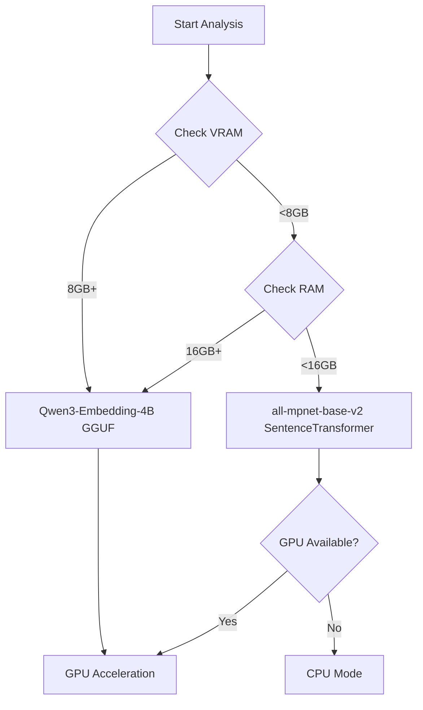
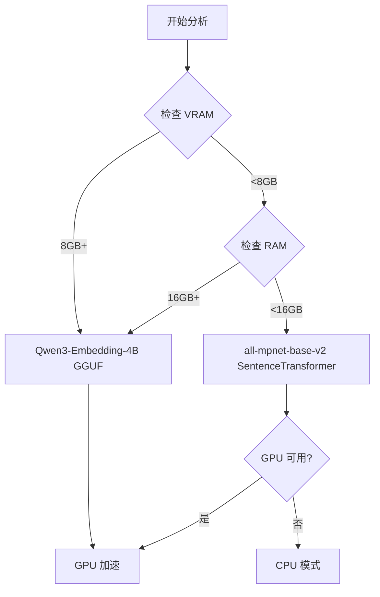

# Hardware Optimization Guide
# 硬件优化指南 | Hardware Optimization Guide

> [!TIP]
> CRCT v8.0 automatically adapts to your hardware. This guide explains how the system selects models, optimizes performance, and how to fine-tune for your environment.
>
> CRCT v8.0 自动适应您的硬件。本指南解释系统如何选择模型、优化性能,以及如何针对您的环境进行微调。

## Overview
## 概述 | Overview

Version 8.0 introduces **hardware-adaptive** behavior that automatically:
- Detects available VRAM, RAM, and CPU resources
- Selects optimal embedding and reranking models
- Adjusts batch sizes for maximum throughput
- Manages memory usage during analysis

版本 8.0 引入了**硬件自适应**行为,自动执行以下操作:
- 检测可用的 VRAM、RAM 和 CPU 资源
- 选择最佳的嵌入和重排序模型
- 调整批次大小以实现最大吞吐量
- 在分析过程中管理内存使用

**Zero configuration required** - the system works out of the box. This guide helps you understand and optimize the defaults.

**零配置要求** - 系统开箱即用。本指南帮助您理解和优化默认设置。

---

## Automatic Model Selection
## 自动模型选择 | Automatic Model Selection

### Decision Tree
### 决策树 | Decision Tree



以下是一个代码示例:



### Model Profiles
### 模型配置 | Model Profiles

#### Qwen3-Embedding-4B-Q6_K (GGUF)

**Use When**: VRAM ≥8GB OR RAM ≥16GB

**使用条件**: VRAM ≥8GB 或 RAM ≥16GB

| Specification | Value |
|---------------|-------|
| **Size** | ~2.4GB |
| **Context Length** | 32,768 tokens |
| **Dimensions** | 2560 |
| **Speed (GPU)** | ~50 docs/sec |
| **Speed (CPU)** | ~5 docs/sec |
| **Accuracy** | ★★★★★ Excellent |

| 规范 | 值 |
|---------------|-------|
| **大小** | ~2.4GB |
| **上下文长度** | 32,768 tokens |
| **维度** | 2560 |
| **速度 (GPU)** | ~50 docs/sec |
| **速度 (CPU)** | ~5 docs/sec |
| **准确度** | ★★★★★ 优秀 |

**Advantages**:
- Handles very large files (up to 32k tokens)
- Best semantic understanding
- Quantized for efficiency

**优势**:
- 处理非常大的文件 (最多 32k tokens)
- 最佳语义理解
- 量化以提高效率

**Requirements**:
- `llama-cpp-python` package
- CUDA for GPU acceleration

**要求**:
- `llama-cpp-python` 包
- CUDA 用于 GPU 加速

#### all-mpnet-base-v2 (SentenceTransformer)

**Use When**: VRAM <8GB AND RAM <16GB

**使用条件**: VRAM <8GB 且 RAM <16GB

| Specification | Value |
|---------------|-------|
| **Size** | ~420MB |
| **Context Length** | 512 tokens |
| **Dimensions** | 384 |
| **Speed (GPU)** | ~200 docs/sec |
| **Speed (CPU)** | ~50 docs/sec |
| **Accuracy** | ★★★★☆ Very Good |

| 规范 | 值 |
|---------------|-------|
| **大小** | ~420MB |
| **上下文长度** | 512 tokens |
| **维度** | 384 |
| **速度 (GPU)** | ~200 docs/sec |
| **速度 (CPU)** | ~50 docs/sec |
| **准确度** | ★★★★☆ 很好 |

**Advantages**:
- Lightweight, fast
- Well-suited for smaller files
- Lower resource requirements

**优势**:
- 轻量级,快速
- 非常适合较小的文件
- 较低的资源要求

**Limitations**:
- Context length limited to 512 tokens
- Slightly lower accuracy than Qwen3

**限制**:
- 上下文长度限制为 512 tokens
- 准确度略低于 Qwen3

---

## Batch Size Optimization
## 批次大小优化 | Batch Size Optimization

### Automatic Sizing
### 自动调整 | Automatic Sizing

The system determines optimal batch sizes based on available VRAM:

系统根据可用的 VRAM 确定最佳批次大小:

```python
def get_optimal_batch_size():
    vram_gb = get_available_vram()

    if vram_gb >= 6:
        return 256
    elif vram_gb >= 4:
        return 128
    elif vram_gb >= 2:
        return 64
    else:
        return 32  # CPU or low VRAM
```

以下是一个代码示例:

```python
def get_optimal_batch_size():
    vram_gb = get_available_vram()

    if vram_gb >= 6:
        return 256
    elif vram_gb >= 4:
        return 128
    elif vram_gb >= 2:
        return 64
    else:
        return 32  # CPU 或低 VRAM
```

### Performance Impact
### 性能影响 | Performance Impact

| Batch Size | Files/Second (GPU) | Memory Usage | Recommended For |
|------------|-------------------|--------------|-----------------|
| **256** | ~200 | ~4GB VRAM | RTX 3060+, 6GB+ VRAM |
| **128** | ~150 | ~2GB VRAM | RTX 2060, 4GB+ VRAM |
| **64** | ~100 | ~1GB VRAM | GTX 1650, 2GB+ VRAM |
| **32** | ~50 | ~512MB VRAM/RAM | CPU or old GPU |

| 批次大小 | 文件/秒 (GPU) | 内存使用 | 推荐用于 |
|------------|-------------------|--------------|-----------------|
| **256** | ~200 | ~4GB VRAM | RTX 3060+, 6GB+ VRAM |
| **128** | ~150 | ~2GB VRAM | RTX 2060, 4GB+ VRAM |
| **64** | ~100 | ~1GB VRAM | GTX 1650, 2GB+ VRAM |
| **32** | ~50 | ~512MB VRAM/RAM | CPU 或旧 GPU |

### Manual Override
### 手动覆盖 | Manual Override

Force specific batch size in `.clinerules.config.json`:

在 `.clinerules.config.json` 中强制指定批次大小:

```json
{
  "embedding": {
    "batch_size": 128,  # Fixed size
    "auto_select_model": true
  }
}
```

代码说明: 在配置文件中强制设置固定的批次大小。

以下是一个代码示例:

```json
{
  "embedding": {
    "batch_size": 128,  # 固定大小
    "auto_select_model": true
  }
}
```

代码说明: 在配置文件中强制设置固定的批次大小。

---

## Resource Detection
## 资源检测 | Resource Detection

### VRAM Detection
### VRAM 检测 | VRAM Detection

```python
# Automatic CUDA VRAM detection
import torch
if torch.cuda.is_available():
    vram_bytes = torch.cuda.get_device_properties(0).total_memory
    vram_gb = vram_bytes / (1024**3)
```

以下是一个代码示例:

```python
# 自动 CUDA VRAM 检测
import torch
if torch.cuda.is_available():
    vram_bytes = torch.cuda.get_device_properties(0).total_memory
    vram_gb = vram_bytes / (1024**3)
```

### RAM Detection
### RAM 检测 | RAM Detection

```python
# System RAM detection
import psutil
ram_bytes = psutil.virtual_memory().total
ram_gb = ram_bytes / (1024**3)
```

以下是一个代码示例:

```python
# 系统 RAM 检测
import psutil
ram_bytes = psutil.virtual_memory().total
ram_gb = ram_bytes / (1024**3)
```

### CPU Detection
### CPU 检测 | CPU Detection

```python
# CPU core count for parallelism
import os
cpu_count = os.cpu_count() or 4
max_workers = min(cpu_count * 4, 64)
```

以下是一个代码示例:

```python
# 用于并行处理的 CPU 核心数
import os
cpu_count = os.cpu_count() or 4
max_workers = min(cpu_count * 4, 64)
```

---

## Performance Profiles
## 性能配置 | Performance Profiles

### High-End Workstation
### 高端工作站 | High-End Workstation

**Hardware**:
- GPU: RTX 4090 (24GB VRAM)
- RAM: 64GB DDR5
- CPU: AMD Ryzen 9 7950X (16 cores)

**硬件**:
- GPU: RTX 4090 (24GB VRAM)
- RAM: 64GB DDR5
- CPU: AMD Ryzen 9 7950X (16 核心)

**Configuration** (Auto-Selected):
```json
{
  "embedding": {
    "model": "Qwen3-Embedding-4B-Q6_K",
    "batch_size": 256,
    "device": "cuda"
  }
}
```

**配置** (自动选择):

以下是一个代码示例:

```json
{
  "embedding": {
    "model": "Qwen3-Embedding-4B-Q6_K",
    "batch_size": 256,
    "device": "cuda"
  }
}
```

**Performance**:
- **1000 files**: ~2 minutes
- **5000 files**: ~8 minutes
- **Reranking (20 pairs)**: ~4 seconds

**性能**:
- **1000 个文件**: ~2 分钟
- **5000 个文件**: ~8 分钟
- **重排序 (20 对)**: ~4 秒

### Mid-Range Desktop
### 中端台式机 | Mid-Range Desktop

**Hardware**:
- GPU: RTX 3060 (12GB VRAM)
- RAM: 32GB DDR4
- CPU: Intel i7-12700K (12 cores)

**硬件**:
- GPU: RTX 3060 (12GB VRAM)
- RAM: 32GB DDR4
- CPU: Intel i7-12700K (12 核心)

**Configuration** (Auto-Selected):
```json
{
  "embedding": {
    "model": "Qwen3-Embedding-4B-Q6_K",
    "batch_size": 256,
    "device": "cuda"
  }
}
```

**配置** (自动选择):

以下是一个代码示例:

```json
{
  "embedding": {
    "model": "Qwen3-Embedding-4B-Q6_K",
    "batch_size": 256,
    "device": "cuda"
  }
}
```

**Performance**:
- **1000 files**: ~3 minutes
- **5000 files**: ~12 minutes
- **Reranking (20 pairs)**: ~6 seconds

**性能**:
- **1000 个文件**: ~3 分钟
- **5000 个文件**: ~12 分钟
- **重排序 (20 对)**: ~6 秒

### Entry-Level Laptop
### 入门级笔记本 | Entry-Level Laptop

**Hardware**:
- GPU: GTX 1650 (4GB VRAM)
- RAM: 16GB DDR4
- CPU: Intel i5-10300H (4 cores)

**硬件**:
- GPU: GTX 1650 (4GB VRAM)
- RAM: 16GB DDR4
- CPU: Intel i5-10300H (4 核心)

**Configuration** (Auto-Selected):
```json
{
  "embedding": {
    "model": "all-mpnet-base-v2",
    "batch_size": 64,
    "device": "cuda"
  }
}
```

**配置** (自动选择):

以下是一个代码示例:

```json
{
  "embedding": {
    "model": "all-mpnet-base-v2",
    "batch_size": 64,
    "device": "cuda"
  }
}
```

**Performance**:
- **1000 files**: ~8 minutes
- **5000 files**: ~35 minutes
- **Reranking (20 pairs)**: ~15 seconds

**性能**:
- **1000 个文件**: ~8 分钟
- **5000 个文件**: ~35 分钟
- **重排序 (20 对)**: ~15 秒

### CPU-Only System
### 仅 CPU 系统 | CPU-Only System

**Hardware**:
- CPU: AMD Ryzen 7 5800X (8 cores)
- RAM: 32GB DDR4
- GPU: None

**硬件**:
- CPU: AMD Ryzen 7 5800X (8 核心)
- RAM: 32GB DDR4
- GPU: 无

**Configuration** (Auto-Selected):
```json
{
  "embedding": {
    "model": "all-mpnet-base-v2",
    "batch_size": 32,
    "device": "cpu"
  }
}
```

**配置** (自动选择):

以下是一个代码示例:

```json
{
  "embedding": {
    "model": "all-mpnet-base-v2",
    "batch_size": 32,
    "device": "cpu"
  }
}
```

**Performance**:
- **1000 files**: ~15 minutes
- **5000 files**: ~60 minutes
- **Reranking (20 pairs)**: ~30 seconds

**性能**:
- **1000 个文件**: ~15 分钟
- **5000 个文件**: ~60 分钟
- **重排序 (20 对)**: ~30 秒

---

## Memory Management
## 内存管理 | Memory Management

### Peak Memory Usage
### 峰值内存使用 | Peak Memory Usage

During analysis, memory usage peaks during:

在分析过程中,内存使用在以下阶段达到峰值:

1. **Embedding Generation**: Batch size × model size
2. **Reranker Loading**: ~2GB (Qwen3 model in VRAM)
3. **Symbol Map Generation**: ~5MB per 1000 files

1. **嵌入生成**: 批次大小 × 模型大小
2. **重排序器加载**: ~2GB (VRAM 中的 Qwen3 模型)
3. **符号映射生成**: 每 1000 个文件约 5MB

### Automatic Unloading
### 自动卸载 | Automatic Unloading

The system automatically unloads reranker after suggestions:

系统在建议后自动卸载重排序器:

```python
# After dependency suggestion phase
unload_reranker_model()
torch.cuda.empty_cache()  # Free VRAM
```

以下是一个代码示例:

```python
# 依赖建议阶段之后
unload_reranker_model()
torch.cuda.empty_cache()  # 释放 VRAM
```

### Cache Compression
### 缓存压缩 | Cache Compression

Cache manager compresses large items:

缓存管理器压缩大型项目:

```python
# Items >1KB compressed with gzip
if size > 1024:
    compressed = gzip.compress(pickle.dumps(value))
    if len(compressed) < len(original) * 0.9:  # 10% savings
        store_compressed(compressed)
```

代码说明: 缓存管理器使用 gzip 压缩大于 1KB 的项目,如果压缩后大小节省超过 10% 则存储压缩版本。

以下是一个代码示例:

```python
# 大于 1KB 的项目使用 gzip 压缩
if size > 1024:
    compressed = gzip.compress(pickle.dumps(value))
    if len(compressed) < len(original) * 0.9:  # 节省 10%
        store_compressed(compressed)
```

代码说明: 缓存管理器使用 gzip 压缩大于 1KB 的项目,如果压缩后大小节省超过 10% 则存储压缩版本。

**Typical Savings**: 30-50% for large projects

**典型节省**: 大型项目节省 30-50%

---

## Optimization Strategies
## 优化策略 | Optimization Strategies

### Strategy 1: Upgrade VRAM
### 策略 1: 升级 VRAM | Strategy 1: Upgrade VRAM

**Impact**: Allows larger batch sizes and better models

**影响**: 允许更大的批次大小和更好的模型

| Before | After | Speedup |
|--------|-------|---------|
| 4GB VRAM → 8GB VRAM | 3x faster | Qwen3 + batch 256 |
| CPU → GPU (any) | 10x faster | GPU acceleration |

| 之前 | 之后 | 加速 |
|--------|-------|---------|
| 4GB VRAM → 8GB VRAM | 3 倍更快 | Qwen3 + batch 256 |
| CPU → GPU (任何) | 10 倍更快 | GPU 加速 |

**ROI**: Highest impact upgrade for CRCT performance

**投资回报**: 对 CRCT 性能影响最大的升级

### Strategy 2: Reduce Scan Limit
### 策略 2: 减少扫描限制 | Strategy 2: Reduce Scan Limit

**Impact**: Trade accuracy for speed

**影响**: 用准确度换取速度

```json
{
  "analysis": {
    "max_reranker_scans": 10  // Default: 20
  }
}
```

以下是一个代码示例:

```json
{
  "analysis": {
    "max_reranker_scans": 10  // 默认值: 20
  }
}
```

- **Time Saved**: ~50% on reranking
- **Accuracy Loss**: Minimal (top pairs still scanned)

- **节省时间**: 重排序节省约 50%
- **准确度损失**: 最小 (顶部对仍会被扫描)

### Strategy 3: Increase RAM
### 策略 3: 增加 RAM | Strategy 3: Increase RAM

**Impact**: Enables Qwen3 model on systems without GPU

**影响**: 在没有 GPU 的系统上启用 Qwen3 模型

| Before | After | Benefit |
|--------|-------|---------|
| 8GB RAM → 16GB RAM | Better model | Qwen3 instead of mpnet |
| 16GB RAM → 32GB RAM | Larger batches | Slightly faster |

| 之前 | 之后 | 好处 |
|--------|-------|---------|
| 8GB RAM → 16GB RAM | 更好的模型 | Qwen3 而非 mpnet |
| 16GB RAM → 32GB RAM | 更大的批次 | 稍快 |

### Strategy 4: Parallel Workers
### 策略 4: 并行工作线程 | Strategy 4: Parallel Workers

**Impact**: Better CPU utilization

**影响**: 更好的 CPU 利用率

```json
{
  "performance": {
    "max_workers": 16  // auto: cpu_count * 4
  }
}
```

以下是一个代码示例:

```json
{
  "performance": {
    "max_workers": 16  // 自动: cpu_count * 4
  }
}
```

**Recommended**: Leave at `auto` unless you know what you're doing

**推荐**: 除非您知道自己在做什么,否则保留 `auto`

### Strategy 5: Disable Features
### 策略 5: 禁用功能 | Strategy 5: Disable Features

For extremely constrained environments:

对于极其受限的环境:

```json
{
  "analysis": {
    "reranker_enabled": false,  // Fastest, but less accurate
    "runtime_inspection_enabled": false  // Skip deep analysis
  }
}
```

以下是一个代码示例:

```json
{
  "analysis": {
    "reranker_enabled": false,  // 最快,但准确度较低
    "runtime_inspection_enabled": false  // 跳过深度分析
  }
}
```

---

## Troubleshooting
## 故障排除 | Troubleshooting

### Issue: "Out of memory" during embedding
### 问题: 嵌入过程中"内存不足" | Issue: "Out of memory" during embedding

**Symptoms**: Process killed or crashes

**症状**: 进程被终止或崩溃

**Solutions**:

**解决方案**:

1. **Reduce batch size**:
   ```json
   {"embedding": {"batch_size": 32}}
   ```

   1. **减少批次大小**:
   ```json
   {"embedding": {"batch_size": 32}}
   ```

2. **Force smaller model**:
   ```json
   {"embedding": {"model_name": "all-mpnet-base-v2"}}
   ```

   2. **强制使用较小的模型**:
   ```json
   {"embedding": {"model_name": "all-mpnet-base-v2"}}
   ```

3. **Increase system RAM** or **close other applications**

   3. **增加系统 RAM** 或 **关闭其他应用程序**

### Issue: "CUDA out of memory"
### 问题: "CUDA 内存不足" | Issue: "CUDA out of memory"

**Symptoms**: CUDA error during GPU operations

**症状**: GPU 操作期间的 CUDA 错误

**Solutions**:

**解决方案**:

1. **Clear CUDA cache**:
   ```python
   import torch
   torch.cuda.empty_cache()
   ```

   1. **清除 CUDA 缓存**:
   ```python
   import torch
   torch.cuda.empty_cache()
   ```

2. **Reduce batch size**:
   ```json
   {"embedding": {"batch_size": 64}}
   ```

   2. **减少批次大小**:
   ```json
   {"embedding": {"batch_size": 64}}
   ```

3. **Force CPU mode**:
   ```json
   {"compute": {"embedding_device": "cpu"}}
   ```

   3. **强制 CPU 模式**:
   ```json
   {"compute": {"embedding_device": "cpu"}}
   ```

### Issue: Analysis very slow
### 问题: 分析非常慢 | Issue: Analysis very slow

**Diagnosis**:
```bash
# Check what's slow
grep "took" cline_docs/debug.txt | tail -20
```

**诊断**:

以下是一个代码示例:

```bash
# 检查什么慢
grep "took" cline_docs/debug.txt | tail -20
```

**Solutions**:

**解决方案**:

| Slow Phase | Fix |
|------------|-----|
| **Embedding** | Reduce batch size or upgrade GPU |
| **Reranking** | Reduce scan limit or disable |
| **File Analysis** | Normal - wait or exclude large dirs |

| 慢阶段 | 修复 |
|------------|-----|
| **嵌入** | 减少批次大小或升级 GPU |
| **重排序** | 减少扫描限制或禁用 |
| **文件分析** | 正常 - 等待或排除大型目录 |

---

## Benchmarks
## 基准测试 | Benchmarks

### Embedding Generation
### 嵌入生成 | Embedding Generation

| Model | Device | 1000 Files | 5000 Files |
|-------|--------|------------|------------|
| Qwen3 | RTX 4090 | 1.5 min | 6 min |
| Qwen3 | RTX 3060 | 2.5 min | 10 min |
| Qwen3 | CPU (16-core) | 8 min | 35 min |
| mpnet | RTX 3060 | 0.5 min | 2 min |
| mpnet | CPU (8-core) | 2 min | 9 min |

| 模型 | 设备 | 1000 个文件 | 5000 个文件 |
|-------|--------|------------|------------|
| Qwen3 | RTX 4090 | 1.5 分钟 | 6 分钟 |
| Qwen3 | RTX 3060 | 2.5 分钟 | 10 分钟 |
| Qwen3 | CPU (16 核心) | 8 分钟 | 35 分钟 |
| mpnet | RTX 3060 | 0.5 分钟 | 2 分钟 |
| mpnet | CPU (8 核心) | 2 分钟 | 9 分钟 |

### Reranking (20 pairs)
### 重排序 (20 对) | Reranking (20 pairs)

| Device | Time |
|--------|------|
| RTX 4090 | 3s |
| RTX 3060 | 5s |
| GTX 1650 | 12s |
| CPU (16-core) | 25s |
| CPU (8-core) | 40s |

| 设备 | 时间 |
|--------|------|
| RTX 4090 | 3 秒 |
| RTX 3060 | 5 秒 |
| GTX 1650 | 12 秒 |
| CPU (16 核心) | 25 秒 |
| CPU (8 核心) | 40 秒 |

### Total Analysis Time
### 总分析时间 | Total Analysis Time

**Project**: 2000 Python files, ~500KB total

**项目**: 2000 个 Python 文件,总计约 500KB

| Configuration | Time | Quality |
|---------------|------|---------|
| RTX 4090 + Qwen3 | 5 min | ★★★★★ |
| RTX 3060 + Qwen3 | 8 min | ★★★★★ |
| GTX 1650 + mpnet | 15 min | ★★★★☆ |
| CPU (16-core) + mpnet | 30 min | ★★★★☆ |

| 配置 | 时间 | 质量 |
|---------------|------|---------|
| RTX 4090 + Qwen3 | 5 分钟 | ★★★★★ |
| RTX 3060 + Qwen3 | 8 分钟 | ★★★★★ |
| GTX 1650 + mpnet | 15 分钟 | ★★★★☆ |
| CPU (16 核心) + mpnet | 30 分钟 | ★★★★☆ |

---

## Advanced Configuration
## 高级配置 | Advanced Configuration

### Custom Model Paths
### 自定义模型路径 | Custom Model Paths

Use local models instead of downloading:

使用本地模型而不是下载:

```json
{
  "models": {
    "embedding_model_path": "/path/to/model.gguf",
    "reranker_model_path": "/path/to/reranker"
  }
}
```

以下是一个代码示例:

```json
{
  "models": {
    "embedding_model_path": "/path/to/model.gguf",
    "reranker_model_path": "/path/to/reranker"
  }
}
```

### Device Selection
### 设备选择 | Device Selection

Override auto-detection:

覆盖自动检测:

```json
{
  "compute": {
    "embedding_device": "cuda:1",  // Use second GPU
    "reranker_device": "cuda:0"    // Use first GPU
  }
}
```

以下是一个代码示例:

```json
{
  "compute": {
    "embedding_device": "cuda:1",  // 使用第二块 GPU
    "reranker_device": "cuda:0"    // 使用第一块 GPU
  }
}
```

### Context Length Limits
### 上下文长度限制 | Context Length Limits

Adjust for your use case:

根据您的用例调整:

```json
{
  "embedding": {
    "max_context_length": 16384,  // Default: 32768
    "ses_max_chars": 2000  // Default: 4000
  }
}
```

以下是一个代码示例:

```json
{
  "embedding": {
    "max_context_length": 16384,  // 默认值: 32768
    "ses_max_chars": 2000  // 默认值: 4000
  }
}
```

Lower values = faster but less context.

较低的值 = 更快但上下文较少。

---

## Best Practices
## 最佳实践 | Best Practices

### 1. Trust Auto-Selection
### 1. 信任自动选择 | 1. Trust Auto-Selection

Let the system choose models and batch sizes unless:
- ✅ You're debugging
- ✅ You have specific constraints
- ✅ You're benchmarking

让系统选择模型和批次大小,除非:
- ✅ 您正在调试
- ✅ 您有特定的约束
- ✅ 您正在进行基准测试

### 2. Monitor Resource Usage
### 2. 监控资源使用 | 2. Monitor Resource Usage

```bash
# During analysis
nvidia-smi  # GPU usage
htop  # CPU/RAM usage
```

以下是一个代码示例:

```bash
# 分析期间
nvidia-smi  # GPU 使用情况
htop  # CPU/RAM 使用情况
```

Watch for:
- VRAM near 100% → reduce batch size
- RAM near 100% → reduce workers or batch size
- CPU near 100% → normal, but check if stuck

注意:
- VRAM 接近 100% → 减少批次大小
- RAM 接近 100% → 减少工作线程或批次大小
- CPU 接近 100% → 正常,但检查是否卡住

### 3. Upgrade Strategically
### 3. 战略性升级 | 3. Upgrade Strategically

**Best ROI**:
1. **GPU** (if none) - 10x speedup
2. **VRAM** (4GB → 8GB+) - Better models
3. **RAM** (8GB → 16GB+) - Enable Qwen3
4. **CPU cores** (4 → 8+) - Faster parallel processing

**最佳投资回报**:
1. **GPU** (如果没有) - 10 倍加速
2. **VRAM** (4GB → 8GB+) - 更好的模型
3. **RAM** (8GB → 16GB+) - 启用 Qwen3
4. **CPU 核心数** (4 → 8+) - 更快的并行处理

### 4. Use Caching
### 4. 使用缓存 | 4. Use Caching

Never disable caching unless debugging:
```json
{
  "caching": {
    "enabled": true,  // Keep true
    "cache_ttl_seconds": 604800  // 7 days
  }
}
```

除非调试,否则永远不要禁用缓存:

以下是一个代码示例:

```json
{
  "caching": {
    "enabled": true,  // 保持为 true
    "cache_ttl_seconds": 604800  // 7 天
  }
}
```

### 5. Profile Before Optimizing
### 5. 优化前先分析性能 | 5. Profile Before Optimizing

Measure first:
```bash
# Time analysis
time python -m cline_utils.dependency_system.dependency_processor analyze-project

# Check bottlenecks
grep "took" cline_docs/debug.txt
```

先测量:

以下是一个代码示例:

```bash
# 计时分析
time python -m cline_utils.dependency_system.dependency_processor analyze-project

# 检查瓶颈
grep "took" cline_docs/debug.txt
```

---

## Future Enhancements
## 未来增强 | Future Enhancements

Planned optimizations:

计划中的优化:

1. **Dynamic Batch Scaling** - Adjust mid-analysis based on memory
2. **Model Quantization Options** - Q4, Q5, Q6, Q8 variants
3. **Distributed Processing** - Multi-GPU support
4. **Streaming Embeddings** - Process as files are analyzed
5. **Incremental Analysis** - Only analyze changed files

1. **动态批次缩放** - 根据内存分析期间调整
2. **模型量化选项** - Q4、Q5、Q6、Q8 变体
3. **分布式处理** - 多 GPU 支持
4. **流式嵌入** - 在分析文件时处理
5. **增量分析** - 仅分析更改的文件

---

## References
## 参考 | References

- [Model Selection Code](cline_utils/dependency_system/analysis/embedding_manager.py#L100)
- [Batch Size Optimizer](cline_utils/dependency_system/analysis/project_analyzer.py#L448)
- [Configuration Guide](CONFIGURATION.md)
- [SES Architecture](SES_ARCHITECTURE.md)

- [模型选择代码](cline_utils/dependency_system/analysis/embedding_manager.py#L100)
- [批次大小优化器](cline_utils/dependency_system/analysis/project_analyzer.py#L448)
- [配置指南](CONFIGURATION.md)
- [SES 架构](SES_ARCHITECTURE.md)

---

**Hardware optimization in v8.0 is automatic and intelligent.** The system adapts to your resources, ensuring the best possible performance without manual tuning. For most users, the defaults are optimal.

**v8.0 中的硬件优化是自动和智能的。** 系统适应您的资源,确保在没有手动调整的情况下获得最佳性能。对于大多数用户来说,默认设置是最优的。
