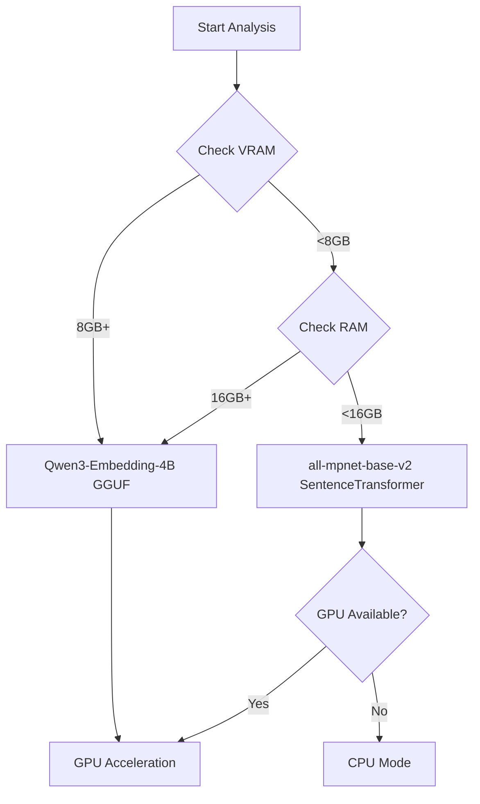

# Hardware Optimization Guide

> [!TIP]
> CRCT v8.0 automatically adapts to your hardware. This guide explains how the system selects models, optimizes performance, and how to fine-tune for your environment.

## Overview

Version 8.0 introduces **hardware-adaptive** behavior that automatically:
- Detects available VRAM, RAM, and CPU resources
- Selects optimal embedding and reranking models
- Adjusts batch sizes for maximum throughput
- Manages memory usage during analysis

**Zero configuration required** - the system works out of the box. This guide helps you understand and optimize the defaults.

---

## Automatic Model Selection

### Decision Tree



### Model Profiles

#### Qwen3-Embedding-4B-Q6_K (GGUF)

**Use When**: VRAM ≥8GB OR RAM ≥16GB

| Specification | Value |
|---------------|-------|
| **Size** | ~2.4GB |
| **Context Length** | 32,768 tokens |
| **Dimensions** | 2560 |
| **Speed (GPU)** | ~50 docs/sec |
| **Speed (CPU)** | ~5 docs/sec |
| **Accuracy** | ★★★★★ Excellent |

**Advantages**:
- Handles very large files (up to 32k tokens)
- Best semantic understanding
- Quantized for efficiency

**Requirements**:
- `llama-cpp-python` package
- CUDA for GPU acceleration

#### all-mpnet-base-v2 (SentenceTransformer)

**Use When**: VRAM <8GB AND RAM <16GB

| Specification | Value |
|---------------|-------|
| **Size** | ~420MB |
| **Context Length** | 512 tokens |
| **Dimensions** | 384 |
| **Speed (GPU)** | ~200 docs/sec |
| **Speed (CPU)** | ~50 docs/sec |
| **Accuracy** | ★★★★☆ Very Good |

**Advantages**:
- Lightweight, fast
- Well-suited for smaller files
- Lower resource requirements

**Limitations**:
- Context length limited to 512 tokens
- Slightly lower accuracy than Qwen3

---

## Batch Size Optimization

### Automatic Sizing

The system determines optimal batch sizes based on available VRAM:

```python
def get_optimal_batch_size():
    vram_gb = get_available_vram()
    
    if vram_gb >= 6:
        return 256
    elif vram_gb >= 4:
        return 128
    elif vram_gb >= 2:
        return 64
    else:
        return 32  # CPU or low VRAM
```

### Performance Impact

| Batch Size | Files/Second (GPU) | Memory Usage | Recommended For |
|------------|-------------------|--------------|-----------------|
| **256** | ~200 | ~4GB VRAM | RTX 3060+, 6GB+ VRAM |
| **128** | ~150 | ~2GB VRAM | RTX 2060, 4GB+ VRAM |
| **64** | ~100 | ~1GB VRAM | GTX 1650, 2GB+ VRAM |
| **32** | ~50 | ~512MB VRAM/RAM | CPU or old GPU |

### Manual Override

Force specific batch size in `.clinerules.config.json`:

```json
{
  "embedding": {
    "batch_size": 128,  # Fixed size
    "auto_select_model": true
  }
}
```

---

## Resource Detection

### VRAM Detection

```python
# Automatic CUDA VRAM detection
import torch
if torch.cuda.is_available():
    vram_bytes = torch.cuda.get_device_properties(0).total_memory
    vram_gb = vram_bytes / (1024**3)
```

### RAM Detection

```python
# System RAM detection
import psutil
ram_bytes = psutil.virtual_memory().total
ram_gb = ram_bytes / (1024**3)
```

### CPU Detection

```python
# CPU core count for parallelism
import os
cpu_count = os.cpu_count() or 4
max_workers = min(cpu_count * 4, 64)
```

---

## Performance Profiles

### High-End Workstation

**Hardware**:
- GPU: RTX 4090 (24GB VRAM)
- RAM: 64GB DDR5
- CPU: AMD Ryzen 9 7950X (16 cores)

**Configuration** (Auto-Selected):
```json
{
  "embedding": {
    "model": "Qwen3-Embedding-4B-Q6_K",
    "batch_size": 256,
    "device": "cuda"
  }
}
```

**Performance**:
- **1000 files**: ~2 minutes
- **5000 files**: ~8 minutes
- **Reranking (20 pairs)**: ~4 seconds

### Mid-Range Desktop

**Hardware**:
- GPU: RTX 3060 (12GB VRAM)
- RAM: 32GB DDR4
- CPU: Intel i7-12700K (12 cores)

**Configuration** (Auto-Selected):
```json
{
  "embedding": {
    "model": "Qwen3-Embedding-4B-Q6_K",
    "batch_size": 256,
    "device": "cuda"
  }
}
```

**Performance**:
- **1000 files**: ~3 minutes
- **5000 files**: ~12 minutes
- **Reranking (20 pairs)**: ~6 seconds

### Entry-Level Laptop

**Hardware**:
- GPU: GTX 1650 (4GB VRAM)
- RAM: 16GB DDR4
- CPU: Intel i5-10300H (4 cores)

**Configuration** (Auto-Selected):
```json
{
  "embedding": {
    "model": "all-mpnet-base-v2",
    "batch_size": 64,
    "device": "cuda"
  }
}
```

**Performance**:
- **1000 files**: ~8 minutes
- **5000 files**: ~35 minutes
- **Reranking (20 pairs)**: ~15 seconds

### CPU-Only System

**Hardware**:
- CPU: AMD Ryzen 7 5800X (8 cores)
- RAM: 32GB DDR4
- GPU: None

**Configuration** (Auto-Selected):
```json
{
  "embedding": {
    "model": "all-mpnet-base-v2",
    "batch_size": 32,
    "device": "cpu"
  }
}
```

**Performance**:
- **1000 files**: ~15 minutes
- **5000 files**: ~60 minutes
- **Reranking (20 pairs)**: ~30 seconds

---

## Memory Management

### Peak Memory Usage

During analysis, memory usage peaks during:

1. **Embedding Generation**: Batch size × model size
2. **Reranker Loading**: ~2GB (Qwen3 model in VRAM)
3. **Symbol Map Generation**: ~5MB per 1000 files

### Automatic Unloading

The system automatically unloads reranker after suggestions:

```python
# After dependency suggestion phase
unload_reranker_model()
torch.cuda.empty_cache()  # Free VRAM
```

### Cache Compression

Cache manager compresses large items:

```python
# Items >1KB compressed with gzip
if size > 1024:
    compressed = gzip.compress(pickle.dumps(value))
    if len(compressed) < len(original) * 0.9:  # 10% savings
        store_compressed(compressed)
```

**Typical Savings**: 30-50% for large projects

---

## Optimization Strategies

### Strategy 1: Upgrade VRAM

**Impact**: Allows larger batch sizes and better models

| Before | After | Speedup |
|--------|-------|---------|
| 4GB VRAM → 8GB VRAM | 3x faster | Qwen3 + batch 256 |
| CPU → GPU (any) | 10x faster | GPU acceleration |

**ROI**: Highest impact upgrade for CRCT performance

### Strategy 2: Reduce Scan Limit

**Impact**: Trade accuracy for speed

```json
{
  "analysis": {
    "max_reranker_scans": 10  // Default: 20
  }
}
```

- **Time Saved**: ~50% on reranking
- **Accuracy Loss**: Minimal (top pairs still scanned)

### Strategy 3: Increase RAM

**Impact**: Enables Qwen3 model on systems without GPU

| Before | After | Benefit |
|--------|-------|---------|
| 8GB RAM → 16GB RAM | Better model | Qwen3 instead of mpnet |
| 16GB RAM → 32GB RAM | Larger batches | Slightly faster |

### Strategy 4: Parallel Workers

**Impact**: Better CPU utilization

```json
{
  "performance": {
    "max_workers": 16  // auto: cpu_count * 4
  }
}
```

**Recommended**: Leave at `auto` unless you know what you're doing

### Strategy 5: Disable Features

For extremely constrained environments:

```json
{
  "analysis": {
    "reranker_enabled": false,  // Fastest, but less accurate
    "runtime_inspection_enabled": false  // Skip deep analysis
  }
}
```

---

## Troubleshooting

### Issue: "Out of memory" during embedding

**Symptoms**: Process killed or crashes

**Solutions**:

1. **Reduce batch size**:
   ```json
   {"embedding": {"batch_size": 32}}
   ```

2. **Force smaller model**:
   ```json
   {"embedding": {"model_name": "all-mpnet-base-v2"}}
   ```

3. **Increase system RAM** or **close other applications**

### Issue: "CUDA out of memory"

**Symptoms**: CUDA error during GPU operations

**Solutions**:

1. **Clear CUDA cache**:
   ```python
   import torch
   torch.cuda.empty_cache()
   ```

2. **Reduce batch size**:
   ```json
   {"embedding": {"batch_size": 64}}
   ```

3. **Force CPU mode**:
   ```json
   {"compute": {"embedding_device": "cpu"}}
   ```

### Issue: Analysis very slow

**Diagnosis**:
```bash
# Check what's slow
grep "took" cline_docs/debug.txt | tail -20
```

**Solutions**:

| Slow Phase | Fix |
|------------|-----|
| **Embedding** | Reduce batch size or upgrade GPU |
| **Reranking** | Reduce scan limit or disable |
| **File Analysis** | Normal - wait or exclude large dirs |

---

## Benchmarks

### Embedding Generation

| Model | Device | 1000 Files | 5000 Files |
|-------|--------|------------|------------|
| Qwen3 | RTX 4090 | 1.5 min | 6 min |
| Qwen3 | RTX 3060 | 2.5 min | 10 min |
| Qwen3 | CPU (16-core) | 8 min | 35 min |
| mpnet | RTX 3060 | 0.5 min | 2 min |
| mpnet | CPU (8-core) | 2 min | 9 min |

### Reranking (20 pairs)

| Device | Time |
|--------|------|
| RTX 4090 | 3s |
| RTX 3060 | 5s |
| GTX 1650 | 12s |
| CPU (16-core) | 25s |
| CPU (8-core) | 40s |

### Total Analysis Time

**Project**: 2000 Python files, ~500KB total

| Configuration | Time | Quality |
|---------------|------|---------|
| RTX 4090 + Qwen3 | 5 min | ★★★★★ |
| RTX 3060 + Qwen3 | 8 min | ★★★★★ |
| GTX 1650 + mpnet | 15 min | ★★★★☆ |
| CPU (16-core) + mpnet | 30 min | ★★★★☆ |

---

## Advanced Configuration

### Custom Model Paths

Use local models instead of downloading:

```json
{
  "models": {
    "embedding_model_path": "/path/to/model.gguf",
    "reranker_model_path": "/path/to/reranker"
  }
}
```

### Device Selection

Override auto-detection:

```json
{
  "compute": {
    "embedding_device": "cuda:1",  // Use second GPU
    "reranker_device": "cuda:0"    // Use first GPU
  }
}
```

### Context Length Limits

Adjust for your use case:

```json
{
  "embedding": {
    "max_context_length": 16384,  // Default: 32768
    "ses_max_chars": 2000  // Default: 4000
  }
}
```

Lower values = faster but less context.

---

## Best Practices

### 1. Trust Auto-Selection

Let the system choose models and batch sizes unless:
- ✅ You're debugging
- ✅ You have specific constraints
- ✅ You're benchmarking

### 2. Monitor Resource Usage

```bash
# During analysis
nvidia-smi  # GPU usage
htop  # CPU/RAM usage
```

Watch for:
- VRAM near 100% → reduce batch size
- RAM near 100% → reduce workers or batch size
- CPU near 100% → normal, but check if stuck

### 3. Upgrade Strategically

**Best ROI**:
1. **GPU** (if none) - 10x speedup
2. **VRAM** (4GB → 8GB+) - Better models
3. **RAM** (8GB → 16GB+) - Enable Qwen3
4. **CPU cores** (4 → 8+) - Faster parallel processing

### 4. Use Caching

Never disable caching unless debugging:
```json
{
  "caching": {
    "enabled": true,  // Keep true
    "cache_ttl_seconds": 604800  // 7 days
  }
}
```

### 5. Profile Before Optimizing

Measure first:
```bash
# Time analysis
time python -m cline_utils.dependency_system.dependency_processor analyze-project

# Check bottlenecks
grep "took" cline_docs/debug.txt
```

---

## Future Enhancements

Planned optimizations:

1. **Dynamic Batch Scaling** - Adjust mid-analysis based on memory
2. **Model Quantization Options** - Q4, Q5, Q6, Q8 variants
3. **Distributed Processing** - Multi-GPU support
4. **Streaming Embeddings** - Process as files are analyzed
5. **Incremental Analysis** - Only analyze changed files

---

## References

- [Model Selection Code](cline_utils/dependency_system/analysis/embedding_manager.py#L100)
- [Batch Size Optimizer](cline_utils/dependency_system/analysis/project_analyzer.py#L448)
- [Configuration Guide](CONFIGURATION.md)
- [SES Architecture](SES_ARCHITECTURE.md)

---

**Hardware optimization in v8.0 is automatic and intelligent.** The system adapts to your resources, ensuring the best possible performance without manual tuning. For most users, the defaults are optimal.
