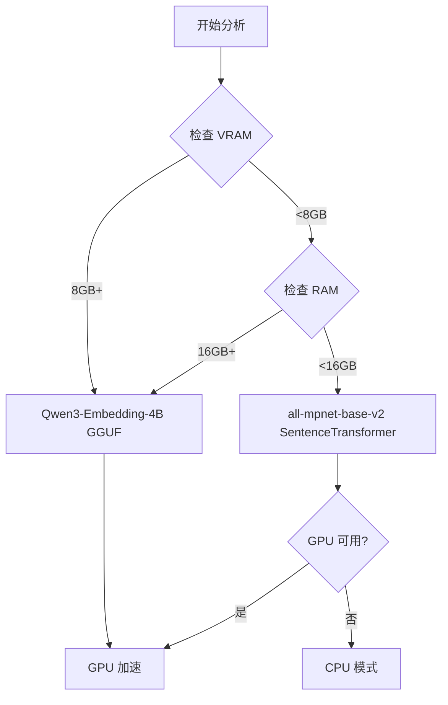

# 硬件优化指南

> [!TIP]
> CRCT v8.0 自动适应您的硬件。本指南解释了系统如何选择模型、优化性能以及如何针对您的环境进行微调。

## 概述

版本 8.0 引入了**硬件自适应**行为，可自动：
- 检测可用的 VRAM、RAM 和 CPU 资源
- 选择最佳的嵌入和重排序模型
- 调整批次大小以实现最大吞吐量
- 在分析期间管理内存使用

**无需配置** - 系统开箱即用。本指南帮助您理解和优化默认设置。

---

## 自动模型选择

### 决策树



### 模型配置文件

#### Qwen3-Embedding-4B-Q6_K (GGUF)

**使用场景**：VRAM ≥8GB 或 RAM ≥16GB

| 规格 | 值 |
|---------------|-------|
| **大小** | ~2.4GB |
| **上下文长度** | 32,768 tokens |
| **维度** | 2560 |
| **速度 (GPU)** | ~50 docs/sec |
| **速度 (CPU)** | ~5 docs/sec |
| **准确度** | ★★★★★ 优秀 |

**优势**：
- 处理非常大的文件（最多 32k tokens）
- 最佳语义理解
- 量化以提高效率

**要求**：
- `llama-cpp-python` 包
- 用于 GPU 加速的 CUDA

#### all-mpnet-base-v2 (SentenceTransformer)

**使用场景**：VRAM <8GB 且 RAM <16GB

| 规格 | 值 |
|---------------|-------|
| **大小** | ~420MB |
| **上下文长度** | 512 tokens |
| **维度** | 384 |
| **速度 (GPU)** | ~200 docs/sec |
| **速度 (CPU)** | ~50 docs/sec |
| **准确度** | ★★★★☆ 非常好 |

**优势**：
- 轻量级、快速
- 非常适合较小的文件
- 较低的资源要求

**限制**：
- 上下文长度限制为 512 tokens
- 准确度略低于 Qwen3

---

## 批次大小优化

### 自动调整大小

系统根据可用 VRAM 确定最佳批次大小：

```python
def get_optimal_batch_size():
    vram_gb = get_available_vram()

    if vram_gb >= 6:
        return 256
    elif vram_gb >= 4:
        return 128
    elif vram_gb >= 2:
        return 64
    else:
        return 32  # CPU 或低 VRAM
```

### 性能影响

| 批次大小 | 文件数/秒 (GPU) | 内存使用 | 推荐用于 |
|------------|-------------------|--------------|-----------------|
| **256** | ~200 | ~4GB VRAM | RTX 3060+, 6GB+ VRAM |
| **128** | ~150 | ~2GB VRAM | RTX 2060, 4GB+ VRAM |
| **64** | ~100 | ~1GB VRAM | GTX 1650, 2GB+ VRAM |
| **32** | ~50 | ~512MB VRAM/RAM | CPU 或旧 GPU |

### 手动覆盖

在 `.clinerules.config.json` 中强制指定批次大小：

```json
{
  "embedding": {
    "batch_size": 128,  # 固定大小
    "auto_select_model": true
  }
}
```

---

## 资源检测

### VRAM 检测

```python
# 自动 CUDA VRAM 检测
import torch
if torch.cuda.is_available():
    vram_bytes = torch.cuda.get_device_properties(0).total_memory
    vram_gb = vram_bytes / (1024**3)
```

### RAM 检测

```python
# 系统 RAM 检测
import psutil
ram_bytes = psutil.virtual_memory().total
ram_gb = ram_bytes / (1024**3)
```

### CPU 检测

```python
# CPU 核心数用于并行处理
import os
cpu_count = os.cpu_count() or 4
max_workers = min(cpu_count * 4, 64)
```

---

## 性能配置文件

### 高端工作站

**硬件**：
- GPU: RTX 4090 (24GB VRAM)
- RAM: 64GB DDR5
- CPU: AMD Ryzen 9 7950X (16 cores)

**配置**（自动选择）：
```json
{
  "embedding": {
    "model": "Qwen3-Embedding-4B-Q6_K",
    "batch_size": 256,
    "device": "cuda"
  }
}
```

**性能**：
- **1000 文件**：~2 分钟
- **5000 文件**：~8 分钟
- **重排序 (20 对)**：~4 秒

### 中端台式机

**硬件**：
- GPU: RTX 3060 (12GB VRAM)
- RAM: 32GB DDR4
- CPU: Intel i7-12700K (12 cores)

**配置**（自动选择）：
```json
{
  "embedding": {
    "model": "Qwen3-Embedding-4B-Q6_K",
    "batch_size": 256,
    "device": "cuda"
  }
}
```

**性能**：
- **1000 文件**：~3 分钟
- **5000 文件**：~12 分钟
- **重排序 (20 对)**：~6 秒

### 入门级笔记本电脑

**硬件**：
- GPU: GTX 1650 (4GB VRAM)
- RAM: 16GB DDR4
- CPU: Intel i5-10300H (4 cores)

**配置**（自动选择）：
```json
{
  "embedding": {
    "model": "all-mpnet-base-v2",
    "batch_size": 64,
    "device": "cuda"
  }
}
```

**性能**：
- **1000 文件**：~8 分钟
- **5000 文件**：~35 分钟
- **重排序 (20 对)**：~15 秒

### 仅 CPU 系统

**硬件**：
- CPU: AMD Ryzen 7 5800X (8 cores)
- RAM: 32GB DDR4
- GPU: 无

**配置**（自动选择）：
```json
{
  "embedding": {
    "model": "all-mpnet-base-v2",
    "batch_size": 32,
    "device": "cpu"
  }
}
```

**性能**：
- **1000 文件**：~15 分钟
- **5000 文件**：~60 分钟
- **重排序 (20 对)**：~30 秒

---

## 内存管理

### 峰值内存使用

在分析期间，内存使用在以下期间达到峰值：

1. **嵌入生成**：批次大小 × 模型大小
2. **重排序器加载**：~2GB（VRAM 中的 Qwen3 模型）
3. **符号映射生成**：每 1000 个文件 ~5MB

### 自动卸载

系统在建议后自动卸载重排序器：

```python
# 在依赖建议阶段之后
unload_reranker_model()
torch.cuda.empty_cache()  # 释放 VRAM
```

### 缓存压缩

缓存管理器压缩大项：

```python
# 大于 1KB 的项使用 gzip 压缩
if size > 1024:
    compressed = gzip.compress(pickle.dumps(value))
    if len(compressed) < len(original) * 0.9:  # 节省 10%
        store_compressed(compressed)
```

**典型节省**：大型项目 30-50%

---

## 优化策略

### 策略 1：升级 VRAM

**影响**：允许更大的批次大小和更好的模型

| 之前 | 之后 | 加速 |
|--------|-------|---------|
| 4GB VRAM → 8GB VRAM | 3倍快 | Qwen3 + batch 256 |
| CPU → GPU（任何） | 10倍快 | GPU 加速 |

**投资回报率**：CRCT 性能升级影响最大

### 策略 2：减少扫描限制

**影响**：用准确度换取速度

```json
{
  "analysis": {
    "max_reranker_scans": 10  // 默认: 20
  }
}
```

- **节省时间**：重排序约 50%
- **准确度损失**：最小（顶部对仍被扫描）

### 策略 3：增加 RAM

**影响**：在没有 GPU 的系统上启用 Qwen3 模型

| 之前 | 之后 | 好处 |
|--------|-------|---------|
| 8GB RAM → 16GB RAM | 更好的模型 | Qwen3 而非 mpnet |
| 16GB RAM → 32GB RAM | 更大的批次 | 稍快 |

### 策略 4：并行工作器

**影响**：更好的 CPU 利用率

```json
{
  "performance": {
    "max_workers": 16  // auto: cpu_count * 4
  }
}
```

**推荐**：除非您知道自己在做什么，否则保持 `auto`

### 策略 5：禁用功能

对于极度受限的环境：

```json
{
  "analysis": {
    "reranker_enabled": false,  // 最快，但准确度较低
    "runtime_inspection_enabled": false  // 跳过深度分析
  }
}
```

---

## 故障排除

### 问题："嵌入期间内存不足"

**症状**：进程被终止或崩溃

**解决方案**：

1. **减少批次大小**：
   ```json
   {"embedding": {"batch_size": 32}}
   ```

2. **强制使用更小的模型**：
   ```json
   {"embedding": {"model_name": "all-mpnet-base-v2"}}
   ```

3. **增加系统 RAM** 或 **关闭其他应用程序**

### 问题："CUDA 内存不足"

**症状**：GPU 操作期间的 CUDA 错误

**解决方案**：

1. **清除 CUDA 缓存**：
   ```python
   import torch
   torch.cuda.empty_cache()
   ```

2. **减少批次大小**：
   ```json
   {"embedding": {"batch_size": 64}}
   ```

3. **强制 CPU 模式**：
   ```json
   {"compute": {"embedding_device": "cpu"}}
   ```

### 问题：分析非常慢

**诊断**：
```bash
# 检查什么慢
grep "took" cline_docs/debug.txt | tail -20
```

**解决方案**：

| 慢阶段 | 修复 |
|------------|-----|
| **嵌入** | 减少批次大小或升级 GPU |
| **重排序** | 减少扫描限制或禁用 |
| **文件分析** | 正常 - 等待或排除大目录 |

---

## 基准测试

### 嵌入生成

| 模型 | 设备 | 1000 文件 | 5000 文件 |
|-------|--------|------------|------------|
| Qwen3 | RTX 4090 | 1.5 分钟 | 6 分钟 |
| Qwen3 | RTX 3060 | 2.5 分钟 | 10 分钟 |
| Qwen3 | CPU (16-core) | 8 分钟 | 35 分钟 |
| mpnet | RTX 3060 | 0.5 分钟 | 2 分钟 |
| mpnet | CPU (8-core) | 2 分钟 | 9 分钟 |

### 重排序（20 对）

| 设备 | 时间 |
|--------|------|
| RTX 4090 | 3秒 |
| RTX 3060 | 5秒 |
| GTX 1650 | 12秒 |
| CPU (16-core) | 25秒 |
| CPU (8-core) | 40秒 |

### 总分析时间

**项目**：2000 个 Python 文件，总计 ~500KB

| 配置 | 时间 | 质量 |
|---------------|------|---------|
| RTX 4090 + Qwen3 | 5 分钟 | ★★★★★ |
| RTX 3060 + Qwen3 | 8 分钟 | ★★★★★ |
| GTX 1650 + mpnet | 15 分钟 | ★★★★☆ |
| CPU (16-core) + mpnet | 30 分钟 | ★★★★☆ |

---

## 高级配置

### 自定义模型路径

使用本地模型而不是下载：

```json
{
  "models": {
    "embedding_model_path": "/path/to/model.gguf",
    "reranker_model_path": "/path/to/reranker"
  }
}
```

### 设备选择

覆盖自动检测：

```json
{
  "compute": {
    "embedding_device": "cuda:1",  // 使用第二个 GPU
    "reranker_device": "cuda:0"    // 使用第一个 GPU
  }
}
```

### 上下文长度限制

根据您的用例调整：

```json
{
  "embedding": {
    "max_context_length": 16384,  // 默认: 32768
    "ses_max_chars": 2000  // 默认: 4000
  }
}
```

较低的值 = 更快但上下文更少。

---

## 最佳实践

### 1. 信任自动选择

让系统选择模型和批次大小，除非：
- ✅ 您正在调试
- ✅ 您有特定的约束
- ✅ 您正在进行基准测试

### 2. 监控资源使用

```bash
# 在分析期间
nvidia-smi  # GPU 使用情况
htop  # CPU/RAM 使用情况
```

注意：
- VRAM 接近 100% → 减少批次大小
- RAM 接近 100% → 减少工作器或批次大小
- CPU 接近 100% → 正常，但检查是否卡住

### 3. 战略性升级

**最佳投资回报率**：
1. **GPU**（如果没有）- 10倍加速
2. **VRAM**（4GB → 8GB+）- 更好的模型
3. **RAM**（8GB → 16GB+）- 启用 Qwen3
4. **CPU 核心**（4 → 8+）- 更快的并行处理

### 4. 使用缓存

除非调试，否则永远不要禁用缓存：
```json
{
  "caching": {
    "enabled": true,  // 保持为 true
    "cache_ttl_seconds": 604800  // 7 天
  }
}
```

### 5. 优化前先分析

先测量：
```bash
# 计时分析
time python -m cline_utils.dependency_system.dependency_processor analyze-project

# 检查瓶颈
grep "took" cline_docs/debug.txt
```

---

## 未来增强

计划中的优化：

1. **动态批次缩放** - 根据内存在分析中期调整
2. **模型量化选项** - Q4、Q5、Q6、Q8 变体
3. **分布式处理** - 多 GPU 支持
4. **流式嵌入** - 在分析文件时处理
5. **增量分析** - 仅分析更改的文件

---

## 参考

- [模型选择代码](cline_utils/dependency_system/analysis/embedding_manager.py#L100)
- [批次大小优化器](cline_utils/dependency_system/analysis/project_analyzer.py#L448)
- [配置指南](CONFIGURATION.md)
- [SES 架构](SES_ARCHITECTURE.md)

---

**v8.0 中的硬件优化是自动且智能的。**系统适应您的资源，确保在不需要手动调整的情况下获得最佳性能。对于大多数用户，默认设置是最佳的。
