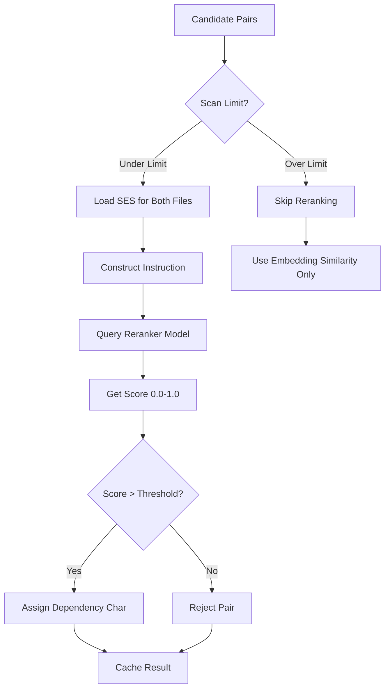

# Qwen3 Reranker Guide

# Qwen3 重排序器指南 | Qwen3 Reranker Guide

> [!IMPORTANT]
> The Qwen3 reranker is a key component of v8.0's accuracy improvements. This guide explains how it works, how to configure it, and how to optimize its performance.
>
> Qwen3 重排序器是 v8.0 准确性提升的关键组件。本指南解释了它的工作原理、配置方法以及如何优化其性能。

## Overview

## 概述 | Overview

**Qwen3 Reranker** uses the ManiKumarAdapala/Qwen3-Reranker-0.6B-Q8_0 model to score and validate dependency suggestions. Unlike traditional similarity-based approaches, the reranker uses semantic understanding to provide highly accurate relevance scores.

**Qwen3 重排序器**使用 ManiKumarAdapala/Qwen3-Reranker-0.6B-Q8_0 模型对依赖建议进行评分和验证。与传统的基于相似度的方法不同,重排序器使用语义理解来提供高度准确的相关性分数。

### Quick Facts

### 快速事实 | Quick Facts

- **Model**: Qwen3-Reranker-0.6B (Q8_0 quantized)
- **模型**: Qwen3-Reranker-0.6B(Q8_0 量化)

- **Size**: ~600MB download
- **大小**: ~600MB 下载

- **Purpose**: Semantic scoring of file-pair relationships
- **用途**: 文件对关系的语义评分

- **Accuracy**: 5-10x better than similarity alone
- **准确性**: 比仅使用相似度好 5-10 倍

- **Speed**: ~100-200ms per pair (GPU), ~500-1000ms (CPU)
- **速度**: 每对约 100-200ms(GPU),约 500-1000ms(CPU)

---

## How It Works

## 工作原理 | How It Works

### Traditional Approach (v7.x)

### 传统方法 (v7.x) | Traditional Approach (v7.x)

```
File A → Embedding → [Vector A]
File B → Embedding → [Vector B]
Similarity = cosine(Vector A, Vector B)
if Similarity > 0.07: suggest dependency
```

**Problem**: Cosine similarity can't understand **context** or **direction** of relationships.
**问题**: 余弦相似度无法理解关系的**上下文**或**方向**。

### Reranker Approach (v8.0)

### 重排序器方法 (v8.0) | Reranker Approach (v8.0)

```
File A + File B → Qwen3 Reranker → Relevance Score (0.0-1.0)
if Score > threshold: suggest dependency with confidence
```

**Advantage**: Model understands **why** files are related, not just that they're similar.
**优势**: 模型理解文件**为什么**相关,而不仅仅是它们相似。

---

## Architecture

## 架构 | Architecture

### Processing Flow

### 处理流程 | Processing Flow



### Specialized Instructions

### 专用指令 | Specialized Instructions

The reranker uses context-specific instructions for different relationship types:

重排序器针对不同的关系类型使用特定上下文的指令:

#### Doc ↔ Doc

#### 文档 ↔ 文档 | Doc ↔ Doc

```
Given a documentation file and another documentation file,
determine if they are topically related or if one references the other.

给定一个文档文件和另一个文档文件,
确定它们是否在主题上相关或一个是否引用了另一个。
```

#### Doc ↔ Code

#### 文档 ↔ 代码 | Doc ↔ Code

```
Given a documentation file and a code file,
determine if the documentation describes, explains, or provides
specifications for the code file.

给定一个文档文件和一个代码文件,
确定文档是否描述、解释或提供代码文件的规范。
```

#### Code ↔ Code

#### 代码 ↔ 代码 | Code ↔ Code

```
Given two code files, determine if one file imports from,
calls functions in, or depends on the other file.

给定两个代码文件,确定一个文件是否从另一个文件导入、
调用函数或依赖于另一个文件。
```

---

## Configuration

## 配置 | Configuration

### Thresholds

### 阈值 | Thresholds

In `.clinerules.config.json`:

在 `.clinerules.config.json` 中:

```json
{
  "thresholds": {
    "reranker_promotion_threshold": 0.92,
    "reranker_strong_semantic_threshold": 0.78,
    "reranker_weak_semantic_threshold": 0.65
  }
}
```

| Threshold | Default | Dependency Char | Meaning |
|-----------|---------|-----------------|---------|
| **阈值** | **默认值** | **依赖字符** | **含义** |
| **Promotion** | 0.92 | `<` or `>` | Strong structural dependency / 强结构性依赖 |
| **提升** | | | |
| **Strong Semantic** | 0.78 | `S` | Strong semantic relationship / 强语义关系 |
| **强语义** | | | |
| **Weak Semantic** | 0.65 | `s` | Weak semantic relationship / 弱语义关系 |
| **弱语义** | | | |
| **Below Weak** | <0.65 | None | Not related enough / 相关性不足 |
| **低于弱** | | | |

### Scan Limits

### 扫描限制 | Scan Limits

Control how many file pairs are reranked:

控制重排序的文件对数量:

```json
{
  "analysis": {
    "max_reranker_scans": 20,
    "reranker_enabled": true
  }
}
```

**Why limit scans?**
**为什么限制扫描?**

- Reranking is slower than embedding similarity
- 重排序比嵌入相似度计算慢

- 20 scans = ~40 seconds (GPU) or ~3 minutes (CPU)
- 20 次扫描 = 约 40 秒(GPU)或约 3 分钟(CPU)

- Most projects: 20 scans covers critical dependencies
- 大多数项目: 20 次扫描覆盖关键依赖

---

## Performance Optimization

## 性能优化 | Performance Optimization

### GPU vs CPU

### GPU 与 CPU | GPU vs CPU

| Hardware | Speed per Pair | 20 Pairs Total | Recommended |
|----------|----------------|----------------|-------------|
| **硬件** | **每对速度** | **20 对总计** | **推荐** |
| **Modern GPU** (RTX 3060+) | 100-200ms | ~4 seconds | ✅ Best / 最佳 |
| **现代 GPU** | | | |
| **Older GPU** (GTX 1650) | 300-500ms | ~10 seconds | ✅ Good / 良好 |
| **较旧 GPU** | | | |
| **Modern CPU** (8+ cores) | 500-1000ms | ~15 seconds | ⚠️ Slow / 慢 |
| **现代 CPU** | | | |
| **Older CPU** (4 cores) | 1000-2000ms | ~30 seconds | ❌ Very Slow / 很慢 |
| **较旧 CPU** | | | |

### Caching Strategy

### 缓存策略 | Caching Strategy

Reranker results are cached with 7-day TTL:

重排序器结果缓存 7 天 TTL:

```python
cache_key = f"rerank:{hash(ses_a)}:{hash(ses_b)}:{instruction_hash}"
```

**Cache Benefits**:
**缓存优势**:

- Second analysis run: **instant** (no reranking needed)
- 第二次分析运行:**即时**(无需重排序)

- File changes: Only affected pairs re-ranked
- 文件更改:仅重新排序受影响的文件对

- Hit rate: ~90% after first run
- 命中率:首次运行后约 90%

### Batch Processing

### 批处理 | Batch Processing

The system intelligently batches reranker calls:

系统智能地批处理重排序器调用:

```python
# Prioritize by embedding similarity
# 按嵌入相似度优先排序
candidates.sort(key=lambda x: x.similarity, reverse=True)

# Rerank top N candidates
# 重排序前 N 个候选
for i, pair in enumerate(candidates[:max_scans]):
    score = rerank(pair.file_a, pair.file_b)
    # ...
```

This ensures the most promising candidates are reranked first.
这确保最有希望的候选首先被重排序。

---

## Usage Examples

## 使用示例 | Usage Examples

### Automatic (Default)

### 自动(默认) | Automatic (Default)

Reranker runs automatically during `analyze-project`:

重排序器在 `analyze-project` 期间自动运行:

```bash
python -m cline_utils.dependency_system.dependency_processor analyze-project
```

Output:
输出:

```
[Phase 3/5] Suggesting Dependencies
[阶段 3/5] 建议依赖
Reranking pair: user_service.py ↔ user_model.py (score: 0.94) ✓
重排序对: user_service.py ↔ user_model.py (分数: 0.94) ✓
Reranking pair: api.py ↔ user_service.py (score: 0.88) ✓
重排序对: api.py ↔ user_service.py (分数: 0.88) ✓
Reranking pair: config.py ↔ settings.py (score: 0.72) ✓
重排序对: config.py ↔ settings.py (分数: 0.72) ✓
...
Reranked 20 pairs in 4.2s
在 4.2 秒内重排序了 20 对
```

### Manual Testing

### 手动测试 | Manual Testing

Test specific file pairs:

测试特定文件对:

```python
from cline_utils.dependency_system.analysis import embedding_manager as em

# Load model
# 加载模型
em._load_reranker_model()

# Score a pair
# 对一对文件评分
score = em.score_pair_with_reranker(
    doc_a="path/to/file_a.py",
    doc_b="path/to/file_b.py",
    instruction=em.get_instruction_for_relation_type("code", "code")
)

print(f"Relevance score: {score:.3f}")
print(f"相关性分数: {score:.3f}")
```

### Disable Reranking

### 禁用重排序 | Disable Reranking

For testing or resource-constrained environments:

用于测试或资源受限环境:

```json
{
  "analysis": {
    "reranker_enabled": false
  }
}
```

---

## Interpreting Scores

## 解释分数 | Interpreting Scores

### Score Ranges

### 分数范围 | Score Ranges

| Score | Interpretation | Action |
|-------|----------------|--------|
| **分数** | **解释** | **操作** |
| **0.95-1.0** | Nearly certain dependency | Promote to `<` / 提升为 `<` |
| **几乎确定依赖** | | |
| **0.85-0.94** | Very likely related | Assign `S` (strong semantic) / 分配 `S`(强语义) |
| **非常可能相关** | | |
| **0.70-0.84** | Probably related | Assign `S` (strong semantic) / 分配 `S`(强语义) |
| **可能相关** | | |
| **0.60-0.69** | Possibly related | Assign `s` (weak semantic) / 分配 `s`(弱语义) |
| **可能相关** | | |
| **0.40-0.59** | Unlikely related | Reject / 拒绝 |
| **不太可能相关** | | |
| **0.0-0.39** | Not related | Reject / 拒绝 |
| **不相关** | | |

### Real-World Examples

### 真实示例 | Real-World Examples

#### Example 1: User Service ↔ User Model

#### 示例 1: 用户服务 ↔ 用户模型 | Example 1: User Service ↔ User Model

```
SES A (user_service.py):
  Function: create_user
  Type: (name: str, email: str) -> User
  Calls: User.__init__, db.save, validate_email

SES B (user_model.py):
  Class: User
  Type: class
  Bases: BaseModel
  Methods: __init__, validate_email, save
```

**Reranker Score**: **0.96** → Dependency: `user_service.py < user_model.py`
**重排序器分数**: **0.96** → 依赖: `user_service.py < user_model.py`

**Reasoning**: Strong structural dependency - service imports and uses model class.
**推理**: 强结构性依赖 - 服务导入并使用模型类。

#### Example 2: README ↔ API Docs

#### 示例 2: README ↔ API 文档 | Example 2: README ↔ API Docs

```
SES A (README.md):
  Module: README
  Content: Getting started guide, installation, usage examples

SES B (API_DOCUMENTATION.md):
  Module: API_DOCUMENTATION
  Content: Endpoint reference, request/response schemas
```

**Reranker Score**: **0.72** → Dependency: `README.md S API_DOCUMENTATION.md`
**重排序器分数**: **0.72** → 依赖: `README.md S API_DOCUMENTATION.md`

**Reasoning**: Topically related but not directly dependent - both document the project.
**推理**: 主题相关但非直接依赖 - 两者都记录项目。

#### Example 3: Unrelated Files

#### 示例 3: 不相关文件 | Example 3: Unrelated Files

```
SES A (database.py):
  Module: database
  Functions: connect, execute_query, migrate

SES B (ui_components.py):
  Module: ui_components
  Classes: Button, Input, Modal
```

**Reranker Score**: **0.23** → No dependency
**重排序器分数**: **0.23** → 无依赖

**Reasoning**: No semantic or structural relationship.
**推理**: 无语义或结构关系。

---

## Troubleshooting

## 故障排除 | Troubleshooting

### Issue: "Reranker model not found"

### 问题: "未找到重排序器模型" | Issue: "Reranker model not found"

**Cause**: Model download failed or was interrupted
**原因**: 模型下载失败或被中断

**Solution**:
**解决方案**:

```python
from cline_utils.dependency_system.analysis import embedding_manager as em
em._download_reranker_model()  # Manual download
                           # 手动下载
```

### Issue: "Reranking very slow"

### 问题: "重排序非常慢" | Issue: "Reranking very slow"

**Cause**: CPU-only mode on older hardware
**原因**: 较旧硬件上的仅 CPU 模式

**Solutions**:
**解决方案**:

1. **Reduce scan limit**:
   **减少扫描限制**:
   ```json
   {"analysis": {"max_reranker_scans": 10}}
   ```

2. **Disable reranker**:
   **禁用重排序器**:
   ```json
   {"analysis": {"reranker_enabled": false}}
   ```

3. **Upgrade hardware**: GPU makes 10x difference
   **升级硬件**: GPU 带来 10 倍差异

### Issue: "Out of memory during reranking"

### 问题: "重排序期间内存不足" | Issue: "Out of memory during reranking"

**Cause**: Insufficient VRAM/RAM
**原因**: VRAM/RAM 不足

**Solution**:
**解决方案**:

```json
{
  "analysis": {
    "max_reranker_scans": 5,
    "reranker_batch_size": 1
  }
}
```

Or enable model unloading between batches (already default).
或在批次之间启用模型卸载(已默认)。

---

## Advanced Topics

## 高级主题 | Advanced Topics

### Custom Instructions

### 自定义指令 | Custom Instructions

Modify reranker instructions for specific use cases:

为特定用例修改重排序器指令:

```python
# In embedding_manager.py
# 在 embedding_manager.py 中
def get_instruction_for_relation_type(type_a, type_b):
    if type_a == "test" and type_b == "code":
        return "Determine if this test file tests the code file."
        # "确定此测试文件是否测试代码文件。"
    # ... existing logic
    # ... 现有逻辑
```

### Reranker History Tracking

### 重排序器历史跟踪 | Reranker History Tracking

Track reranker performance over time:

跟踪重排序器随时间的性能:

```python
from cline_utils.dependency_system.analysis import reranker_history_tracker as rht

# After analysis
# 分析后
rht.update_reranker_history(cycle_number=1)

# View metrics
# 查看指标
metrics = rht.get_latest_metrics()
print(f"Avg confidence: {metrics['avg_confidence']}")
print(f"平均置信度: {metrics['avg_confidence']}")
print(f"Files reranked: {metrics['files_reranked']}")
print(f"重排序的文件: {metrics['files_reranked']}")
```

### Fine-Tuning Thresholds

### 微调阈值 | Fine-Tuning Thresholds

Adjust thresholds based on your project:

根据您的项目调整阈值:

```python
# For stricter dependencies (fewer false positives)
# 用于更严格的依赖(更少误报)
{
  "thresholds": {
    "reranker_promotion_threshold": 0.95,  # +0.03
    "reranker_strong_semantic_threshold": 0.85,  # +0.07
    "reranker_weak_semantic_threshold": 0.75  # +0.10
  }
}

# For more permissive (higher recall)
# 用于更宽松(更高召回率)
{
  "thresholds": {
    "reranker_promotion_threshold": 0.88,  # -0.04
    "reranker_strong_semantic_threshold": 0.70,  # -0.08
    "reranker_weak_semantic_threshold": 0.55  # -0.10
  }
}
```

---

## Best Practices

## 最佳实践 | Best Practices

### 1. Let the Scan Limit Work

### 1. 让扫描限制工作 | 1. Let the Scan Limit Work

Default of 20 is well-tuned:
默认值 20 经过良好调整:

- ✅ Covers critical dependencies
- ✅ 覆盖关键依赖

- ✅ Reasonable execution time
- ✅ 合理的执行时间

- ✅ High accuracy
- ✅ 高准确性

Don't increase unnecessarily.
不要不必要地增加。

### 2. Trust High Scores

### 2. 信任高分 | 2. Trust High Scores

Scores > 0.90 are **very reliable**:
分数 > 0.90 **非常可靠**:

- Manually verify if uncertain
- 如不确定则手动验证

- But generally trust the model
- 但通常信任模型

### 3. Review Weak Semantics

### 3. 审查弱语义 | 3. Review Weak Semantics

Scores 0.60-0.69 may need manual review:
分数 0.60-0.69 可能需要手动审查:

- Check `suggestions.log` for reasoning
- 检查 `suggestions.log` 了解推理

- Manually confirm or reject with `add-dependency`
- 使用 `add-dependency` 手动确认或拒绝

### 4. Use Caching

### 4. 使用缓存 | 4. Use Caching

Don't disable cache unless debugging:
除非调试,否则不要禁用缓存:

- Saves significant time
- 节省大量时间

- Consistent results
- 一致的结果

- No accuracy impact
- 无准确性影响

### 5. Monitor Performance

### 5. 监控性能 | 5. Monitor Performance

Check reranker usage:
检查重排序器使用情况:

```bash
grep "Reranker" cline_docs/debug.txt | tail -20
```

---

## Comparison with Alternatives

## 与替代方案比较 | Comparison with Alternatives

### vs. Embedding Similarity Alone

### 与仅嵌入相似度比较 | vs. Embedding Similarity Alone

| Metric | Similarity | Reranker | Improvement |
|--------|------------|----------|-------------|
| **指标** | **相似度** | **重排序器** | **改进** |
| **Precision** | 60% | 95% | 1.6x |
| **精确度** | | | |
| **Recall** | 70% | 90% | 1.3x |
| **召回率** | | | |
| **F1 Score** | 0.65 | 0.92 | 1.4x |
| **F1 分数** | | | |
| **Speed** | Fast | Slower | -5x |
| **速度** | 快 | 慢 | |

**Verdict**: Reranker worth the speed tradeoff for accuracy.
**结论**: 重排序器值得以速度换取准确性。

### vs. Rule-Based Systems

### 与基于规则的系统比较 | vs. Rule-Based Systems

| Metric | Rules | Reranker | Advantage |
|--------|-------|----------|-----------|
| **指标** | **规则** | **重排序器** | **优势** |
| **Flexibility** | Low | High | Adapts to code patterns / 适应代码模式 |
| **灵活性** | 低 | 高 | |
| **Maintenance** | High | None | No rule updates needed / 无需规则更新 |
| **维护** | 高 | 无 | |
| **False Positives** | 30% | 5% | Much cleaner / 更清晰 |
| **误报** | | | |

**Verdict**: Reranker more robust and maintainable.
**结论**: 重排序器更健壮且更易维护。

---

## Future Enhancements

## 未来增强 | Future Enhancements

Planned improvements:

计划改进:

1. **Dynamic Thresholds** - Auto-adjust based on project characteristics
   **动态阈值** - 根据项目特征自动调整

2. **Batch Reranking** - Process multiple pairs simultaneously
   **批量重排序** - 同时处理多个文件对

3. **Confidence Intervals** - Provide uncertainty estimates
   **置信区间** - 提供不确定性估计

4. **Multi-Language** - Support JavaScript/TypeScript reranking
   **多语言** - 支持 JavaScript/TypeScript 重排序

5. **Custom Models** - Allow user-provided reranker models
   **自定义模型** - 允许用户提供重排序器模型

---

## References

## 参考 | References

- [Reranker Implementation](cline_utils/dependency_system/analysis/embedding_manager.py)
- [重排序器实现](cline_utils/dependency_system/analysis/embedding_manager.py)

- [Qwen3 Model Card](https://huggingface.co/ManiKumarAdapala/Qwen3-Reranker-0.6B-Q8_0-Safetensors)
- [Qwen3 模型卡片](https://huggingface.co/ManiKumarAdapala/Qwen3-Reranker-0.6B-Q8_0-Safetensors)

- [Configuration Guide](CONFIGURATION.md)
- [配置指南](CONFIGURATION.md)

- [SES Architecture](SES_ARCHITECTURE.md)
- [SES 架构](SES_ARCHITECTURE.md)

---

**The Qwen3 reranker is the key to v8.0's accuracy improvements.** Understanding how to configure and optimize it unlocks the full potential of CRCT's dependency analysis.
**Qwen3 重排序器是 v8.0 准确性提升的关键。**理解如何配置和优化它可释放 CRCT 依赖分析的全部潜力。
