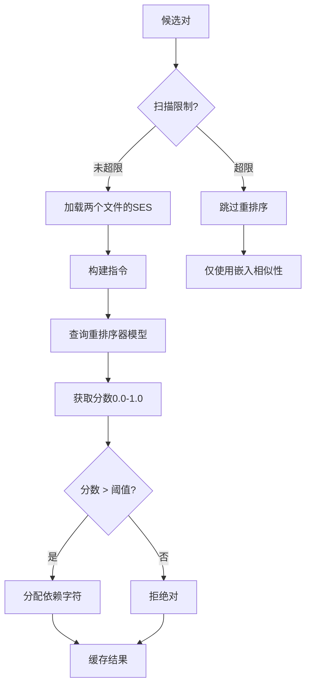

# Qwen3重排序器指南

> [!IMPORTANT]
> Qwen3重排序器是v8.0准确性改进的关键组件。本指南解释了它的工作原理、如何配置以及如何优化其性能。

## 概述

**Qwen3重排序器（Qwen3 Reranker）**使用ManiKumarAdapala/Qwen3-Reranker-0.6B-Q8_0模型对依赖建议进行评分和验证。与传统的基于相似性的方法不同，重排序器使用语义理解提供高度准确的相关性分数。

### 快速信息

- **模型**: Qwen3-Reranker-0.6B（Q8_0量化）
- **大小**: 约600MB下载
- **目的**: 文件对关系的语义评分
- **准确性**: 比单独相似性好5-10倍
- **速度**: 每对约100-200ms（GPU），约500-1000ms（CPU）

---

## 工作原理

### 传统方法（v7.x）

```
文件A → 嵌入 → [向量A]
文件B → 嵌入 → [向量B]
相似性 = cosine(向量A, 向量B)
if 相似性 > 0.07: 建议依赖
```

**问题**：余弦相似性无法理解关系的**上下文**或**方向**。

### 重排序器方法（v8.0）

```
文件A + 文件B → Qwen3重排序器 → 相关性分数（0.0-1.0）
if 分数 > 阈值: 建议依赖并带置信度
```

**优势**：模型理解文件**为何**相关，而不仅仅是它们相似。

---

## 架构

### 处理流程



### 专门指令

重排序器针对不同关系类型使用上下文特定的指令：

#### Doc ↔ Doc
```
给定一个文档文件和另一个文档文件，
确定它们在主题上是否相关或一个是否引用另一个。
```

#### Doc ↔ Code
```
给定一个文档文件和一个代码文件，
确定文档是否描述、解释或为代码文件提供规范。
```

#### Code ↔ Code
```
给定两个代码文件，确定一个文件是否从另一个文件导入、
调用函数或依赖另一个文件。
```

---

## 配置

### 阈值

在`.clinerules.config.json`中：

```json
{
  "thresholds": {
    "reranker_promotion_threshold": 0.92,
    "reranker_strong_semantic_threshold": 0.78,
    "reranker_weak_semantic_threshold": 0.65
  }
}
```

| 阈值 | 默认值 | 依赖字符 | 含义 |
|-----------|---------|-----------------|---------|
| **提升** | 0.92 | `<` 或 `>` | 强结构依赖 |
| **强语义** | 0.78 | `S` | 强语义关系 |
| **弱语义** | 0.65 | `s` | 弱语义关系 |
| **低于弱** | <0.65 | 无 | 关联不够 |

### 扫描限制

控制重排序多少文件对：

```json
{
  "analysis": {
    "max_reranker_scans": 20,
    "reranker_enabled": true
  }
}
```

**为何限制扫描？**
- 重排序比嵌入相似性慢
- 20次扫描 = 约40秒（GPU）或约3分钟（CPU）
- 大多数项目：20次扫描覆盖关键依赖

---

## 性能优化

### GPU vs CPU

| 硬件 | 每对速度 | 20对总计 | 推荐 |
|----------|----------------|----------------|-------------|
| **现代GPU**（RTX 3060+） | 100-200ms | 约4秒 | ✅ 最佳 |
| **较老GPU**（GTX 1650） | 300-500ms | 约10秒 | ✅ 良好 |
| **现代CPU**（8+核心） | 500-1000ms | 约15秒 | ⚠️ 慢 |
| **较老CPU**（4核心） | 1000-2000ms | 约30秒 | ❌ 非常慢 |

### 缓存策略

重排序器结果缓存7天TTL：

```python
cache_key = f"rerank:{hash(ses_a)}:{hash(ses_b)}:{instruction_hash}"
```

**缓存优势**：
- 第二次分析运行：**即时**（无需重排序）
- 文件更改：仅受影响的对重新排序
- 命中率：首次运行后约90%

### 批处理

系统智能地批处理重排序器调用：

```python
# 按嵌入相似性优先排序
candidates.sort(key=lambda x: x.similarity, reverse=True)

# 重排序前N个候选
for i, pair in enumerate(candidates[:max_scans]):
    score = rerank(pair.file_a, pair.file_b)
    # ...
```

这确保首先重排序最有希望的候选。

---

## 使用示例

### 自动（默认）

重排序器在`analyze-project`期间自动运行：

```bash
python -m cline_utils.dependency_system.dependency_processor analyze-project
```

输出：
```
[阶段3/5] 建议依赖
重排序对: user_service.py ↔ user_model.py (分数: 0.94) ✓
重排序对: api.py ↔ user_service.py (分数: 0.88) ✓
重排序对: config.py ↔ settings.py (分数: 0.72) ✓
...
20对在4.2秒内重排序
```

### 手动测试

测试特定文件对：

```python
from cline_utils.dependency_system.analysis import embedding_manager as em

# 加载模型
em._load_reranker_model()

# 对一个对评分
score = em.score_pair_with_reranker(
    doc_a="path/to/file_a.py",
    doc_b="path/to/file_b.py",
    instruction=em.get_instruction_for_relation_type("code", "code")
)

print(f"相关性分数: {score:.3f}")
```

### 禁用重排序

用于测试或资源受限环境：

```json
{
  "analysis": {
    "reranker_enabled": false
  }
}
```

---

## 解释分数

### 分数范围

| 分数 | 解释 | 操作 |
|-------|----------------|--------|
| **0.95-1.0** | 几乎确定的依赖 | 提升为`<` |
| **0.85-0.94** | 很可能相关 | 分配`S`（强语义） |
| **0.70-0.84** | 可能相关 | 分配`S`（强语义） |
| **0.60-0.69** | 可能相关 | 分配`s`（弱语义） |
| **0.40-0.59** | 不太可能相关 | 拒绝 |
| **0.0-0.39** | 不相关 | 拒绝 |

### 实际示例

#### 示例1：用户服务 ↔ 用户模型

```
SES A (user_service.py):
  Function: create_user
  Type: (name: str, email: str) -> User
  Calls: User.__init__, db.save, validate_email

SES B (user_model.py):
  Class: User
  Type: class
  Bases: BaseModel
  Methods: __init__, validate_email, save
```

**重排序器分数**：**0.96** → 依赖：`user_service.py < user_model.py`

**推理**：强结构依赖 - 服务导入并使用模型类。

#### 示例2：README ↔ API文档

```
SES A (README.md):
  Module: README
  Content: Getting started guide, installation, usage examples

SES B (API_DOCUMENTATION.md):
  Module: API_DOCUMENTATION
  Content: Endpoint reference, request/response schemas
```

**重排序器分数**：**0.72** → 依赖：`README.md S API_DOCUMENTATION.md`

**推理**：主题相关但不直接依赖 - 两者都记录项目。

#### 示例3：不相关文件

```
SES A (database.py):
  Module: database
  Functions: connect, execute_query, migrate

SES B (ui_components.py):
  Module: ui_components
  Classes: Button, Input, Modal
```

**重排序器分数**：**0.23** → 无依赖

**推理**：无语义或结构关系。

---

## 故障排除

### 问题："未找到重排序器模型"

**原因**：模型下载失败或被中断

**解决方案**：
```python
from cline_utils.dependency_system.analysis import embedding_manager as em
em._download_reranker_model()  # 手动下载
```

### 问题："重排序非常慢"

**原因**：较老硬件上的仅CPU模式

**解决方案**：
1. **减少扫描限制**：
   ```json
   {"analysis": {"max_reranker_scans": 10}}
   ```

2. **禁用重排序器**：
   ```json
   {"analysis": {"reranker_enabled": false}}
   ```

3. **升级硬件**：GPU带来10倍差异

### 问题："重排序期间内存不足"

**原因**：显存/内存不足

**解决方案**：
```json
{
  "analysis": {
    "max_reranker_scans": 5,
    "reranker_batch_size": 1
  }
}
```

或在批次之间启用模型卸载（已默认）。

---

## 高级主题

### 自定义指令

为特定用例修改重排序器指令：

```python
# 在embedding_manager.py中
def get_instruction_for_relation_type(type_a, type_b):
    if type_a == "test" and type_b == "code":
        return "确定此测试文件是否测试代码文件。"
    # ... 现有逻辑
```

### 重排序器历史跟踪

随时间跟踪重排序器性能：

```python
from cline_utils.dependency_system.analysis import reranker_history_tracker as rht

# 分析后
rht.update_reranker_history(cycle_number=1)

# 查看指标
metrics = rht.get_latest_metrics()
print(f"平均置信度: {metrics['avg_confidence']}")
print(f"重排序的文件: {metrics['files_reranked']}")
```

### 微调阈值

根据您的项目调整阈值：

```python
# 对于更严格的依赖（更少误报）
{
  "thresholds": {
    "reranker_promotion_threshold": 0.95,  # +0.03
    "reranker_strong_semantic_threshold": 0.85,  # +0.07
    "reranker_weak_semantic_threshold": 0.75  # +0.10
  }
}

# 对于更宽松（更高召回率）
{
  "thresholds": {
    "reranker_promotion_threshold": 0.88,  # -0.04
    "reranker_strong_semantic_threshold": 0.70,  # -0.08
    "reranker_weak_semantic_threshold": 0.55  # -0.10
  }
}
```

---

## 最佳实践

### 1. 让扫描限制发挥作用

默认值20已经过良好调优：
- ✅ 覆盖关键依赖
- ✅ 合理的执行时间
- ✅ 高准确性

不要不必要地增加。

### 2. 信任高分

分数 > 0.90 **非常可靠**：
- 如果不确定，手动验证
- 但通常信任模型

### 3. 审查弱语义

分数0.60-0.69可能需要手动审查：
- 检查`suggestions.log`以获取推理
- 使用`add-dependency`手动确认或拒绝

### 4. 使用缓存

除非调试，否则不要禁用缓存：
- 节省大量时间
- 一致的结果
- 无准确性影响

### 5. 监控性能

检查重排序器使用情况：
```bash
grep "Reranker" cline_docs/debug.txt | tail -20
```

---

## 与替代方案的比较

### vs. 仅嵌入相似性

| 指标 | 相似性 | 重排序器 | 改进 |
|--------|------------|----------|-------------|
| **精确度** | 60% | 95% | 1.6倍 |
| **召回率** | 70% | 90% | 1.3倍 |
| **F1分数** | 0.65 | 0.92 | 1.4倍 |
| **速度** | 快 | 较慢 | -5倍 |

**结论**：重排序器的速度权衡值得提高准确性。

### vs. 基于规则的系统

| 指标 | 规则 | 重排序器 | 优势 |
|--------|-------|----------|-----------|
| **灵活性** | 低 | 高 | 适应代码模式 |
| **维护** | 高 | 无 | 无需规则更新 |
| **误报** | 30% | 5% | 更清晰 |

**结论**：重排序器更强大且可维护。

---

## 未来增强

计划的改进：

1. **动态阈值** - 根据项目特征自动调整
2. **批量重排序** - 同时处理多个对
3. **置信区间** - 提供不确定性估计
4. **多语言** - 支持JavaScript/TypeScript重排序
5. **自定义模型** - 允许用户提供的重排序器模型

---

## 参考资料

- [重排序器实现](cline_utils/dependency_system/analysis/embedding_manager.py)
- [Qwen3模型卡](https://huggingface.co/ManiKumarAdapala/Qwen3-Reranker-0.6B-Q8_0-Safetensors)
- [配置指南](CONFIGURATION.md)
- [SES架构](SES_ARCHITECTURE.md)

---

**Qwen3重排序器是v8.0准确性改进的关键。** 了解如何配置和优化它可以释放CRCT依赖分析的全部潜力。
