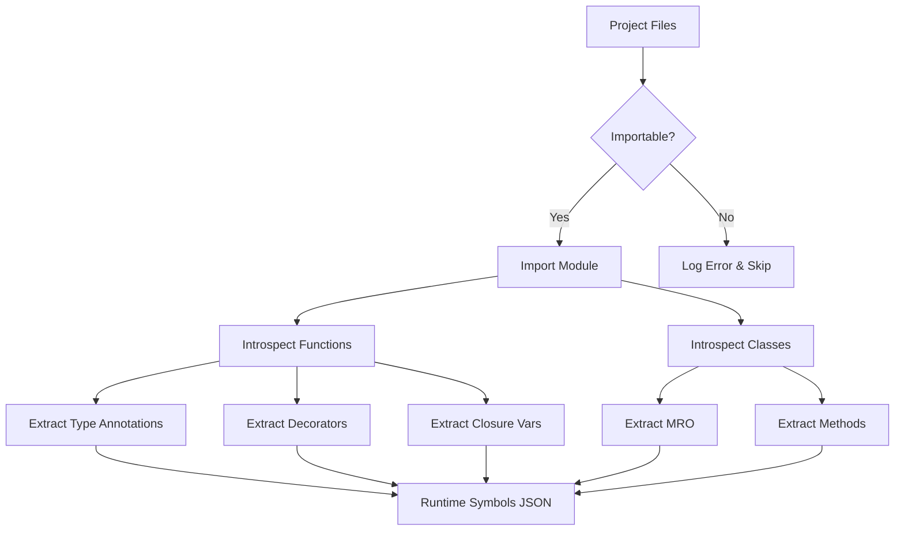

# Runtime Inspector Documentation

# 运行时检查器文档 | Runtime Inspector Documentation

> [!NOTE]
> The Runtime Inspector is a core v8.0 component that extracts deep metadata from live Python modules. This guide explains how it works, how to use it, and how to troubleshoot issues.
>
> 运行时检查器是 v8.0 的核心组件,从活动的 Python 模块中提取深度元数据。本指南解释了它的工作原理、使用方法以及如何排除故障。

## Overview

## 概述 | Overview

**Runtime Inspector** (`runtime_inspector.py`) imports and introspects Python modules to extract metadata that static analysis cannot provide:

**运行时检查器**(`runtime_inspector.py`)导入并内省 Python 模块以提取静态分析无法提供的元数据:

- Type annotations from function signatures
- 来自函数签名的类型注解

- Actual inheritance chains (MRO)
- 实际的继承链(MRO)

- Decorator information
- 装饰器信息

- Closure variables
- 闭包变量

- Async/property/classmethod attributes
- Async/property/classmethod 属性

This data is merged with AST analysis to create comprehensive Symbol Essence Strings.
此数据与 AST 分析合并以创建全面的符号本质字符串(SES)。

---

## How It Works

## 工作原理 | How It Works

### Inspection Process

### 检查流程 | Inspection Process



### What Gets Extracted

### 提取内容 | What Gets Extracted

#### For Functions

#### 对于函数 | For Functions

```python
def calculate_price(items: List[Item], discount: Decimal = 0) -> Decimal:
    """Calculate total price with discount."""
    return sum(item.price for item in items) * (1 - discount)
```

**Extracted Metadata**:
**提取的元数据**:

```json
{
  "type_annotations": {
    "items": "typing.List[Item]",
    "discount": "decimal.Decimal",
    "return": "decimal.Decimal"
  },
  "decorators": [],
  "is_async": false,
  "is_property": false,
  "closure_vars": []
}
```

#### For Classes

#### 对于类 | For Classes

```python
@dataclass
class User(BaseModel, Serializable):
    name: str
    email: EmailStr

    def validate(self) -> bool:
        return validate_email(self.email)
```

**Extracted Metadata**:
**提取的元数据**:

```json
{
  "bases": ["BaseModel", "Serializable"],
  "mro": ["User", "BaseModel", "Serializable", "object"],
  "decorators": ["dataclass"],
  "methods": {
    "validate": {
      "type_annotations": {"return": "bool"},
      "is_async": false
    }
  }
}
```

---

## Usage

## 使用 | Usage

### Automatic (Default)

### 自动(默认) | Automatic (Default)

Runtime inspection runs automatically during `analyze-project`:

运行时检查在 `analyze-project` 期间自动运行:

```bash
python -m cline_utils.dependency_system.dependency_processor analyze-project
```

Output:
输出:

```
[Phase 1/5] Runtime Symbol Inspection
[阶段 1/5] 运行时符号检查
Inspecting user_service.py... ✓
正在检查 user_service.py... ✓
Inspecting user_model.py... ✓
正在检查 user_model.py... ✓
Inspecting database.py... ✓
正在检查 database.py... ✓
...
Inspected 245 modules in 12.3s
在 12.3 秒内检查了 245 个模块
Saved to runtime_symbols.json
已保存到 runtime_symbols.json
```

### Manual Execution

### 手动执行 | Manual Execution

Run inspector independently:

独立运行检查器:

```bash
python -m cline_utils.dependency_system.analysis.runtime_inspector
```

Options:
选项:

```bash
# Specify directory
# 指定目录
python -m cline_utils.dependency_system.analysis.runtime_inspector --path src/

# Verbose output
# 详细输出
python -m cline_utils.dependency_system.analysis.runtime_inspector --verbose

# Force re-inspection
# 强制重新检查
python -m cline_utils.dependency_system.analysis.runtime_inspector --force
```

### Programmatic Usage

### 编程方式使用 | Programmatic Usage

```python
from cline_utils.dependency_system.analysis import runtime_inspector as ri

# Inspect single module
# 检查单个模块
metadata = ri.inspect_module("path/to/module.py")

# Inspect directory
# 检查目录
ri.inspect_project_modules(
    code_roots=["src/", "lib/"],
    output_path="runtime_symbols.json"
)
```

---

## Output Format

## 输出格式 | Output Format

### runtime_symbols.json

```json
{
  "/abs/path/to/user_service.py": {
    "functions": {
      "create_user": {
        "type_annotations": {
          "name": "str",
          "email": "str",
          "return": "User"
        },
        "decorators": ["validate_input"],
        "is_async": false,
        "closure_vars": ["db_connection"]
      }
    },
    "classes": {
      "UserService": {
        "bases": ["BaseService"],
        "mro": ["UserService", "BaseService", "object"],
        "decorators": ["singleton"],
        "methods": {
          "get_user": {...},
          "delete_user": {...}
        }
      }
    }
  }
}
```

### Integration with Symbol Map

### 与符号映射集成 | Integration with Symbol Map

Runtime symbols are merged with AST analysis:
运行时符号与 AST 分析合并:

```python
# symbol_map_merger.py
# 符号映射合并器
merged = merge_runtime_and_ast(
    runtime_data=load_runtime_symbols(),
    ast_data=load_ast_analysis()
)
```

Result in `project_symbol_map.json`:
`project_symbol_map.json` 中的结果:

```json
{
  "/abs/path/to/user_service.py": {
    "functions": {
      "create_user": {
        // From runtime
        // 来自运行时
        "type_annotations": {...},
        "decorators": [...],
        // From AST
        // 来自 AST
        "calls": ["User.__init__", "db.save"],
        "line_numbers": [45, 46, 47],
        "imports": [...]
      }
    }
  }
}
```

---

## Configuration

## 配置 | Configuration

### Enable/Disable

### 启用/禁用 | Enable/Disable

In `.clinerules.config.json`:

在 `.clinerules.config.json` 中:

```json
{
  "analysis": {
    "runtime_inspection_enabled": true,
    "runtime_inspection_timeout": 30
  }
}
```

### Exclusions

### 排除 | Exclusions

Exclude specific patterns:
排除特定模式:

```json
{
  "excluded_file_patterns": [
    "*_test.py",
    "*/migrations/*",
    "*/vendor/*"
  ]
}
```

### Code Roots

### 代码根目录 | Code Roots

Only inspect files in defined code roots:
仅检查定义的代码根目录中的文件:

```json
{
  "code_roots": [
    "src/",
    "lib/",
    "app/"
  ]
}
```

---

## Troubleshooting

## 故障排除 | Troubleshooting

### Issue: "Failed to import module"

### 问题: "无法导入模块" | Issue: "Failed to import module"

**Cause**: Syntax errors, missing dependencies, or import cycles
**原因**: 语法错误、缺少依赖或导入循环

**Diagnosis**:
**诊断**:

```bash
# Test importability
# 测试可导入性
python -c "import your.module"

# Check errors
# 检查错误
grep "Failed to inspect" cline_docs/debug.txt
```

**Solutions**:
**解决方案**:

1. **Fix syntax errors**:
   **修复语法错误**:
   ```bash
   python -m pylint your_package/ --errors-only
   ```

2. **Install dependencies**:
   **安装依赖**:
   ```bash
   pip install -r requirements.txt
   ```

3. **Exclude problematic files**:
   **排除问题文件**:
   ```json
   {
     "excluded_file_patterns": ["*broken_module.py"]
   }
   ```

### Issue: "Import cycles detected"

### 问题: "检测到导入循环" | Issue: "Import cycles detected"

**Cause**: Circular imports in project
**原因**: 项目中的循环导入

**Solution**: Refactor to break cycle or exclude one file:
**解决方案**: 重构以打破循环或排除一个文件:

```python
# Instead of:
# 代替:
# a.py: from b import something
# b.py: from a import something_else

# Use:
# 使用:
# c.py: shared_function()
# a.py: from c import shared_function
# b.py: from c import shared_function
```

### Issue: "Module has no attribute"

### 问题: "模块没有属性" | Issue: "Module has no attribute"

**Cause**: Dynamic attribute creation not visible to inspector
**原因**: 检查器看不到动态属性创建

**Solution**: Add type stubs or exclude:
**解决方案**: 添加类型存根或排除:

```python
# Add stub
# 添加存根
def __getattr__(name: str) -> Any: ...

# Or exclude
# 或排除
{"excluded_file_patterns": ["*dynamic.py"]}
```

### Issue: "Runtime inspection slow"

### 问题: "运行时检查缓慢" | Issue: "Runtime inspection slow"

**Cause**: Large number of modules or slow imports
**原因**: 大量模块或缓慢的导入

**Solutions**:
**解决方案**:

1. **Exclude test files**:
   **排除测试文件**:
   ```json
   {"excluded_file_patterns": ["*_test.py", "test_*.py"]}
   ```

2. **Reduce timeout**:
   **减少超时**:
   ```json
   {"analysis": {"runtime_inspection_timeout": 10}}
   ```

3. **Skip heavy imports**:
   **跳过繁重的导入**:
   Mock slow dependencies in test environment
   在测试环境中模拟缓慢的依赖

---

## Limitations

## 限制 | Limitations

### 1. Requires Importable Code

### 1. 需要可导入的代码 | 1. Requires Importable Code

Runtime inspection needs valid Python that can be imported.
运行时检查需要可以导入的有效 Python 代码。

**Workarounds**:
**变通方法**:

- Fix syntax errors before analysis
- 分析前修复语法错误

- Mock unavailable dependencies
- 模拟不可用的依赖

- Exclude broken files
- 排除损坏的文件

### 2. Side Effects on Import

### 2. 导入时的副作用 | 2. Side Effects on Import

Some modules execute code on import.
某些模块在导入时执行代码。

**Workarounds**:
**变通方法**:

```python
# Use if __name__ == "__main__" guard
# 使用 if __name__ == "__main__" 保护
if __name__ == "__main__":
    run_application()  # Won't execute during inspection
                       # 在检查期间不会执行
```

### 3. Dynamic Code Not Captured

### 3. 未捕获动态代码 | 3. Dynamic Code Not Captured

`eval()`, `exec()`, metaclasses may not be fully captured.
`eval()`, `exec()`, 元类可能未被完全捕获。

**Workarounds**:
**变通方法**:

- AST analysis still provides structure
- AST 分析仍然提供结构

- Add type hints for better static analysis
- 添加类型提示以获得更好的静态分析

### 4. External Dependencies

### 4. 外部依赖 | 4. External Dependencies

Modules importing unavailable packages fail.
导入不可用包的模块失败。

**Workarounds**:
**变通方法**:

- Install in virtual environment
- 在虚拟环境中安装

- Use mock imports
- 使用模拟导入

- Exclude external modules
- 排除外部模块

---

## Best Practices

## 最佳实践 | Best Practices

### 1. Keep Code Importable

### 1. 保持代码可导入 | 1. Keep Code Importable

```python
# ✅ Good - importable
# ✅ 良好 - 可导入
def process_data(items: List[Item]) -> DataFrame:
    return pd.DataFrame(items)

# ❌ Bad - syntax error
# ❌ 不良 - 语法错误
def process_data(items: List[Item]) -> DataFrame
    return pd.DataFrame(items)  # Missing colon
                              # 缺少冒号
```

### 2. Use Type Hints

### 2. 使用类型提示 | 2. Use Type Hints

```python
# ✅ Good - runtime inspector extracts types
# ✅ 良好 - 运行时检查器提取类型
def create_user(name: str, email: str) -> User:
    return User(name, email)

# ⚠️ Less useful - no type info
# ⚠️ 作用较小 - 无类型信息
def create_user(name, email):
    return User(name, email)
```

### 3. Guard Main Code

### 3. 保护主代码 | 3. Guard Main Code

```python
# ✅ Good - won't execute during inspection
# ✅ 良好 - 在检查期间不会执行
if __name__ == "__main__":
    app.run()

# ❌ Bad - executes on import
# ❌ 不良 - 在导入时执行
app.run()  # Starts server during inspection!
          # 在检查期间启动服务器!
```

### 4. Document Dynamism

### 4. 记录动态行为 | 4. Document Dynamism

```python
# ✅ Good - type stub for dynamic attributes
# ✅ 良好 - 动态属性的类型存根
class DynamicModel:
    def __getattr__(self, name: str) -> Any:
        """Dynamically generated attributes."""
        """动态生成的属性。"""
        return self._data.get(name)
```

### 5. Handle Missing Dependencies Gracefully

### 5. 优雅处理缺失的依赖 | 5. Handle Missing Dependencies Gracefully

```python
# ✅ Good - optional import
# ✅ 良好 - 可选导入
try:
    import optional_package
    HAS_OPTIONAL = True
except ImportError:
    HAS_OPTIONAL = False

# ❌ Bad - crashes during inspection
# ❌ 不良 - 在检查期间崩溃
import optional_package  # Fails if not installed
                        # 如果未安装则失败
```

---

## Advanced Topics

## 高级主题 | Advanced Topics

### Custom Metadata Extraction

### 自定义元数据提取 | Custom Metadata Extraction

Extend the inspector for project-specific metadata:
扩展检查器以获取项目特定的元数据:

```python
# In runtime_inspector.py
# 在 runtime_inspector.py 中
def extract_custom_metadata(obj):
    metadata = {}

    # Extract custom decorators
    # 提取自定义装饰器
    if hasattr(obj, "__custom_metadata__"):
        metadata["custom"] = obj.__custom_metadata__

    # Extract API routes (Flask example)
    # 提取 API 路由(Flask 示例)
    if hasattr(obj, "__route__"):
        metadata["route"] = obj.__route__

    return metadata
```

### Selective Inspection

### 选择性检查 | Selective Inspection

Inspect only specific modules:
仅检查特定模块:

```python
from cline_utils.dependency_system.analysis import runtime_inspector as ri

# Inspect only models
# 仅检查模型
ri.inspect_project_modules(
    code_roots=["src/models/"],
    output_path="models_runtime.json"
)
```

### Validation

### 验证 | Validation

Validate runtime symbols against AST:
根据 AST 验证运行时符号:

```python
from cline_utils.dependency_system.analysis import symbol_map_merger as smm

# Merge and validate
# 合并和验证
merged = smm.merge_runtime_and_ast(runtime_data, ast_data)
issues = smm.validate_merged_output(merged)

# Categorize issues
# 分类问题
for category, items in issues.items():
    print(f"{category}: {len(items)} issues")
    print(f"{category}: {len(items)} 个问题")
```

---

## Performance Characteristics

## 性能特征 | Performance Characteristics

### Inspection Speed

### 检查速度 | Inspection Speed

| Project Size | Modules | Inspection Time |
|--------------|---------|-----------------|
| **项目大小** | **模块数** | **检查时间** |
| Small / 小 | 50 | 2 seconds / 2 秒 |
| Medium / 中 | 500 | 15 seconds / 15 秒 |
| Large / 大 | 2000 | 60 seconds / 60 秒 |

**Note**: First run slower (imports), subsequent runs faster (already imported).
**注意**: 首次运行较慢(导入),后续运行更快(已导入)。

### Memory Usage

### 内存使用 | Memory Usage

- **Peak**: ~200MB during inspection
- **峰值**: 检查期间约 200MB

- **Persistent**: ~2-5MB per 1000 modules in JSON
- **持久化**: JSON 中每 1000 个模块约 2-5MB

### Caching

### 缓存 | Caching

Runtime symbols cached until files change:
运行时符号缓存直到文件更改:

- File modified → re-inspect that file only
- 文件修改 → 仅重新检查该文件

- No changes → use cached data (instant)
- 无更改 → 使用缓存数据(即时)

---

## Comparison with Alternatives

## 与替代方案比较 | Comparison with Alternatives

### vs. AST-Only Analysis

### 与仅 AST 分析比较 | vs. AST-Only Analysis

| Feature | AST Only | Runtime Inspector | Advantage |
|---------|----------|-------------------|-----------|
| **功能** | **仅 AST** | **运行时检查器** | **优势** |
| **Type Annotations** | Strings | Resolved Types | Runtime / 运行时 |
| **类型注解** | 字符串 | 解析的类型 | |
| **Inheritance** | Names only | Full MRO | Runtime / 运行时 |
| **继承** | 仅名称 | 完整 MRO | |
| **Decorators** | Yes | Yes | Tie / 平局 |
| **装饰器** | 是 | 是 | |
| **Syntax Errors** | Tolerated | Fails | AST / AST |
| **语法错误** | 容忍 | 失败 | |
| **Accuracy** | Good | Excellent | Runtime / 运行时 |
| **准确性** | 良好 | 优秀 | |

**Best**: Use both (merged by symbol_map_merger)
**最佳**: 同时使用(由 symbol_map_merger 合并)

### vs. Static Type Checkers (mypy/pyright)

### 与静态类型检查器比较 | vs. Static Type Checkers (mypy/pyright)

| Feature | Type Checker | Runtime Inspector |
|---------|--------------|-------------------|
| **功能** | **类型检查器** | **运行时检查器** |
| **Purpose** | Type verification | Metadata extraction |
| **用途** | 类型验证 | 元数据提取 |
| **Speed** | Fast | Medium |
| **速度** | 快 | 中等 |
| **Requires Valid Code** | No | Yes |
| **需要有效代码** | 否 | 是 |
| **Output** | Errors | JSON metadata |
| **输出** | 错误 | JSON 元数据 |

**Different tools** for different purposes.
**不同工具**用于不同目的。

---

## References

## 参考 | References

- [Runtime Inspector Implementation](cline_utils/dependency_system/analysis/runtime_inspector.py)
- [运行时检查器实现](cline_utils/dependency_system/analysis/runtime_inspector.py)

- [Symbol Map Merger](cline_utils/dependency_system/analysis/symbol_map_merger.py)
- [符号映射合并器](cline_utils/dependency_system/analysis/symbol_map_merger.py)

- [SES Architecture](SES_ARCHITECTURE.md)
- [SES 架构](SES_ARCHITECTURE.md)

- [Configuration Guide](CONFIGURATION.md)
- [配置指南](CONFIGURATION.md)

---

**Runtime inspection completes the v8.0 analysis pipeline by providing data that static analysis alone cannot capture.** Combined with AST analysis, it enables unprecedented accuracy in understanding code structure and relationships.
**运行时检查通过提供静态分析无法捕获的数据来完成 v8.0 分析流程。**与 AST 分析相结合,它实现了对代码结构和关系的空前准确性。
