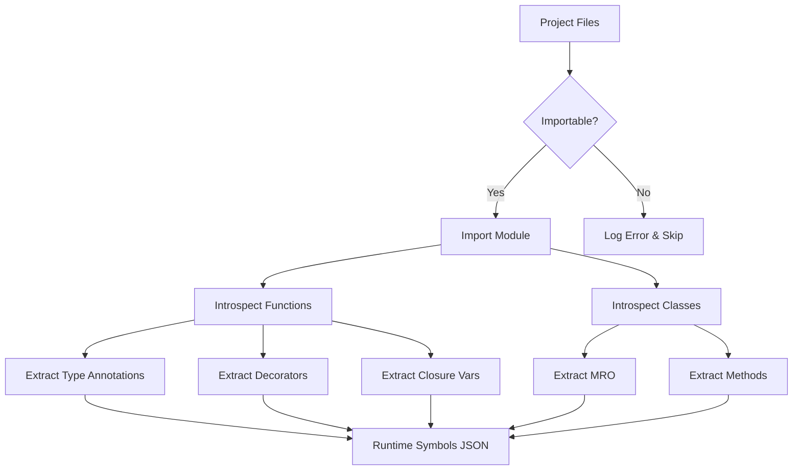

# Runtime Inspector Documentation

> [!NOTE]
> The Runtime Inspector is a core v8.0 component that extracts deep metadata from live Python modules. This guide explains how it works, how to use it, and how to troubleshoot issues.

## Overview

**Runtime Inspector** (`runtime_inspector.py`) imports and introspects Python modules to extract metadata that static analysis cannot provide:

- Type annotations from function signatures
- Actual inheritance chains (MRO)
- Decorator information
- Closure variables
- Async/property/classmethod attributes

This data is merged with AST analysis to create comprehensive Symbol Essence Strings.

---

## How It Works

### Inspection Process



### What Gets Extracted

#### For Functions

```python
def calculate_price(items: List[Item], discount: Decimal = 0) -> Decimal:
    """Calculate total price with discount."""
    return sum(item.price for item in items) * (1 - discount)
```

**Extracted Metadata**:
```json
{
  "type_annotations": {
    "items": "typing.List[Item]",
    "discount": "decimal.Decimal",
    "return": "decimal.Decimal"
  },
  "decorators": [],
  "is_async": false,
  "is_property": false,
  "closure_vars": []
}
```

#### For Classes

```python
@dataclass
class User(BaseModel, Serializable):
    name: str
    email: EmailStr
    
    def validate(self) -> bool:
        return validate_email(self.email)
```

**Extracted Metadata**:
```json
{
  "bases": ["BaseModel", "Serializable"],
  "mro": ["User", "BaseModel", "Serializable", "object"],
  "decorators": ["dataclass"],
  "methods": {
    "validate": {
      "type_annotations": {"return": "bool"},
      "is_async": false
    }
  }
}
```

---

## Usage

### Automatic (Default)

Runtime inspection runs automatically during `analyze-project`:

```bash
python -m cline_utils.dependency_system.dependency_processor analyze-project
```

Output:
```
[Phase 1/5] Runtime Symbol Inspection
Inspecting user_service.py... ✓
Inspecting user_model.py... ✓
Inspecting database.py... ✓
...
Inspected 245 modules in 12.3s
Saved to runtime_symbols.json
```

### Manual Execution

Run inspector independently:

```bash
python -m cline_utils.dependency_system.analysis.runtime_inspector
```

Options:
```bash
# Specify directory
python -m cline_utils.dependency_system.analysis.runtime_inspector --path src/

# Verbose output
python -m cline_utils.dependency_system.analysis.runtime_inspector --verbose

# Force re-inspection
python -m cline_utils.dependency_system.analysis.runtime_inspector --force
```

### Programmatic Usage

```python
from cline_utils.dependency_system.analysis import runtime_inspector as ri

# Inspect single module
metadata = ri.inspect_module("path/to/module.py")

# Inspect directory
ri.inspect_project_modules(
    code_roots=["src/", "lib/"],
    output_path="runtime_symbols.json"
)
```

---

## Output Format

### runtime_symbols.json

```json
{
  "/abs/path/to/user_service.py": {
    "functions": {
      "create_user": {
        "type_annotations": {
          "name": "str",
          "email": "str",
          "return": "User"
        },
        "decorators": ["validate_input"],
        "is_async": false,
        "closure_vars": ["db_connection"]
      }
    },
    "classes": {
      "UserService": {
        "bases": ["BaseService"],
        "mro": ["UserService", "BaseService", "object"],
        "decorators": ["singleton"],
        "methods": {
          "get_user": {...},
          "delete_user": {...}
        }
      }
    }
  }
}
```

### Integration with Symbol Map

Runtime symbols are merged with AST analysis:

```python
# symbol_map_merger.py
merged = merge_runtime_and_ast(
    runtime_data=load_runtime_symbols(),
    ast_data=load_ast_analysis()
)
```

Result in `project_symbol_map.json`:
```json
{
  "/abs/path/to/user_service.py": {
    "functions": {
      "create_user": {
        // From runtime
        "type_annotations": {...},
        "decorators": [...],
        // From AST
        "calls": ["User.__init__", "db.save"],
        "line_numbers": [45, 46, 47],
        "imports": [...]
      }
    }
  }
}
```

---

## Configuration

### Enable/Disable

In `.clinerules.config.json`:

```json
{
  "analysis": {
    "runtime_inspection_enabled": true,
    "runtime_inspection_timeout": 30
  }
}
```

### Exclusions

Exclude specific patterns:

```json
{
  "excluded_file_patterns": [
    "*_test.py",
    "*/migrations/*",
    "*/vendor/*"
  ]
}
```

### Code Roots

Only inspect files in defined code roots:

```json
{
  "code_roots": [
    "src/",
    "lib/",
    "app/"
  ]
}
```

---

## Troubleshooting

### Issue: "Failed to import module"

**Cause**: Syntax errors, missing dependencies, or import cycles

**Diagnosis**:
```bash
# Test importability
python -c "import your.module"

# Check errors
grep "Failed to inspect" cline_docs/debug.txt
```

**Solutions**:

1. **Fix syntax errors**:
   ```bash
   python -m pylint your_package/ --errors-only
   ```

2. **Install dependencies**:
   ```bash
   pip install -r requirements.txt
   ```

3. **Exclude problematic files**:
   ```json
   {
     "excluded_file_patterns": ["*broken_module.py"]
   }
   ```

### Issue: "Import cycles detected"

**Cause**: Circular imports in project

**Solution**: Refactor to break cycle or exclude one file:
```python
# Instead of:
# a.py: from b import something
# b.py: from a import something_else

# Use:
# c.py: shared_function()
# a.py: from c import shared_function
# b.py: from c import shared_function
```

### Issue: "Module has no attribute"

**Cause**: Dynamic attribute creation not visible to inspector

**Solution**: Add type stubs or exclude:
```python
# Add stub
def __getattr__(name: str) -> Any: ...

# Or exclude
{"excluded_file_patterns": ["*dynamic.py"]}
```

### Issue: "Runtime inspection slow"

**Cause**: Large number of modules or slow imports

**Solutions**:

1. **Exclude test files**:
   ```json
   {"excluded_file_patterns": ["*_test.py", "test_*.py"]}
   ```

2. **Reduce timeout**:
   ```json
   {"analysis": {"runtime_inspection_timeout": 10}}
   ```

3. **Skip heavy imports**:
   Mock slow dependencies in test environment

---

## Limitations

### 1. Requires Importable Code

Runtime inspection needs valid Python that can be imported.

**Workarounds**:
- Fix syntax errors before analysis
- Mock unavailable dependencies
- Exclude broken files

### 2. Side Effects on Import

Some modules execute code on import.

**Workarounds**:
```python
# Use if __name__ == "__main__" guard
if __name__ == "__main__":
    run_application()  # Won't execute during inspection
```

### 3. Dynamic Code Not Captured

`eval()`, `exec()`, metaclasses may not be fully captured.

**Workarounds**:
- AST analysis still provides structure
- Add type hints for better static analysis

### 4. External Dependencies

Modules importing unavailable packages fail.

**Workarounds**:
- Install in virtual environment
- Use mock imports
- Exclude external modules

---

## Best Practices

### 1. Keep Code Importable

```python
# ✅ Good - importable
def process_data(items: List[Item]) -> DataFrame:
    return pd.DataFrame(items)

# ❌ Bad - syntax error
def process_data(items: List[Item]) -> DataFrame
    return pd.DataFrame(items)  # Missing colon
```

### 2. Use Type Hints

```python
# ✅ Good - runtime inspector extracts types
def create_user(name: str, email: str) -> User:
    return User(name, email)

# ⚠️ Less useful - no type info
def create_user(name, email):
    return User(name, email)
```

### 3. Guard Main Code

```python
# ✅ Good - won't execute during inspection
if __name__ == "__main__":
    app.run()

# ❌ Bad - executes on import
app.run()  # Starts server during inspection!
```

### 4. Document Dynamism

```python
# ✅ Good - type stub for dynamic attributes
class DynamicModel:
    def __getattr__(self, name: str) -> Any:
        """Dynamically generated attributes."""
        return self._data.get(name)
```

### 5. Handle Missing Dependencies Gracefully

```python
# ✅ Good - optional import
try:
    import optional_package
    HAS_OPTIONAL = True
except ImportError:
    HAS_OPTIONAL = False
    
# ❌ Bad - crashes during inspection
import optional_package  # Fails if not installed
```

---

## Advanced Topics

### Custom Metadata Extraction

Extend the inspector for project-specific metadata:

```python
# In runtime_inspector.py
def extract_custom_metadata(obj):
    metadata = {}
    
    # Extract custom decorators
    if hasattr(obj, "__custom_metadata__"):
        metadata["custom"] = obj.__custom_metadata__
        
    # Extract API routes (Flask example)
    if hasattr(obj, "__route__"):
        metadata["route"] = obj.__route__
        
    return metadata
```

### Selective Inspection

Inspect only specific modules:

```python
from cline_utils.dependency_system.analysis import runtime_inspector as ri

# Inspect only models
ri.inspect_project_modules(
    code_roots=["src/models/"],
    output_path="models_runtime.json"
)
```

### Validation

Validate runtime symbols against AST:

```python
from cline_utils.dependency_system.analysis import symbol_map_merger as smm

# Merge and validate
merged = smm.merge_runtime_and_ast(runtime_data, ast_data)
issues = smm.validate_merged_output(merged)

# Categorize issues
for category, items in issues.items():
    print(f"{category}: {len(items)} issues")
```

---

## Performance Characteristics

### Inspection Speed

| Project Size | Modules | Inspection Time |
|--------------|---------|-----------------|
| Small | 50 | 2 seconds |
| Medium | 500 | 15 seconds |
| Large | 2000 | 60 seconds |

**Note**: First run slower (imports), subsequent runs faster (already imported).

### Memory Usage

- **Peak**: ~200MB during inspection
- **Persistent**: ~2-5MB per 1000 modules in JSON

### Caching

Runtime symbols cached until files change:
- File modified → re-inspect that file only
- No changes → use cached data (instant)

---

## Comparison with Alternatives

### vs. AST-Only Analysis

| Feature | AST Only | Runtime Inspector | Advantage |
|---------|----------|-------------------|-----------|
| **Type Annotations** | Strings | Resolved Types | Runtime |
| **Inheritance** | Names only | Full MRO | Runtime |
| **Decorators** | Yes | Yes | Tie |
| **Syntax Errors** | Tolerated | Fails | AST |
| **Accuracy** | Good | Excellent | Runtime |

**Best**: Use both (merged by symbol_map_merger)

### vs. Static Type Checkers (mypy/pyright)

| Feature | Type Checker | Runtime Inspector |
|---------|--------------|-------------------|
| **Purpose** | Type verification | Metadata extraction |
| **Speed** | Fast | Medium |
| **Requires Valid Code** | No | Yes |
| **Output** | Errors | JSON metadata |

**Different tools** for different purposes.

---

## References

- [Runtime Inspector Implementation](cline_utils/dependency_system/analysis/runtime_inspector.py)
- [Symbol Map Merger](cline_utils/dependency_system/analysis/symbol_map_merger.py)
- [SES Architecture](SES_ARCHITECTURE.md)
- [Configuration Guide](CONFIGURATION.md)

---

**Runtime inspection completes the v8.0 analysis pipeline by providing data that static analysis alone cannot capture.** Combined with AST analysis, it enables unprecedented accuracy in understanding code structure and relationships.
