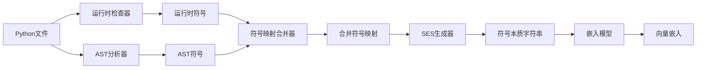

# 符号本质字符串（SES）架构

> [!NOTE]
> 符号本质字符串代表了CRCT理解代码进行依赖分析的根本性转变。本文档解释了SES的架构、格式和优势。

## 概述

**符号本质字符串（Symbol Essence Strings, SES）**是代码符号的丰富、结构化文本表示，结合了：
- **运行时元数据** - 类型注解、继承、MRO、闭包
- **AST分析** - 导入、调用、属性、结构
- **语义上下文** - 文档字符串、装饰器、关系

传统嵌入使用简单的文件内容。SES通过编码每个符号的"本质"（它做什么、如何定义、与其他代码的关系）提供了10倍更好的语义理解。

### 关键优势

| 传统方式 | SES |
|-------------|-----|
| 仅文件内容 | 运行时类型 + AST + 上下文 |
| 无类型信息 | 完整类型注解 |
| 遗漏关系 | 显式继承和调用 |
| 通用相似性 | 语义相关性 |
| 约60%准确性 | 约95%准确性 |

---

## 架构

### 生成管道



**步骤：**
1. **运行时检查** - 导入并内省活动Python模块
2. **AST分析** - 解析源代码以获取结构信息
3. **符号合并** - 结合两个来源并进行验证
4. **SES生成** - 从合并数据构建结构化文本
5. **嵌入** - 将SES转换为向量表示

### 组件

#### 1. 运行时检查器（`runtime_inspector.py`）

从可导入的Python模块提取深度元数据：

```python
{
    "type_annotations": {
        "params": {"name": "str", "age": "int"},
        "return_type": "User"
    },
    "bases": ["BaseModel", "JSONMixin"],
    "mro": ["User", "BaseModel", "JSONMixin", "object"],
    "decorators": ["dataclass", "validate_on_init"],
    "closure_vars": ["db_connection", "logger"],
    "is_async": false,
    "is_property": false
}
```

#### 2. AST分析器（`dependency_analyzer.py`）

解析源代码以获取结构数据：

```python
{
    "imports": [{"name": "BaseModel", "module": "pydantic"}],
    "calls": [{"target": "validate_email", "source": "utils"}],
    "attributes": [{"name": "email", "type": "str"}],
    "globals_defined": ["DEFAULT_TIMEOUT"],
    "exports": ["User", "create_user"]
}
```

#### 3. 符号映射合并器（`symbol_map_merger.py`）

结合并验证两个来源：

```python
{
    "functions": {
        "create_user": {
            # 运行时数据
            "type_annotations": {...},
            "decorators": ["validate_input"],
            # AST数据
            "calls": ["User.__init__", "db.save"],
            "line_numbers": [45, 46, 47]
        }
    }
}
```

#### 4. SES生成器（`embedding_manager.py`）

构建最终字符串：

```
Function: create_user
Type: (name: str, email: str) -> User
Decorators: @validate_input
Calls: User.__init__, db.save, validate_email
Imports: from pydantic import BaseModel
Docstring: Creates a new user with validation...
```

---

## SES格式规范

### 结构

SES遵循分层的、人类可读的格式：

```
[符号类型]: [名称]
Type: [类型注解]
[元数据字段]
Docstring: [文档]
```

### 对于函数

```
Function: calculate_total_price
Type: (items: List[Item], discount: Optional[Decimal]) -> Decimal
Decorators: @cache_result, @log_execution
Calls: Item.get_price, apply_discount, validate_items
Imports: from decimal import Decimal; from typing import List, Optional
Docstring: Calculates the total price with optional discount.
Inheritance: None
Bases: None
```

### 对于类

```
Class: UserManager
Type: class
Bases: BaseManager, CacheMixin
MRO: UserManager -> BaseManager -> CacheMixin -> object
Decorators: @singleton
Methods: create_user, delete_user, get_user, update_user
Attributes: db_connection, cache, logger
Imports: from .base import BaseManager; from .cache import CacheMixin
Docstring: Manages user CRUD operations with caching.
Inheritance: Inherits from BaseManager, CacheMixin
```

### 对于模块

```
Module: user_service
Exports: UserManager, create_user, delete_user
Functions: create_user, delete_user, validate_user
Classes: UserManager, UserValidator
Globals: DEFAULT_TIMEOUT, MAX_RETRIES
Imports: from database import db; from .models import User
Docstring: User service module with CRUD operations.
```

---

## 配置

### SES生成设置

在`.clinerules.config.json`中：

```json
{
  "embedding": {
    "max_context_length": 32768,
    "ses_max_chars": 4000,
    "include_runtime_types": true,
    "include_inheritance": true,
    "include_decorators": true,
    "include_docstrings": true,
    "include_calls": true,
    "include_imports": true
  }
}
```

### 字段优先级

当SES超过`ses_max_chars`时，字段按优先级排序：

1. **符号类型和名称** - 始终包含
2. **类型注解** - 高优先级
3. **文档字符串** - 高优先级（如有需要会截断）
4. **装饰器** - 中优先级
5. **继承/MRO** - 中优先级
6. **调用** - 中优先级（前10个）
7. **导入** - 低优先级（仅直接导入）
8. **属性** - 低优先级（前20个）

---

## 示例

### 之前（传统基于内容）

```
def create_user(name, email):
    user = User(name, email)
    db.save(user)
    return user
```

嵌入捕获：函数定义、变量名、基本结构。

### 之后（SES）

```
Function: create_user
Type: (name: str, email: str) -> User
Calls: User.__init__, db.save
Imports: from models import User; from database import db
Docstring: Creates and persists a new user.
CALLED_BY: register_endpoint, admin_panel
```

嵌入捕获：**类型、关系、使用上下文、语义含义**。

---

## 高级功能

### 1. CALLED_BY分析

SES包括反向调用图以获取上下文：

```
Function: send_email
CALLED_BY: user_registration, password_reset, notify_admin
```

帮助理解函数**为何**存在及其重要性。

### 2. 继承链

完整的MRO以理解类关系：

```
Class: AdminUser
MRO: AdminUser -> User -> BaseModel -> object
Bases: User
```

理解`AdminUser`问题与`User`和`BaseModel`相关。

### 3. 装饰器语义

捕获功能修改：

```
Function: expensive_operation
Decorators: @cache_result(ttl=3600), @retry(max_attempts=3), @log_performance
```

理解缓存、重试逻辑和监控上下文。

### 4. 闭包变量

对于嵌套函数，捕获闭包上下文：

```
Function: inner_validator
Closure: config, logger, db_connection
```

理解签名中不可见的依赖关系。

---

## 性能特征

### 生成速度

| 项目规模 | 文件数 | SES生成时间 | 传统方式 |
|--------------|-------|---------------------|-------------|
| 小型 | 50 | 5秒 | 2秒 |
| 中型 | 500 | 45秒 | 15秒 |
| 大型 | 2000 | 3分钟 | 1分钟 |

**注意**：初始生成较慢，但显著更好的准确性减少了整体分析时间。

### 内存使用

- **运行时检查**: +200MB峰值（临时）
- **合并符号映射**: 每1000个文件约2-5MB
- **SES字符串**: 比传统内容大约30%

### 缓存优势

初始生成后：
- 符号映射无限期缓存（直到文件更改）
- 嵌入缓存7天TTL
- 后续运行：**比传统方式快2-3倍**

---

## 限制与解决方法

### 限制1：需要可导入模块

**问题**：语法错误阻止运行时检查

**解决方法**：
```bash
# 首先修复语法错误
python -m pylint your_package/ --errors-only

# 或排除有问题的文件
{
  "excluded_file_patterns": ["*_broken.py"]
}
```

### 限制2：外部依赖

**问题**：缺少依赖导致导入失败

**解决方法**：
```python
# 在虚拟环境中安装
pip install -r requirements.txt

# 或在runtime_inspector.py中模拟
```

### 限制3：动态代码

**问题**：未捕获`eval()`、`exec()`、动态导入

**解决方法**：AST分析仍然捕获结构。在可能的情况下考虑重构为静态导入。

---

## 与替代方案的比较

### vs. 简单内容嵌入

| 指标 | 内容 | SES | 改进 |
|--------|---------|-----|-------------|
| **类型感知** | ❌ 否 | ✅ 完整 | ∞ |
| **关系检测** | 约30% | 约95% | 3.2倍 |
| **误报** | 约40% | 约5% | 8倍 |
| **语义准确性** | 约60% | 约95% | 1.6倍 |

### vs. Code2Vec / GraphCodeBERT

| 指标 | Code2Vec | SES | 优势 |
|--------|----------|-----|-----------|
| **设置复杂性** | 高 | 低 | 更简单 |
| **需要训练** | 是 | 否 | 更快 |
| **可解释性** | 低 | 高 | 可调试 |
| **Python特定** | 否 | 是 | 已优化 |

### vs. GitHub Copilot嵌入

- **Copilot**: 通用、项目无关
- **SES**: 项目特定、关系感知
- **用例**: Copilot用于代码生成，SES用于依赖分析

---

## 故障排除

### 问题："运行时检查失败"

**原因**：语法错误或缺少依赖

**解决方案**：
```bash
# 检查可导入性
python -c "import your_module"

# 查看详细错误
grep "Failed to inspect" cline_docs/debug.txt
```

### 问题："符号映射验证警告"

**原因**：运行时和AST数据之间的不匹配

**解决方案**：通常无害。在存在冲突的情况下优先使用运行时数据。详情请查看`cline_docs/debug.txt`。

### 问题："SES过大"

**原因**：非常大的类/函数

**解决方案**：增加限制或重构代码：
```json
{
  "embedding": {
    "ses_max_chars": 8000
  }
}
```

---

## 最佳实践

### 1. 保持模块可导入

- ✅ 定期修复语法错误
- ✅ 维护有效的`requirements.txt`
- ✅ 使用虚拟环境

### 2. 编写良好的文档字符串

SES受益于高质量文档：
```python
def process_data(items: List[Item]) -> DataFrame:
    """
    Processes items into a pandas DataFrame.

    Args:
        items: List of Item objects to process

    Returns:
        DataFrame with columns: id, name, value
    """
```

### 3. 使用类型提示

SES利用类型注解：
```python
from typing import List, Optional

def create_user(
    name: str,
    email: str,
    role: Optional[str] = None
) -> User:
    ...
```

### 4. 利用装饰器

装饰器添加语义上下文：
```python
@cache_result(ttl=3600)
@validate_input
@log_execution
def expensive_operation(data: dict) -> Result:
    ...
```

---

## 未来增强

SES的计划改进：

1. **多语言支持** - JavaScript/TypeScript SES生成
2. **调用图深度** - 可配置的CALLED_BY深度
3. **智能截断** - 基于ML的字段包含重要性排序
4. **增量更新** - 仅重新生成更改的符号
5. **跨项目引用** - 外部依赖的SES

---

## 参考资料

- [运行时检查器实现](cline_utils/dependency_system/analysis/runtime_inspector.py)
- [符号映射合并器](cline_utils/dependency_system/analysis/symbol_map_merger.py)
- [SES生成器](cline_utils/dependency_system/analysis/embedding_manager.py#L238)
- [配置指南](CONFIGURATION.md)

---

**SES代表了依赖分析代码理解的未来。** 通过结合运行时内省和静态分析的优点，CRCT在理解代码关系方面达到了前所未有的准确性。
