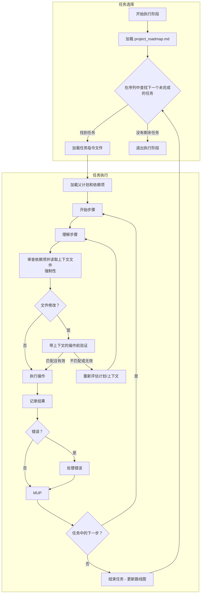

# **Cline 递归思维链系统 (CRCT) - 执行插件**

**本插件为 CRCT 系统的执行阶段提供详细指令和流程。应与核心系统提示词结合使用。**

---

## I. 进入和退出执行阶段

**进入执行阶段：**
1.  **`.clinerules` 检查**：始终首先读取 `.clinerules`。如果 `[LAST_ACTION_STATE]` 显示 `current_phase: "Execution"` 或 `next_phase: "Execution"`，则按这些指令执行，如果指定了 `next_action`，则从中恢复。
2.  **从策略过渡**：由策略阶段更新的 `project_roadmap.md` 文件现在包含当前周期的权威、有序的 `Execution_*` 任务列表。此列表是本阶段的主要输入。
3.  **用户触发**：在策略后启动新会话，或如果暂停则恢复执行。

**退出执行阶段：**
1. **完成标准：**
   - **`project_roadmap.md` 中当前周期的"统一执行序列"中列出的所有 `Execution_*` 任务都已标记为完成（`[x]`）。**
   - 所有任务的预期输出已生成并验证。
   - 结果和观察已记录。
   - 所有操作遵循 MUP。
2. **`.clinerules` 更新（MUP）：**
   - 继续清理和整合：
     ```
     [LAST_ACTION_STATE]
     last_action: "Completed Execution Phase - Tasks Executed"
     current_phase: "Execution"
     next_action: "Phase Complete - User Action Required"
     next_phase: "Cleanup/Consolidation"
     ```
   - *备选：如果过渡回设置/维护阶段进行重新验证（标准执行后不太常见）*：
     ```
     [LAST_ACTION_STATE]
     last_action: "Completed Execution Phase - Tasks Executed, Needs Verification"
     current_phase: "Execution"
     next_action: "Phase Complete - User Action Required"
     next_phase: "Set-up/Maintenance"
     ```
   - 项目完成：
     ```
     [LAST_ACTION_STATE]
     last_action: "Completed Execution Phase - Project Objectives Achieved"
     current_phase: "Execution"
     next_action: "Project Completion - User Review"
     next_phase: "Project Complete"
     ```
   *注意："Project Complete" 暂停系统；如果需要，定义进一步的操作。*
3. **用户操作**：更新 `.clinerules` 后，暂停以便用户触发下一阶段。参见核心系统提示词第 III 节的阶段过渡检查清单。

---

## II. 加载执行上下文

**操作**：为所选任务指令加载必要的上下文，遵循规划层次结构和依赖关系。

**流程：**
**加载主计划（强制性第一步）**：
    *   `read_file` `project_roadmap.md`。
    *   说明："读取 `project_roadmap.md` 以识别当前周期的执行序列。"

1.  **从统一序列中识别下一个任务**：
    *   在路线图中找到当前周期的"统一执行序列"检查清单。
    *   扫描列表以查找**第一个未标记为完成的任务**（即，第一个 `[ ]`）。这是 `[Current_Task_File_Path]`。
    *   **如果未找到未完成的任务**：本周期的执行已完成。说明："项目路线图执行序列中的所有任务都已完成。继续退出阶段。" **转到第 I 节，退出执行阶段。**
    *   **如果找到任务**：说明："从路线图中识别出下一个任务：`[Current_Task_File_Path]`。"

2.  **加载父计划（上下文）**：读取包含该任务的父 `implementation_plan_*.md` 文件（或 `*_module.md` 的相关部分）。这提供了更高级别的目标和上下文。说明："读取父计划 `{plan_name}.md` 以获取任务上下文。"
3.  **加载任务指令**：读取特定的 `Execution_{task_name}.md` 文件。
4.  **加载依赖项（强制性执行前步骤）**：
    *   **识别依赖项**：审查任务指令文件的 `Context/Dependencies` 部分，*并且*对此任务修改的主要文件运行 `show-dependencies --key <key>`。（使用 `analyze-project` 输出或按约定查找键，如果不确定）。说明："使用 `show-dependencies` 检查任务目标的依赖项。"
    *   **读取依赖文件**：**关键是，使用 `read_file` 加载从 `show-dependencies` 输出和任务显式上下文列表中识别为直接依赖项的文件内容**（'<'、'>'、'x'、'd' 关系与任务相关）。**在编码/修改之前未能从依赖文件收集上下文是引入错误和逻辑不一致的高风险。** 说明："读取依赖文件的内容：`{file_path_1}`、`{file_path_2}`..."
    *   **加载其他显式上下文**：使用 `read_file` 加载当前任务文件中显式列出的任何其他特定任务指令、文档文件或代码片段，作为必需的上下文。

---

## III. 从指令文件执行任务

**操作**：执行加载的任务指令文件中详细说明的逐步计划，保持对其在层次结构中的位置及其依赖关系的意识。

**流程：**
1.  **遍历步骤：** 对于任务指令文件中的每个编号步骤：
    *   **A. 理解步骤**：阅读步骤的描述。澄清所需的具体操作，考虑整体任务目标和从父实施计划（在第 II 节中加载）获得的上下文。
    *   **B. 审查依赖项和上下文（强制性强化）**：**在为此特定步骤生成或修改*任何*代码或重要文件内容之前：**
        *   如果步骤涉及复杂的交互或上下文可能过时，使用 `show-dependencies --key <target_file_key>` 重新检查依赖项。
        *   **关键**：确保你已**读取并理解第 II.4 节中识别的直接依赖文件的相关内容**（`read_file`）。此步骤如何与这些依赖项交互（例如，调用函数、使用数据结构、实现接口）？说明："在继续执行步骤之前，根据之前读取的文件确认对依赖项 `{key_1}`、`{key_2}` 的交互的理解。"
    *   **C. 操作前验证（文件修改的强制性要求）**：在使用修改文件的工具（`replace_in_file`、现有文件上的 `write_to_file`、更改文件的 `execute_command`）之前：
        *   使用 `read_file` 重新读取此步骤的特定目标文件。
        *   生成"操作前验证"思维链：
            1.  **预期更改**：清楚地说明此步骤计划的修改（例如，"在文件 Z 的 Y 行插入函数 X"）。
            2.  **依赖项上下文摘要**：简要总结预期更改如何与 III.1.B 中审查的关键依赖项相关（例如，"函数 X 实现在依赖文件 A 中定义的接口"，"更改遵守依赖函数 B 预期的数据格式"）。
            3.  **预期当前状态**：描述在更改之前你期望看到的文件的特定部分（例如，"期望 Y 行为空"，"期望函数签名 Z 存在"）。
            4.  **实际当前状态**：从 `read_file` 输出中注意观察到的实际状态。
            5.  **验证**：比较预期状态和实际状态。**仅当**它们合理匹配**并且**预期更改与依赖项上下文摘要一致时才继续。如果验证失败，**停止**，说明差异，并重新评估步骤、计划或依赖项。如果需要，请求澄清。
        *   示例：
            ```
            操作前验证：
            1. 预期更改：将 `game_logic.py`（键：2Ca1）中的第 55 行替换为 `new_score = calculate_score(data, multipliers)`。
            2. 依赖项上下文摘要：`calculate_score` 从 `scoring_utils.py`（键：2Cb3，通过 show-dependencies 和 read_file 确认的依赖项）导入。它期望 `data`（dict）和 `multipliers`（list）。`game_logic.py` 可以在作用域中访问这些变量。
            3. 预期当前状态：第 55 行包含旧计算 `new_score = data['base'] * 1.1`。
            4. 实际当前状态：第 55 行是 `new_score = data['base'] * 1.1`。
            5. 验证：确认匹配。更改与依赖项上下文一致。继续执行 `replace_in_file`。
            ```
    *   **D. 执行操作**：使用适当的工具（`write_to_file`、`execute_command`、`replace_in_file` 等）执行步骤中描述的操作。
    *   **E. 记录结果（迷你思维链）**：在操作后立即记录结果：
        *   **执行的操作**：简要重述执行的操作。
        *   **结果**：成功、失败、命令输出、生成的内容片段。
        *   **观察**：任何意外行为、潜在问题或获得的见解。
        *   **下一步**：确认移动到下一步或处理错误。
    *   **F. MUP**：遵循核心 MUP（核心提示词第 VI 节）和下面的第 IV 节添加。**在每个步骤后执行 MUP。**

2.  **错误处理：** 如果操作失败或产生意外结果：
    *   记录错误消息和导致它的迷你思维链。
    *   诊断原因：检查命令语法、文件路径、权限、依赖项冲突（参考 III.1.B 中的上下文），或生成的代码/指令中的逻辑错误。如果适用，请参考核心提示词第 VIII 节以获取依赖项命令错误详细信息。
    *   提出解决方案：根据依赖项理解更正命令、修改代码逻辑、调整任务指令，或者如果计划似乎有缺陷，则查询用户。
    *   执行修复。
    *   记录解决流程。
    *   在继续之前应用 MUP 后解决。

3.  **代码生成和修改指南：**
    *（提醒：在生成/修改代码之前，确保执行了步骤 III.1.B '审查依赖项和上下文'，包括读取依赖文件）*
    在执行涉及编写或更改代码的操作时，严格遵守以下内容：
    1.  **上下文驱动**：
     - 代码**必须**与依赖项审查（III.1.B）和操作前验证（III.1.C）期间识别的交互、接口、数据格式和需求保持一致。
    2.  **模块化**：
     - 编写小型、专注的函数/方法/类。追求高内聚和低耦合。
     - 设计可重用的组件以提高可维护性。
    3.  **清晰度和可读性**：
     - 为变量、函数和类使用有意义的名称。
     - 遵循特定于语言的格式约定（例如，Python 的 PEP 8）。
     - 仅为复杂的逻辑或意图添加注释，避免冗余解释代码*做什么*。
     - 根据任务步骤提供完整的、可运行的代码块或片段。
    4.  **错误处理**：
     - 预测错误（例如，无效输入、文件未找到）并实现健壮的处理（例如，try-except、返回值检查）。
     - 验证输入和假设以尽早防止错误。
    5.  **效率**：
     - 优先考虑清晰度和正确性，但要注意性能关键任务的算法复杂性。
    6.  **文档**：
     - 为公共 API 或复杂函数添加文档字符串或注释，详细说明目的、参数和返回值。
     - 保持文档简洁并与代码更改同步。
    7.  **测试**：
     - 编写可测试的代码，并在适用的情况下，为新功能或修复建议或包含单元测试。
    8.  **依赖项管理**：
     - 尽可能使用现有依赖项。除非明确计划，否则避免添加新的外部库。
     - 如果代码更改在项目文件之间引入*新的功能依赖项*，准备更新相关的迷你追踪器（参见 MUP 添加，第 IV 节）。
    9.  **安全性**：
   - 遵循安全编码实践以减轻漏洞（例如，避免注入风险、安全的凭据处理）。

4.  **执行流程图**



---

## IV. 执行插件 - MUP 添加

在核心 MUP 步骤（核心提示词第 VI 节）之后，*在任务指令的每个步骤之后*执行：
1.  **更新任务指令文件**：
    *   标记刚刚完成的步骤（例如，添加 `[DONE]` 或类似标记）。
    *   如果对后续上下文有用，直接将迷你思维链的任何重要观察或结果作为注释保存到相关步骤的任务文件中。除非在执行期间发现错误，否则避免更改核心指令。
    *   如果任务现在已完全完成，更新其整体状态部分。
    *   使用 `write_to_file` 保存更改。
2.  **更新迷你追踪器（如果创建了新的功能依赖项）**：
    *   **条件**：如果执行的步骤修改了文件 A（键 `key_A`）中的代码，使其*现在*直接导入、调用或功能上依赖于文件 B（键 `key_B`）*在同一模块内*的代码/数据，并且此依赖项之前不存在或未准确反映。
    *   **操作**：在相关的 `{module_name}_module.md` 迷你追踪器上使用 `add-dependency`。
    *   **推理（强制性）**：清楚地说明为什么根据*此步骤中所做的代码更改*添加/更新依赖项。
    *   示例（在添加导入后，将从函数/文件 2Ca1 到模块 'C' 中的 2Ca3 的依赖项添加）：
        ```bash
        # MUP 触发器：步骤 X 将 'from .file3 import specific_func' 添加到与键 2Ca1 关联的文件。
        # 推理：这创建了一个新的功能依赖项，其中 2Ca1 现在需要 2Ca3 的 specific_func。
        python -m cline_utils.dependency_system.dependency_processor add-dependency --tracker path/to/module_C/module_C_module.md --source-key 2Ca1 --target-key 2Ca3 --dep-type "<"
        ```
        *（使用正确的 dep-type：如果 A 调用 B，则为 '<'；如果 B 调用 A，则为 '>'；如果相互，则为 'x'；如果是必要的文档链接，则为 'd'）*
3.  **更新领域模块/实施计划文档（如果重要）**：如果任务执行导致原始计划中未捕获的重大设计更改或结果，请在相关的领域模块（`*_module.md`）或实施计划（`implementation_plan_*.md`）中简要记录。
4.  **更新 `.clinerules` [LAST_ACTION_STATE]：** 更新 `last_action`、`current_phase`、`next_action`、`next_phase`。
    *   步骤后：
        ```
        [LAST_ACTION_STATE]
        last_action: "Completed Step {N} in Execution_{task_name}.md"
        current_phase: "Execution"
        next_action: "Execute Step {N+1} in Execution_{task_name}.md"
        next_phase: "Execution"
        ```
    *   完成任务中的最后一步后：
        ```
        [LAST_ACTION_STATE]
        last_action: "Completed all steps in Execution_{task_name}.md"
        current_phase: "Execution"
        next_action: "Select next Execution task or transition phase"
        next_phase: "Execution" # 默认，仅在*所有*计划任务完成时更改。
        ```
    *   退出阶段时（如第 I 节中定义）：使用第 I 节中的适当状态。

---

## V. 快速参考
- **目标**：根据指令、依赖项和质量指南，逐步执行计划的 `Execution_*` 任务，修改文件/代码。
- **关键操作**：
    - 加载上下文：父计划 -> 任务指令 -> 依赖项（`show-dependencies` + `read_file`）。
    - 按顺序执行步骤。
    - **强制性**：在编码/修改之前审查依赖项并**读取上下文文件**。
    - **强制性**：对文件修改执行操作前验证。
    - 遵循代码质量指南。
    - 在每个操作后记录结果（迷你思维链）。
    - 在每个操作后执行 MUP。
    - 如果创建了新的功能依赖项，更新迷你追踪器（`add-dependency`）。
- **关键输入**：优先级任务列表（来自策略）、`implementation_plan_*.md`、`Execution_*.md`、依赖项追踪器信息（`show-dependencies`）、依赖文件的内容（`read_file`）。
- **关键输出**：修改的项目文件（代码、文档）、更新的 `activeContext.md`、更新的任务指令文件、可能更新的迷你追踪器、更新的 `.clinerules`。
- **MUP 添加**：更新指令文件（步骤完成、注释）、迷你追踪器（如果需要）、可能的计划/模块，以及 `.clinerules`。
