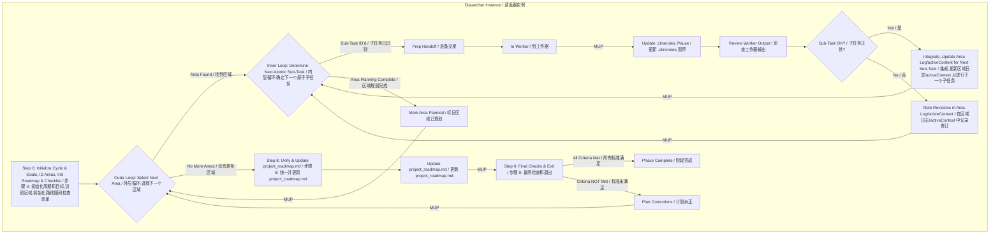

# **Cline Recursive Chain-of-Thought System (CRCT) - Strategy Plugin (Dispatcher Focus)**

# **Cline 递归思维链系统 (CRCT) - 策略插件 (调度器视角)**

This Plugin provides detailed instructions and procedures for the **Dispatcher** role within the Strategy phase of the CRCT system. It guides an iterative, exhaustive process of constructing and maintaining the comprehensive, dependency-aware `project_roadmap.md` using a Dispatcher/Worker pattern facilitated by the `new_task` tool.

本插件为 CRCT 系统的策略阶段中的**调度器 (Dispatcher)** 角色提供详细的指令和程序。它指导了一个迭代的、详尽的过程,用于构建和维护全面的、感知依赖关系的 `project_roadmap.md`,使用由 `new_task` 工具促进的调度器/工作器模式。

**Core Concept (Dispatcher Perspective):**
- The primary instance running this plugin acts as the **Dispatcher**. It orchestrates the overall Strategy phase for the defined cycle goals by updating `project_roadmap.md`.
- The Dispatcher identifies distinct planning "areas" (modules, features) relevant to the cycle goals.
- For each area, the Dispatcher uses the `<new_task>` tool to delegate detailed planning (Worker steps) to separate, fresh **Worker** instances (which will use `strategy_worker_plugin.md`).
- The Dispatcher reviews each Worker's output, updates overall progress, and dispatches further sub-tasks for an area or moves to the next area until all are planned for the cycle.
- Finally, the Dispatcher integrates the cycle's detailed plans into the main `project_roadmap.md` and performs final checks.

**核心概念 (调度器视角):**
- 运行此插件的主要实例作为**调度器**。它通过更新 `project_roadmap.md` 来协调为定义的周期目标进行的整体策略阶段。
- 调度器识别与周期目标相关的不同规划"区域" (模块、功能)。
- 对于每个区域,调度器使用 `<new_task>` 工具将详细规划 (工作器步骤) 委派给独立的、全新的**工作器 (Worker)** 实例 (这些实例将使用 `strategy_worker_plugin.md`)。
- 调度器审查每个工作器的输出,更新整体进度,并为某个区域调度进一步的子任务或移动到下一个区域,直到周期的所有区域都规划完成。
- 最后,调度器将周期的详细计划集成到主 `project_roadmap.md` 中并执行最终检查。

This pattern ensures maximal context separation for planning each area. All `Strategy_*` tasks for planning and all `Execution_*` tasks comprising the roadmap for the targeted work of the cycle must be defined before transitioning to Execution.
This plugin should be used in conjunction with the Core System Prompt.

此模式确保了规划每个区域时最大的上下文分离。在转换到执行阶段之前,必须定义所有用于规划的 `Strategy_*` 任务和构成周期目标工作路线图的所有 `Execution_*` 任务。
此插件应与核心系统提示结合使用。

**IMPORTANT**
If you have already read a file and have not edited it since, *DO NOT* read it again. Use the version in your context. Only load a new version of the file if *you* have recently altered the content.
*Do not use the tool XML tags in general responses, as it will activate the tool unintentionally.*
*system_manifest and other CRCT system files are not tracked by the *project* trackers*

**重要提示**
如果您已经读取了一个文件并且自那时起没有编辑过它,*请不要*再次读取它。使用您上下文中的版本。只有在*您*最近更改了内容时才加载文件的新版本。
*不要在一般响应中使用工具 XML 标签,因为它会意外激活工具。*
*system_manifest 和其他 CRCT 系统文件不由*项目*跟踪器跟踪*

**DO NOT** clutter activeContext with detailed information. Use the appropriate documentation.

**不要**用详细信息使 activeContext 变得杂乱。使用适当的文档。

**Entering and Exiting Strategy Phase (Dispatcher Role)**

**进入和退出策略阶段 (调度器角色)**

**Entering Strategy Phase:**
1.  **`.clinerules` Check (Mandatory First Step)**: Read `.clinerules` file content.
2.  **Determine Current State & Assume Dispatcher Role**:
    *   If `[LAST_ACTION_STATE]` indicates `current_phase: "Strategy"`, resume from the action indicated by `next_action`, consulting `activeContext.md`. You are the Dispatcher.
    *   If `[LAST_ACTION_STATE]` indicates `next_phase: "Strategy"`, this signifies a transition from a previous phase. Assume the **Dispatcher** role and proceed starting from **Section II.A, Step 0** of this plugin.
3.  **User Trigger**: If starting a new session and `.clinerules` indicates Strategy, assume Dispatcher role. If fresh into Strategy, begin at Step 0.

**进入策略阶段:**
1.  **`.clinerules` 检查 (强制第一步)**: 读取 `.clinerules` 文件内容。
2.  **确定当前状态并承担调度器角色**:
    *   如果 `[LAST_ACTION_STATE]` 指示 `current_phase: "Strategy"` (策略),则从 `next_action` 指示的操作恢复,参考 `activeContext.md`。您是调度器。
    *   如果 `[LAST_ACTION_STATE]` 指示 `next_phase: "Strategy"` (策略),这表示从上一阶段的转换。承担**调度器**角色并从此插件的**第 II.A 节,步骤 0**开始。
3.  **用户触发**: 如果开始新会话且 `.clinerules` 指示策略阶段,则承担调度器角色。如果刚进入策略阶段,则从步骤 0 开始。

**Exiting Strategy Phase:** (Performed by Dispatcher)
1.  **Completion Criteria (Mandatory Check)**: Verify ALL the following are met for the current Strategy cycle's goals:
    *   All identified areas/modules relevant to the cycle's goals have been planned (status "[x] Area Planned" in `current_cycle_checklist.md`) and their respective HDTA documents are complete.
    *   **A comprehensive, unified, and sequenced list of all `Execution_*` tasks for the cycle has been generated and integrated into the `project_roadmap.md`**.
    *   All high-priority work planned for this strategy cycle has been decomposed into atomic Task Instructions (`*.md`), with clear phase prefixes (`Strategy_*`, `Execution_*`), and explicit minimal context links.
    *   All necessary HDTA documents (System Manifest, Domain Modules, Implementation Plans, Task Instructions) relevant to the planned work have been created or updated. No placeholders or incomplete sections relevant to the planned work remain.
    *   `Execution_*` tasks have been sequenced and prioritized within their respective areas and their final, unified sequence has been reviewed for inter-area consistency during the update of `project_roadmap.md`. *NOTE: Do not assign workers Execution tasks*.
    *   All HDTA documents are correctly linked (Tasks from Plans, Plans from Modules, Modules from Manifest).
    *   All `Strategy_*` tasks identified and scoped for completion *during this Strategy phase* (including those created by Workers for sub-component planning or plan refinement) have been completed.
    *   The `project_roadmap.md` (incorporating this cycle's plan) reflects the completed planning state for all cycle goals.
    *   The `project_roadmap.md` has been updated with this cycle's plan, reviewed for coherence, and accurately reflects the unified roadmap for all cycle goals, including the explicit execution sequence for the Execution phase.
2.  **`.clinerules` Update (Mandatory MUP Step)**: If completion criteria are met, update `.clinerules` `[LAST_ACTION_STATE]` **exactly** as follows:
    ```
    last_action: "Completed Strategy Phase: Unified Roadmap for All Cycle Goals"
    current_phase: "Strategy"
    next_action: "Phase Complete - User Action Required"
    next_phase: "Execution"
    ```
    Also, add profound, reusable insights to `[LEARNING_JOURNAL]`.
3.  **Pause for User Action**: After successfully updating `.clinerules`, state completion and await user action.

**退出策略阶段:** (由调度器执行)
1.  **完成标准 (强制检查)**: 验证当前策略周期的目标是否满足以下所有条件:
    *   所有与周期目标相关的已识别区域/模块都已规划 (在 `current_cycle_checklist.md` 中状态为 "[x] Area Planned" (区域已规划)),并且它们各自的 HDTA 文档已完成。
    *   **已经生成并集成了周期的所有 `Execution_*` 任务的全面、统一和排序的列表到 `project_roadmap.md` 中**。
    *   为此策略周期规划的所有高优先级工作已分解为原子任务指令 (`*.md`),具有清晰的阶段前缀 (`Strategy_*` (策略)、`Execution_*` (执行)) 和明确的最低上下文链接。
    *   与规划工作相关的所有必要 HDTA 文档 (系统清单、域模块、实施计划、任务指令) 已创建或更新。没有与规划工作相关的占位符或不完整部分。
    *   `Execution_*` 任务已在其各自区域内排序和确定优先级,并且在更新 `project_roadmap.md` 期间,其最终统一序列已审查区域间一致性。*注意:不要为工作器分配执行任务*。
    *   所有 HDTA 文档都已正确链接 (任务来自计划,计划来自模块,模块来自清单)。
    *   所有 `Strategy_*` 任务已识别并限定在*此策略阶段期间*完成 (包括工作器为子组件规划或计划细化创建的任务) 都已完成。
    *   `project_roadmap.md` (包含此周期的计划) 反映了所有周期目标的已完成规划状态。
    *   `project_roadmap.md` 已更新此周期的计划,已审查连贯性,并准确反映所有周期目标的统一路线图,包括执行阶段的明确执行序列。
2.  **`.clinerules` 更新 (强制 MUP 步骤)**: 如果满足完成标准,请**完全**按照以下方式更新 `.clinerules` `[LAST_ACTION_STATE]`:
    ```
    last_action: "Completed Strategy Phase: Unified Roadmap for All Cycle Goals"
    current_phase: "Strategy"
    next_action: "Phase Complete - User Action Required"
    next_phase: "Execution"
    ```
    此外,将深刻的、可重用的见解添加到 `[LEARNING_JOURNAL]` (学习日志)。
3.  **等待用户操作**: 成功更新 `.clinerules` 后,说明完成状态并等待用户操作。

## I. Phase Objective & Guiding Principles (Dispatcher Focus)

## I. 阶段目标与指导原则 (调度器视角)

**Objective**: The primary objective of the Strategy Phase, from the Dispatcher's perspective, is to **orchestrate the construction (if not yet existing), refinement, and maintenance of the single, comprehensive `project_roadmap.md`**. This is achieved by defining cycle goals, identifying relevant "Areas" (modules/features), delegating the detailed planning of each Area to Worker instances, and **finally, unifying these plans into a single, sequenced execution list within `project_roadmap.md` for the next phase.**
The Dispatcher reviews Worker outputs, ensures integration of planned work into `project_roadmap.md`, and confirms all `Strategy_*` planning tasks for the cycle are complete before exiting.

**目标**: 从调度器的角度来看,策略阶段的主要目标是**协调单个、全面的 `project_roadmap.md` 的构建 (如果尚未存在)、细化和维护**。这是通过定义周期目标、识别相关"区域" (模块/功能)、将每个区域的详细规划委派给工作器实例,以及**最终将这些计划统一到 `project_roadmap.md` 中的单个、排序的执行列表以供下一阶段使用**来实现的。
调度器审查工作器输出,确保规划的工作集成到 `project_roadmap.md` 中,并在退出前确认周期的所有 `Strategy_*` 规划任务都已完成。

**CRITICAL CONSTRAINT: MINIMAL CONTEXT LOADING.** Proactively manage what is loaded into working context.

**关键约束:最低上下文加载。** 主动管理加载到工作上下文中的内容。

**Guiding Principles**:

**指导原则**:

<<<**CRITICAL**>>>
*Before **any** planning activities (Dispatcher or Worker), you **MUST** first assess the current state of relevant project artifacts. This includes:*
    *   *Reading the actual code for any area/module/file being planned or potentially impacted.*
    *   *If any project tracker (`module_relationship_tracker.md`, `doc_tracker.md`, `*_module.md` mini-trackers) indicates a dependency (via `show-dependencies` or direct tracker review if necessary for context), the relevant sections of that dependent file (code or documentation) **MUST** be read to understand the nature and implications of the dependency.*
*Failure to perform this comprehensive assessment, including reading dependent files, will lead to incomplete or flawed planning.*
*   The files identified as dependencies through `show-dependencies` (sourced from project trackers) **MUST** then have their relevant sections read using `read_file`.

<<<**关键**>>>
*在**任何**规划活动 (调度器或工作器) 之前,您**必须**首先评估相关项目工件的当前状态。这包括:*
    *   *读取正在规划或可能受到影响的任何区域/模块/文件的实际代码。*
    *   *如果任何项目跟踪器 (`module_relationship_tracker.md`、`doc_tracker.md`、`*_module.md` 小型跟踪器) 指示依赖关系 (通过 `show-dependencies` 或在必要时直接审查跟踪器以获取上下文),则**必须**读取该依赖文件的相关部分 (代码或文档) 以了解依赖关系的性质和影响。*
*未能执行此全面评估,包括读取依赖文件,将导致不完整或有缺陷的规划。*
*   通过 `show-dependencies` (源自项目跟踪器) 识别为依赖关系的文件**必须**然后使用 `read_file` 读取其相关部分。

**(Dispatcher Focused Principles):**
1.  **Dispatcher/Worker Model**: Strategy phase orchestrated by Dispatcher delegating area planning to Workers via `<new_task>`. Workers will use `strategy_worker_plugin.md`.
2.  **Iterative Area-Based Dispatch**: Decompose cycle goals into "areas"; iteratively dispatch planning for each.
3.  **Review Cycle**: Review Worker output before accepting area plans or requesting revisions.
4.  **Unification and Cohesive Roadmap**: After all areas are planned, integrate their plans into the main `project_roadmap.md`, resolving inter-area conflicts and **creating a single, sequenced execution list for the cycle.**
5.  **Overall Progress Tracking**: Maintain high-level status of area planning using `current_cycle_checklist.md`.

**(调度器聚焦原则):**
1.  **调度器/工作器模型**: 策略阶段由调度器通过 `<new_task>` 将区域规划委派给工作器来协调。工作器将使用 `strategy_worker_plugin.md`。
2.  **基于区域的迭代调度**: 将周期目标分解为"区域";迭代地为每个区域调度规划。
3.  **审查循环**: 在接受区域计划或请求修订之前审查工作器输出。
4.  **统一和连贯的路线图**: 在所有区域规划完成后,将它们的计划集成到主 `project_roadmap.md` 中,解决区域间冲突并**为周期创建单个、排序的执行列表**。
5.  **整体进度跟踪**: 使用 `current_cycle_checklist.md` 维护区域规划的高级状态。

**(Overall System Principles Referenced by Dispatcher):**
15. **Roadmap as Primary Output**: All activities contribute to building/refining `project_roadmap.md` via HDTA.
16. **Minimal Context Handover**: Dispatcher's `<new_task>` message provides minimal pointers for Workers.

**(调度器参考的整体系统原则):**
15. **路线图作为主要输出**: 所有活动都有助于通过 HDTA 构建/细化 `project_roadmap.md`。
16. **最低上下文交接**: 调度器的 `<new_task>` 消息为工作器提供最低限度的指针。

## II. Dispatcher Workflow: Orchestrating Granular Roadmap Construction

## II. 调度器工作流程: 协调细粒度路线图构建

This section details the procedures for the **Dispatcher** instance.

本节详细说明**调度器**实例的程序。

*   **Dispatcher Step 0: Initialize Strategy Cycle, Define Goals, & Load Core Project Plans.**

*   **调度器步骤 0: 初始化策略周期、定义目标和加载核心项目计划。**

*   **Action A (CRITICAL Core System Initialization & Overall Cycle Goal Definition)**:
    *   1. **Read `.clinerules`**: Confirm current state.
    *   2. **CRITICAL PRE-CONDITION: Assess Current Project State**: Review `progress.md`, `system_manifest.md`, `activeContext.md`. If specific areas are targets, skim their existing HDTA and code. State: "Initial project state assessment complete."
    *   3. **Define/Confirm Overall Cycle Goals**: Formulate goals. Use `ask_followup_question` if unclear. Update `activeContext.md`. State: "Confirmed overall cycle goals... Documented in `activeContext.md`."

*   **操作 A (关键核心系统初始化和整体周期目标定义)**:
    *   1. **读取 `.clinerules`**: 确认当前状态。
    *   2. **关键前提条件:评估当前项目状态**: 审查 `progress.md`、`system_manifest.md`、`activeContext.md`。如果特定区域是目标,则略读其现有的 HDTA 和代码。状态:"Initial project state assessment complete." (初始项目状态评估完成。)
    *   3. **定义/确认整体周期目标**: 制定目标。如果不清楚,请使用 `ask_followup_question` (提出后续问题)。更新 `activeContext.md`。状态:"Confirmed overall cycle goals... Documented in `activeContext.md`." (已确认整体周期目标...已记录在 `activeContext.md` 中。)

*   **Action B (Initialize/Load Core HDTA & Project Roadmap)**:
    *   1. **Initialize/Load `project_roadmap.md` (CRITICAL)**: Check for `project_roadmap.md`. If new, create from `project_roadmap_template.md`, perform initial population using `system_manifest.md` and dependency visualization (`visualize-dependencies`), and save. If exists, load. State creation/load status.
    *   2. **Verify and Load `system_manifest.md`**: Check for `system_manifest.md`. If missing, error and halt. If exists, load. State: "Loaded `system_manifest.md`."
    *   3. **Preliminary Identification of Relevant Domain Modules**: Based on cycle goals and manifest, list relevant `*_module.md` files. Check existence (do not read content). State: "Preliminarily identified relevant modules... Checked existence."

*   **操作 B (初始化/加载核心 HDTA 和项目路线图)**:
    *   1. **初始化/加载 `project_roadmap.md` (关键)**: 检查 `project_roadmap.md`。如果是新的,则从 `project_roadmap_template.md` 创建,使用 `system_manifest.md` 和依赖关系可视化 (`visualize-dependencies`) 执行初始填充,并保存。如果存在,则加载。状态创建/加载状态。
    *   2. **验证和加载 `system_manifest.md`**: 检查 `system_manifest.md`。如果缺失,则错误并停止。如果存在,则加载。状态:"Loaded `system_manifest.md`." (已加载 `system_manifest.md`。)
    *   3. **初步识别相关域模块**: 基于周期目标和清单,列出相关的 `*_module.md` 文件。检查存在性 (不读取内容)。状态:"Preliminarily identified relevant modules... Checked existence." (已初步识别相关模块...已检查存在性。)

*   **Action C (Identify Areas for Current Cycle & Initialize/Load Cycle-Specific Trackers)**:
    *   1. **Identify Relevant Areas from Manifest**: Based on cycle goals and manifest, identify "Areas" for planning. State: "Identified Areas for cycle: `[List]`."
    *   2. **Handle `hierarchical_task_checklist_*.md`**: Search for existing checklists. If found and relevant, `ask_followup_question` to continue/consolidate/new. Create/load/update `current_cycle_checklist.md`. Populate with Areas from C.1, status `[ ] Unplanned`. State: "Active cycle checklist set to: `current_cycle_checklist.md`. Populated/updated."
    *   3. **Initialize `hdta_review_progress_[session_id].md`**: Create from template. State: "Initialized HDTA Review Progress Tracker."

*   **操作 C (识别当前周期的区域并初始化/加载周期特定跟踪器)**:
    *   1. **从清单识别相关区域**: 基于周期目标和清单,识别用于规划的"区域"。状态:"Identified Areas for cycle: `[List]`." (已识别周期的区域:`[列表]`。)
    *   2. **处理 `hierarchical_task_checklist_*.md`**: 搜索现有检查清单。如果找到且相关,则 `ask_followup_question` (提出后续问题) 以继续/合并/新建。创建/加载/更新 `current_cycle_checklist.md`。使用 C.1 中的区域填充,状态 `[ ] Unplanned` (未规划)。状态:"Active cycle checklist set to: `current_cycle_checklist.md`. Populated/updated." (活动周期检查清单设置为: `current_cycle_checklist.md`。已填充/更新。)
    *   3. **初始化 `hdta_review_progress_[session_id].md`**: 从模板创建。状态:"Initialized HDTA Review Progress Tracker." (已初始化 HDTA 审查进度跟踪器。)

*   **Action D (Initialize Dispatcher Area Planning Logs & Perform Initial Overview)**:
    *   1. **Initialize Dispatcher Area Planning Logs**: For each Area in C.1, create `[AreaName]_planning_log_[cycle_id].md` from template, set `next_atomic_planning_step: "Initial_Area_Assessment"`. Store this file in `cline_docs/dispatch_logs/`. State: "Initialized Dispatcher Area Planning Logs."
    *   2. **Initial Overview & Visualization Check**: Briefly review inter-Area dependencies (`show-dependencies`). Check for/review auto-generated diagrams. State overview findings.

*   **操作 D (初始化调度器区域规划日志并执行初始概述)**:
    *   1. **初始化调度器区域规划日志**: 对于 C.1 中的每个区域,从模板创建 `[AreaName]_planning_log_[cycle_id].md`,设置 `next_atomic_planning_step: "Initial_Area_Assessment"` (初始区域评估)。将此文件存储在 `cline_docs/dispatch_logs/` 中。状态:"Initialized Dispatcher Area Planning Logs." (已初始化调度器区域规划日志。)
    *   2. **初始概述和可视化检查**: 简要审查区域间依赖关系 (`show-dependencies`)。检查/审查自动生成的图表。状态概述发现。

*   **Action E (Finalize Step 0 State & MUP)**:
    *   1. **State**: "Dispatcher completed Strategy Cycle Initialization (Step 0)..."
    *   2. **Update MUP**: Perform Dispatcher MUP (Section V). Set `.clinerules` `next_action: "Orchestrate Area Planning"`. Update `activeContext.md`.

*   **操作 E (完成步骤 0 状态和 MUP)**:
    *   1. **状态**: "Dispatcher completed Strategy Cycle Initialization (Step 0)..." (调度器已完成策略周期初始化 (步骤 0)...)
    *   2. **更新 MUP**: 执行调度器 MUP (第 V 节)。设置 `.clinerules` `next_action: "Orchestrate Area Planning"` (协调区域规划)。更新 `activeContext.md`。

*   **Step 1: Main Orchestration Loop.**

*   **步骤 1: 主协调循环。**

*   **Directive**: Iteratively select a high-level Area. Within that Area, identify and dispatch the next required atomic planning sub-task to a Worker instance using `<new_task>`, pause, and upon the Worker's completion, review the results before dispatching the next task. Repeat until the Area's plan is complete. Then, select the next Area.

*   **指令**: 迭代选择一个高级区域。在该区域内,识别并使用 `<new_task>` 将下一个所需的原子规划子任务调度给工作器实例,暂停,并在工作器完成后审查结果,然后再调度下一个任务。重复直到区域的计划完成。然后,选择下一个区域。

*   **OUTER LOOP START (Per High-Level Area):**
    *   **Action A (Select Next High-Level Area for Planning)**:
        *   Read `current_cycle_checklist.md`.
        *   Identify the first Area with status not equal to "[x] Area Planned". Prioritize any Area marked "[ ] Area Revision Required".
        *   **If None Found** (all Areas are "[x] Area Planned"): All planning complete. State: "Dispatcher confirms all cycle Areas are planned. Proceeding to final roadmap unification.". Update `.clinerules` `next_action: "Unify Cycle Plan and Update project_roadmap.md"`. **Go to Dispatcher Step 8.**
        *   **If Area Found**: Let this be `[Current_Orchestration_Area_Name]`.
        *   Update `activeContext.md`: Set `current_orchestration_area: "[Current_Orchestration_Area_Name]"`.
        *   State: "Dispatcher focusing on Area: `[Current_Orchestration_Area_Name]` (Status: `[Status from checklist]`)."

*   **外层循环开始 (每个高级区域):**
    *   **操作 A (选择下一个高级区域进行规划)**:
        *   读取 `current_cycle_checklist.md`。
        *   识别状态不等于 "[x] Area Planned" (区域已规划) 的第一个区域。优先考虑标记为 "[ ] Area Revision Required" (区域需要修订) 的任何区域。
        *   **如果未找到** (所有区域都是 "[x] Area Planned"): 所有规划完成。状态:"Dispatcher confirms all cycle Areas are planned. Proceeding to final roadmap unification." (调度器确认所有周期区域已规划。继续进行最终路线图统一。)。更新 `.clinerules` `next_action: "Unify Cycle Plan and Update project_roadmap.md"` (统一周期计划并更新 project_roadmap.md)。**转到调度器步骤 8。**
        *   **如果找到区域**: 让此为 `[Current_Orchestration_Area_Name]` (当前协调区域名称)。
        *   更新 `activeContext.md`: 设置 `current_orchestration_area: "[Current_Orchestration_Area_Name]"`。
        *   状态:"Dispatcher focusing on Area: `[Current_Orchestration_Area_Name]` (Status: `[Status from checklist]`)." (调度器专注于区域:`[Current_Orchestration_Area_Name]` (状态:`[来自检查清单的状态]`)。)

    *   **INNER LOOP START (Per Atomic Planning Sub-Task within `[Current_Orchestration_Area_Name]`):**
        *   **Action B (Determine Next Atomic Planning Sub-Task for `[Current_Orchestration_Area_Name]`)**:
            1.  **Assess Current Planning State for `[Current_Orchestration_Area_Name]`**:
                *   Read the Dispatcher Area Planning Log file for `[Current_Orchestration_Area_Name]` (located in `cline_docs/dispatch_logs/`) to find the `next_atomic_planning_step` and review the planning progress for this area.
                *   Review existing HDTA files for this Area (`_module.md`, `implementation_plan_*.md` files, lists of tasks).
                *   **If the planning log indicates the next step is "Initial_Area_Assessment"**: The first sub-task is to assess existing files. Set `atomic_sub_task_description` to "Perform Initial State Assessment for Area `[Current_Orchestration_Area_Name]` (read existing module/plan files, document current state summary in the Worker Output file)."
                *   **Otherwise (based on previous sub-task completion documented in the planning log)**: Determine the *next logical, granular planning action* based on the standard workflow (Initial Assessment -> Dependency Analysis -> HDTA Structure (Module -> Plan(s) -> Task Def) -> Sequencing -> Local Strategy Tasks). Examples:
                    *   If initial assessment done, next is "Perform Dependency Analysis for `[Key component/file of Current_Orchestration_Area_Name]`."
                    *   If `_module.md` outline needed: "Create/Update `[Current_Orchestration_Area_Name]_module.md` outline."
                    *   If a specific `implementation_plan_*.md` needs creation/update: "Create/Update `implementation_plan_[Feature]_for_[Area].md` with objectives & high-level steps."
                    *   If a plan section needs task decomposition: "Decompose `implementation_plan_[Feature].md#SectionX` into atomic `Execution_*` task files."
                    *   If tasks need sequencing in a plan: "Sequence tasks in `implementation_plan_[Feature].md`."
                    *   If a local `Strategy_*.md` task (like refining a plan detail) needs execution: "Execute `Strategy_RefinePlanDetail_For_Feature.md`."

    *   **内层循环开始 (在 `[Current_Orchestration_Area_Name]` 内的每个原子规划子任务):**
        *   **操作 B (确定 `[Current_Orchestration_Area_Name]` 的下一个原子规划子任务)**:
            1.  **评估 `[Current_Orchestration_Area_Name]` 的当前规划状态**:
                *   读取 `[Current_Orchestration_Area_Name]` 的调度器区域规划日志文件 (位于 `cline_docs/dispatch_logs/` 中) 以查找 `next_atomic_planning_step` (下一个原子规划步骤) 并审查此区域的规划进度。
                *   审查此区域的现有 HDTA 文件 (`_module.md`、`implementation_plan_*.md` 文件、任务列表)。
                *   **如果规划日志指示下一步是 "Initial_Area_Assessment" (初始区域评估)**: 第一个子任务是评估现有文件。设置 `atomic_sub_task_description` (原子子任务描述) 为 "Perform Initial State Assessment for Area `[Current_Orchestration_Area_Name]` (read existing module/plan files, document current state summary in the Worker Output file)." (对区域 `[Current_Orchestration_Area_Name]` 执行初始状态评估 (读取现有模块/计划文件,在工作器输出文件中记录当前状态摘要)。)
                *   **否则 (根据规划日志中记录的先前子任务完成情况)**: 基于标准工作流确定*下一个逻辑的、细粒度的规划操作* (初始评估 -> 依赖关系分析 -> HDTA 结构 (模块 -> 计划 -> 任务定义) -> 排序 -> 本地策略任务)。示例:
                    *   如果初始评估完成,下一步是 "Perform Dependency Analysis for `[Key component/file of Current_Orchestration_Area_Name]`." (对 `[Current_Orchestration_Area_Name]` 的关键组件/文件执行依赖关系分析。)
                    *   如果需要 `_module.md` 大纲:"Create/Update `[Current_Orchestration_Area_Name]_module.md` outline." (创建/更新 `[Current_Orchestration_Area_Name]_module.md` 大纲。)
                    *   如果特定的 `implementation_plan_*.md` 需要创建/更新:"Create/Update `implementation_plan_[Feature]_for_[Area].md` with objectives & high-level steps." (使用目标和高级步骤创建/更新 `implementation_plan_[Feature]_for_[Area].md`。)
                    *   如果计划部分需要任务分解:"Decompose `implementation_plan_[Feature].md#SectionX` into atomic `Execution_*` task files." (将 `implementation_plan_[Feature].md#SectionX` 分解为原子 `Execution_*` 任务文件。)
                    *   如果计划中的任务需要排序:"Sequence tasks in `implementation_plan_[Feature].md`." (对 `implementation_plan_[Feature].md` 中的任务进行排序。)
                    *   如果本地 `Strategy_*.md` 任务 (如细化计划细节) 需要执行:"Execute `Strategy_RefinePlanDetail_For_Feature.md`." (执行 `Strategy_RefinePlanDetail_For_Feature.md`。)

            2.  **Check for Area Completion**: If assessment indicates all necessary planning sub-tasks (Module, Plans, Task Defs, Sequencing, Local Strategy Tasks) for `[Current_Orchestration_Area_Name]` appear complete *and their outputs have been accepted*:
                *   Update `current_cycle_checklist.md`: Mark `[Current_Orchestration_Area_Name]` as "[x] Area Planned".
                *   Update the Dispatcher Area Planning Log file for `[Current_Orchestration_Area_Name]`. Update the Area Status to "[x] Planned". Update the "Last Updated" timestamp.
                *   Update `activeContext.md`: Note "Area `[Current_Orchestration_Area_Name]` planning complete." Clear `current_orchestration_area`.
                *   State: "Dispatcher: Planning for Area `[Current_Orchestration_Area_Name]` is now complete."
                *   **GOTO Action A (Outer Loop Start)** to select the next high-level Area.

            2.  **检查区域完成情况**: 如果评估表明 `[Current_Orchestration_Area_Name]` 的所有必要规划子任务 (模块、计划、任务定义、排序、本地策略任务) 似乎已完成*并且其输出已被接受*:
                *   更新 `current_cycle_checklist.md`: 将 `[Current_Orchestration_Area_Name]` 标记为 "[x] Area Planned" (区域已规划)。
                *   更新 `[Current_Orchestration_Area_Name]` 的调度器区域规划日志文件。将区域状态更新为 "[x] Planned" (已规划)。更新"最后更新"时间戳。
                *   更新 `activeContext.md`: 注明"Area `[Current_Orchestration_Area_Name]` planning complete." (区域 `[Current_Orchestration_Area_Name]` 规划完成。)清除 `current_orchestration_area` (当前协调区域)。
                *   状态:"Dispatcher: Planning for Area `[Current_Orchestration_Area_Name]` is now complete." (调度器:区域 `[Current_Orchestration_Area_Name]` 的规划现已完成。)
                *   **转到操作 A (外层循环开始)** 以选择下一个高级区域。

            3.  Let the determined next action be `[Atomic_Sub_Task_Description]`.
            4.  State: "Dispatcher identified next atomic planning sub-task for Area `[Current_Orchestration_Area_Name]`: `[Atomic_Sub_Task_Description]`."

            3.  让确定的下一个操作为 `[Atomic_Sub_Task_Description]` (原子子任务描述)。
            4.  状态:"Dispatcher identified next atomic planning sub-task for Area `[Current_Orchestration_Area_Name]`: `[Atomic_Sub_Task_Description]`." (调度器已识别区域 `[Current_Orchestration_Area_Name]` 的下一个原子规划子任务:`[Atomic_Sub_Task_Description]`。)

        *   **Action C (Prepare Handoff Content for Worker - for the Atomic Sub-Task)**: Gather minimal pointers and craft the handoff content. This content **MUST precisely define ONLY the single `[Atomic_Sub_Task_Description]`**.
            *   **Content to include:**
                *   Instruction: "Assume Worker Role."
                *   Plugin Reference: "Read `strategy_worker_plugin.md`. Execute specific action from its Section I (Worker Task Execution) as instructed."
                *   Overall Area Context: `[Current_Orchestration_Area_Name]`.
                *   **Specific Sub-Task Directive**: `[Detailed instructions for the Atomic_Sub_Task_Description, referencing specific files, sections, or previous outputs if necessary]`. For example: "For Area `[Current_Orchestration_Area_Name]`, focus on file `path/to/specific_file.py`. Perform dependency analysis using `show-dependencies`. Document findings (key dependencies, implications) in `activeContext.md` under section `DepAnalysis_[specific_file_key]`." OR "Based on `implementation_plan_X.md#SectionY`, create atomic `Execution_*.md` task files. Ensure each has Objective, Min Context, Steps. Save to `tasks/exec/`. Link from Plan X."
                *   **Strict Scope Limitation**: "DO NOT perform any other planning steps beyond this specific sub-task."
                *   Expected Outputs: `[Specific files to be created/updated, or specific section in activeContext.md to be populated]`.
                *   MUP Reminder: "Worker MUP: Save outputs, update `hdta_review_progress`, update Worker Output file. NO `.clinerules` changes."
                *   Completion Signal: "Signal task completion to Dispatcher using the method specified by the current interface when THIS SPECIFIC SUB-TASK is fully complete."
                *   **Context Pointers**: (Minimal and relevant ONLY to the sub-task)
                    *   `checklist_path`: `current_cycle_checklist.md`
                    *   `active_context_path`: `activeContext.md` (for overall goals, and for Worker to write its output if specified)
                    *   Paths to *specific* files/diagrams directly needed for *this sub-task*.
                    *   Relevant `revision_notes` from Dispatcher if this is a re-dispatch of a failed sub-task.
                    *   Reinforce that workers need to verify documentation against the actual code files to determine the *actual* state.

        *   **操作 C (为工作器准备交接内容 - 针对原子子任务)**: 收集最低限度的指针并制作交接内容。此内容**必须精确定义仅单个 `[Atomic_Sub_Task_Description]`**。
            *   **要包括的内容**:
                *   指令:"Assume Worker Role." (承担工作器角色。)
                *   插件参考:"Read `strategy_worker_plugin.md`. Execute specific action from its Section I (Worker Task Execution) as instructed." (读取 `strategy_worker_plugin.md`。按照指示从其第 I 节 (工作器任务执行) 执行特定操作。)
                *   整体区域上下文:`[Current_Orchestration_Area_Name]`。
                *   **特定子任务指令**:`[Atomic_Sub_Task_Description 的详细指令,必要时引用特定文件、部分或先前的输出]`。例如:"For Area `[Current_Orchestration_Area_Name]`, focus on file `path/to/specific_file.py`. Perform dependency analysis using `show-dependencies`. Document findings (key dependencies, implications) in `activeContext.md` under section `DepAnalysis_[specific_file_key]`." (对于区域 `[Current_Orchestration_Area_Name]`,专注于文件 `path/to/specific_file.py`。使用 `show-dependencies` 执行依赖关系分析。在 `activeContext.md` 的 `DepAnalysis_[specific_file_key]` 部分记录发现 (关键依赖关系、影响)。) 或 "Based on `implementation_plan_X.md#SectionY`, create atomic `Execution_*.md` task files. Ensure each has Objective, Min Context, Steps. Save to `tasks/exec/`. Link from Plan X." (基于 `implementation_plan_X.md#SectionY`,创建原子 `Execution_*.md` 任务文件。确保每个都有目标、最小上下文、步骤。保存到 `tasks/exec/`。从计划 X 链接。)
                *   **严格范围限制**:"DO NOT perform any other planning steps beyond this specific sub-task." (不要执行超出此特定子任务的任何其他规划步骤。)
                *   预期输出:`[要创建/更新的特定文件,或要填充的 activeContext.md 中的特定部分]`。
                *   MUP 提醒:"Worker MUP: Save outputs, update `hdta_review_progress`, update Worker Output file. NO `.clinerules` changes." (工作器 MUP:保存输出,更新 `hdta_review_progress`,更新工作器输出文件。不更改 `.clinerules`。)
                *   完成信号:"Signal task completion to Dispatcher using the method specified by the current interface when THIS SPECIFIC SUB-TASK is fully complete." (当此特定子任务完全完成时,使用当前接口指定的方法向调度器发出任务完成信号。)
                *   **上下文指针**: (最低限度且仅与子任务相关)
                    *   `checklist_path`: `current_cycle_checklist.md`
                    *   `active_context_path`: `activeContext.md` (用于整体目标,以及工作器在其指定时写入其输出)
                    *   *此子任务*直接需要的*特定*文件/图表的路径。
                    *   如果这是失败子任务的重新调度,则来自调度器的相关 `revision_notes` (修订注释)。
                    *   强调工作器需要根据实际代码文件验证文档以确定*实际*状态。

            *   State: "Dispatcher prepared handoff content for Worker sub-task: `[Atomic_Sub_Task_Description]` for Area `[Current_Orchestration_Area_Name]`."

            *   状态:"Dispatcher prepared handoff content for Worker sub-task: `[Atomic_Sub_Task_Description]` for Area `[Current_Orchestration_Area_Name]`." (调度器已为区域 `[Current_Orchestration_Area_Name]` 的工作器子任务 `[Atomic_Sub_Task_Description]` 准备了交接内容。)

        *   **Action D (Use `<new_task>` Tool - Follow Interface Schema)**:
            *   **CRITICAL**: Use the `new_task` tool. Package the Handoff Content from Action C.
            *   **IMPORTANT**: Adhere strictly to the `new_task` tool's XML structure and parameters as specified by the current interface's system prompt/documentation.
            *   Execute the tool call.
            *   State: "Dispatcher invoking `<new_task>` for sub-task: `[Atomic_Sub_Task_Description]` for Area `[Current_Orchestration_Area_Name]`."

        *   **操作 D (使用 `<new_task>` 工具 - 遵循接口模式)**:
            *   **关键**: 使用 `new_task` 工具。打包来自操作 C 的交接内容。
            *   **重要**: 严格遵守当前接口的系统提示/文档指定的 `new_task` 工具的 XML 结构和参数。
            *   执行工具调用。
            *   状态:"Dispatcher invoking `<new_task>` for sub-task: `[Atomic_Sub_Task_Description]` for Area `[Current_Orchestration_Area_Name]`." (调度器正在为区域 `[Current_Orchestration_Area_Name]` 的子任务 `[Atomic_Sub_Task_Description]` 调用 `<new_task>`。)

        *   **Action E (Update Dispatcher State & Pause)**:
            *   Update the Dispatcher Area Planning Log file for `[Current_Orchestration_Area_Name]` (located in `cline_docs/dispatch_logs/`). Add a new row to the "Atomic Planning Sub-Task Log" table: `| [Atomic_Sub_Task_Directive] | [Worker Instance ID] | Dispatched | In Progress (Worker) | [Link to expected Worker Output file - TBD by Worker] |`. Update the "Last Updated" timestamp.
            *   Update `activeContext.md`: Set `current_orchestration_area: "[Current_Orchestration_Area_Name]"`.
            *   Update `.clinerules` `[LAST_ACTION_STATE]`:
                ```
                last_action: "Dispatched sub-task '[Atomic_Sub_Task_Description]' for Area: [Current_Orchestration_Area_Name] to Worker."
                current_phase: "Strategy"
                next_action: "Review Worker Completion for Sub-Task: [Atomic_Sub_Task_Description], Area: [Current_Orchestration_Area_Name]"
                next_phase: "Strategy"
                ```
            *   State: "Dispatcher dispatched sub-task `[Atomic_Sub_Task_Description]` for Area `[Current_Orchestration_Area_Name]`. Logged in area planning file. Pausing and awaiting worker completion."
            *   **PAUSE EXECUTION.**

        *   **操作 E (更新调度器状态并暂停)**:
            *   更新 `[Current_Orchestration_Area_Name]` 的调度器区域规划日志文件 (位于 `cline_docs/dispatch_logs/` 中)。在"原子规划子任务日志"表中添加一个新行:`| [Atomic_Sub_Task_Directive] | [Worker Instance ID] | Dispatched | In Progress (Worker) | [Link to expected Worker Output file - TBD by Worker] |` (| [原子子任务指令] | [工作器实例 ID] | 已调度 | 进行中 (工作器) | [链接到预期工作器输出文件 - 由工作器待定] |)。更新"最后更新"时间戳。
            *   更新 `activeContext.md`: 设置 `current_orchestration_area: "[Current_Orchestration_Area_Name]"`。
            *   更新 `.clinerules` `[LAST_ACTION_STATE]`:
                ```
                last_action: "Dispatched sub-task '[Atomic_Sub_Task_Description]' for Area: [Current_Orchestration_Area_Name] to Worker."
                current_phase: "Strategy"
                next_action: "Review Worker Completion for Sub-Task: [Atomic_Sub_Task_Description], Area: [Current_Orchestration_Area_Name]"
                next_phase: "Strategy"
                ```
            *   状态:"Dispatcher dispatched sub-task `[Atomic_Sub_Task_Description]` for Area `[Current_Orchestration_Area_Name]`. Logged in area planning file. Pausing and awaiting worker completion." (调度器已为区域 `[Current_Orchestration_Area_Name]` 调度子任务 `[Atomic_Sub_Task_Description]`。已记录在区域规划文件中。暂停并等待工作器完成。)
            *   **暂停执行。**

        *   **(Dispatcher Resumes Here)** **Action F (Review Worker Completion for Atomic Sub-Task)**: (Triggered when control returns after Worker's `<attempt_completion>`)
            *   Retrieve `[Current_Orchestration_Area_Name]` and `[Atomic_Sub_Task_Description]` from `.clinerules` `next_action` or `activeContext.md`.
            *   State: "Dispatcher resuming. Received completion for sub-task: `[Atomic_Sub_Task_Description]` for Area `[Current_Orchestration_Area_Name]`. Reviewing outputs."
            *   **Identify Outputs**: The primary output is the Worker Sub-Task Output file (located in `cline_docs/dispatch_logs/`). Check file system for this file and any other specified outputs (e.g., updated HDTA files).
            *   **Review Content**: Read the Worker Sub-Task Output file. Verify the Worker completed the *specific sub-task assigned* and documented its process and outputs accurately within that file. Check for quality and adherence to instructions. Did it overstep its scope?
                *   **Check for Child Tasks**: Explicitly check the Worker Output File and any parent Task Instruction files created/modified by the Worker for any listed "Children" (i.e., newly created `.md` task files linked from a parent task).
                *   If child tasks are identified:
                    1.  Note them in the Dispatcher Area Planning Log for `[Current_Orchestration_Area_Name]`.
                    2.  The Dispatcher is responsible for ensuring these child tasks are added to the `current_cycle_checklist.md` (likely nested under their parent task or the relevant Implementation Plan).
                    3.  The Dispatcher must also ensure these child tasks are appropriately considered for the final cycle-wide unification and sequencing in Step 8.
            *   State: "Dispatcher review of sub-task `[Atomic_Sub_Task_Description]` output complete. Assessment: `[Brief assessment based on Worker Output file content, including note if child tasks were identified]`."

        *   **(调度器在此处恢复)** **操作 F (审查原子子任务的工作器完成情况)**: (在工作器的 `<attempt_completion>` 之后控制返回时触发)
            *   从 `.clinerules` `next_action` 或 `activeContext.md` 中检索 `[Current_Orchestration_Area_Name]` 和 `[Atomic_Sub_Task_Description]`。
            *   状态:"Dispatcher resuming. Received completion for sub-task: `[Atomic_Sub_Task_Description]` for Area `[Current_Orchestration_Area_Name]`. Reviewing outputs." (调度器正在恢复。已收到区域 `[Current_Orchestration_Area_Name]` 的子任务 `[Atomic_Sub_Task_Description]` 的完成。正在审查输出。)
            *   **识别输出**: 主要输出是工作器子任务输出文件 (位于 `cline_docs/dispatch_logs/` 中)。检查文件系统以查找此文件和任何其他指定的输出 (例如,更新的 HDTA 文件)。
            *   **审查内容**: 读取工作器子任务输出文件。验证工作器已完成*分配的特定子任务*并在此文件中准确地记录了其过程和输出。检查质量和对指令的遵守情况。它是否超出了其范围?
                *   **检查子任务**: 显式检查工作器输出文件和工作器创建/修改的任何父任务指令文件中是否有任何列出的"子任务" (即从父任务链接的新创建的 `.md` 任务文件)。
                *   如果识别了子任务:
                    1.  在 `[Current_Orchestration_Area_Name]` 的调度器区域规划日志中记录它们。
                    2.  调度器负责确保将这些子任务添加到 `current_cycle_checklist.md` (可能嵌套在其父任务或相关实施计划下)。
                    3.  调度器还必须确保在步骤 8 中适当地考虑这些子任务以进行最终的周期范围统一和排序。
            *   状态:"Dispatcher review of sub-task `[Atomic_Sub_Task_Description]` output complete. Assessment: `[Brief assessment based on Worker Output file content, including note if child tasks were identified]`." (调度器对子任务 `[Atomic_Sub_Task_Description]` 输出的审查已完成。评估:`[基于工作器输出文件内容的简要评估,包括是否识别了子任务的注释]`。)

            *   **Action G (Accept or Request Revision for Sub-Task)**:
                *   **If Acceptable**:
                    *   State: "Dispatcher accepts output for sub-task: `[Atomic_Sub_Task_Description]`."
                    *   Integrate the Worker's output (e.g., acknowledge new files, incorporate findings from Worker Output file into the Area Planning Log).
                    *   Update the Dispatcher Area Planning Log file for `[Current_Orchestration_Area_Name]` (located in `cline_docs/dispatch_logs/`). Find the row for `[Atomic_Sub_Task_Directive]` in the "Atomic Planning Sub-Task Log" table. Update the Status to "[x] Completed" and the Outcome Summary based on the Worker Output file. Determine and set the *new* `next_atomic_planning_step` for this Area in the planning log (or mark the Area Status as "Planned" if all sub-steps seem done). Update the "Last Updated" timestamp.
                    *   Perform Dispatcher MUP (Section V). Set `.clinerules` `next_action: "Orchestrate Area Planning"`.
                    *   State: "Proceeding to identify next atomic planning sub-task for Area `[Current_Orchestration_Area_Name]`."
                    *   **GOTO Action B (Inner Loop Start for `[Current_Orchestration_Area_Name]`).**

            *   **操作 G (接受或请求子任务的修订)**:
                *   **如果可接受**:
                    *   状态:"Dispatcher accepts output for sub-task: `[Atomic_Sub_Task_Description]`." (调度器接受子任务 `[Atomic_Sub_Task_Description]` 的输出。)
                    *   集成工作器的输出 (例如,确认新文件,将工作器输出文件中的发现纳入区域规划日志)。
                    *   更新 `[Current_Orchestration_Area_Name]` 的调度器区域规划日志文件 (位于 `cline_docs/dispatch_logs/` 中)。在"原子规划子任务日志"表中查找 `[Atomic_Sub_Task_Directive]` 的行。将状态更新为 "[x] Completed" (已完成),并根据工作器输出文件更新结果摘要。在规划日志中确定并设置此区域的*新* `next_atomic_planning_step` (或如果所有子步骤似乎都已完成,则将区域状态标记为 "Planned" (已规划))。更新"最后更新"时间戳。
                    *   执行调度器 MUP (第 V 节)。设置 `.clinerules` `next_action: "Orchestrate Area Planning"` (协调区域规划)。
                    *   状态:"Proceeding to identify next atomic planning sub-task for Area `[Current_Orchestration_Area_Name]`." (正在继续识别区域 `[Current_Orchestration_Area_Name]` 的下一个原子规划子任务。)
                    *   **转到操作 B (针对 `[Current_Orchestration_Area_Name]` 的内层循环开始)。**

                *   **If Revision Needed**:
                    *   State: "Dispatcher requires revisions for sub-task: `[Atomic_Sub_Task_Description]`. Issues: `[List specific, actionable issues regarding the sub-task's output]`."
                    *   Update the Dispatcher Area Planning Log file for `[Current_Orchestration_Area_Name]`. Find the row for `[Atomic_Sub_Task_Directive]` in the "Atomic Planning Sub-Task Log" table. Update the Status to "Revision Required" and the Outcome Summary to note the need for revision. Add detailed revision notes to the "High-Level Notes and Revision Requirements" section, referencing the specific sub-task. Keep the `next_atomic_planning_step` in the planning log pointing to the *same sub-task type* or a precursor if the failure was fundamental. Update the "Last Updated" timestamp.
                    *   Perform Dispatcher MUP (Section V). Set `.clinerules` `next_action: "Orchestrate Area Planning"`.
                    *   State: "Revision requirements noted for sub-task. Proceeding to re-dispatch."
                    *   **GOTO Action B (Inner Loop Start for `[Current_Orchestration_Area_Name]`).** (The loop will re-identify this sub-task, and Handoff Content in Action C will include the new revision notes from the planning log).

                *   **如果需要修订**:
                    *   状态:"Dispatcher requires revisions for sub-task: `[Atomic_Sub_Task_Description]`. Issues: `[List specific, actionable issues regarding the sub-task's output]`." (调度器需要对子任务 `[Atomic_Sub_Task_Description]` 进行修订。问题:`[列出关于子任务输出的具体、可操作的问题]`。)
                    *   更新 `[Current_Orchestration_Area_Name]` 的调度器区域规划日志文件。在"原子规划子任务日志"表中查找 `[Atomic_Sub_Task_Directive]` 的行。将状态更新为 "Revision Required" (需要修订),并将结果摘要记录为需要修订。在"高级注释和修订要求"部分添加详细的修订注释,引用特定的子任务。使规划日志中的 `next_atomic_planning_step` 指向*相同的子任务类型*或前驱 (如果失败是根本性的)。更新"最后更新"时间戳。
                    *   执行调度器 MUP (第 V 节)。设置 `.clinerules` `next_action: "Orchestrate Area Planning"` (协调区域规划)。
                    *   状态:"Revision requirements noted for sub-task. Proceeding to re-dispatch." (已记录子任务的修订要求。继续进行重新调度。)
                    *   **转到操作 B (针对 `[Current_Orchestration_Area_Name]` 的内层循环开始)。** (循环将重新识别此子任务,操作 C 中的交接内容将包括来自规划日志的新修订注释。)

*   **(Dispatcher) Step 8: Unify Cycle Plan and Update `project_roadmap.md`.**

*   **(调度器) 步骤 8: 统一周期计划并更新 `project_roadmap.md`。**

*   **Directive**: Consolidate the individually planned area roadmaps for the current cycle (represented by their HDTA documents) and integrate this cycle's plan into the main `project_roadmap.md`. Review for inter-area consistency, dependency conflicts, and overall logical flow of the *cycle's contribution* to the project.

*   **指令**: 合并当前周期的各个规划的区域路线图 (由其 HDTA 文档表示),并将此周期的计划集成到主 `project_roadmap.md` 中。审查区域间一致性、依赖关系冲突以及周期对项目的*周期贡献*的整体逻辑流程。

*   **Action A (Verify All Areas Planned for Cycle)**: As a final check, read `current_cycle_checklist.md` (the active checklist for this cycle, identified in Step 0) and confirm all areas relevant to the current cycle goals have the status "[x] Planned". If not, return to Step 1 (Dispatch Loop) to address the discrepancies. State: "Dispatcher confirms all required cycle Areas are marked '[x] Planned' in `current_cycle_checklist.md`. Proceeding with unification and `project_roadmap.md` update."

*   **操作 A (验证周期的所有区域已规划)**: 作为最后检查,读取 `current_cycle_checklist.md` (此周期的活动检查清单,在步骤 0 中识别),并确认与当前周期目标相关的所有区域都具有状态 "[x] Planned" (已规划)。如果没有,则返回步骤 1 (调度循环) 以解决差异。状态:"Dispatcher confirms all required cycle Areas are marked '[x] Planned' in `current_cycle_checklist.md`. Proceeding with unification and `project_roadmap.md` update." (调度器确认所有必需的周期区域在 `current_cycle_checklist.md` 中标记为 '[x] Planned'。继续进行统一和 `project_roadmap.md` 更新。)

*   **Action B (Load Cycle Plans & Identify Interfaces)**:
    *   For each planned area in `current_cycle_checklist.md`, load its primary `implementation_plan_*.md` file(s) using `read_file`. These contain the task lists, sequences, and objectives for each area *for this cycle*.
    *   Optionally, load the `[AreaName]_module.md` files for high-level context relevant to this cycle's changes.
    *   **Identify Interface Tasks**: Scan the Implementation Plans and Task Instructions (`Dependencies` sections) for *this cycle's tasks* to identify key tasks that represent interfaces or integration points *between* different planned areas for this cycle. Note these tasks and their dependencies.
    *   **Minimize Loading**: Avoid reloading all individual Task Instruction files from this cycle unless a specific conflict or dependency requires deep inspection.

*   **操作 B (加载周期计划并识别接口)**:
    *   对于 `current_cycle_checklist.md` 中的每个规划区域,使用 `read_file` 加载其主要 `implementation_plan_*.md` 文件。这些包含*此周期*每个区域的任务列表、序列和目标。
    *   可选地,加载 `[AreaName]_module.md` 文件以获取与此周期更改相关的高级上下文。
    *   **识别接口任务**: 扫描*此周期的任务*的实施计划和任务指令 (`Dependencies` 部分),以识别代表*此周期*的不同规划区域*之间的*接口或集成点的关键任务。记录这些任务及其依赖关系。
    *   **最小化加载**: 避免重新加载此周期的所有单独任务指令文件,除非特定冲突或依赖关系需要深入检查。

*   **Action C (Review and Resolve Inter-Area Issues for Cycle's Plan Cohesion)**:
    *   Check for logical flow and dependencies *between tasks planned in different areas for this cycle*.
    *   Ensure task granularity and instruction clarity are reasonably consistent.
    *   Identify and resolve any conflicting instructions, timing issues, or resource contention *within this cycle's planned tasks*. This might require targeted updates to specific Task Instructions or Implementation Plans for this cycle.
    *   Use `show-dependencies --key <key_of_interfacing_task_or_file>` if needed.
    *   State: "Reviewed inter-area plans for current cycle. `[No major issues found / Identified issue: {description}, Resolution: {action_taken}]`."
    *   **Consult Diagrams**: Review relevant dependency diagrams.
    *   **Generate Focused Diagram (If Needed)** for complex inter-area connections *within this cycle's scope*.
    *   **Identify & Resolve Conflicts** within the cycle's plan. If significant rework is needed for an area, note it, mark area as "[ ] Revision Required" in `current_cycle_checklist.md`, set `.clinerules` `next_action: "Orchestrate Area Planning"`, and loop back to Step 1.
    *   State: "Dispatcher reviewed inter-area plans for cycle. `[Issues/Resolutions / No major conflicts found]`."

*   **操作 C (审查和解决周期计划一致性的区域间问题)**:
    *   检查*此周期不同区域中规划的任务之间的*逻辑流程和依赖关系。
    *   确保任务粒度和指令清晰度合理一致。
    *   识别并解决*此周期规划任务中的*任何冲突指令、时间问题或资源争用。这可能需要针对此周期的特定任务指令或实施计划进行定向更新。
    *   如有必要,使用 `show-dependencies --key <key_of_interfacing_task_or_file>` (显示依赖关系 --键 <接口任务或文件的键>)。
    *   状态:"Reviewed inter-area plans for current cycle. `[No major issues found / Identified issue: {description}, Resolution: {action_taken}]`." (已审查当前周期的区域间计划。`[未发现重大问题 / 已识别问题:{描述}, 解决方案:{采取的行动}]`。)
    *   **咨询图表**: 审查相关的依赖关系图表。
    *   **生成聚焦图表 (如果需要)** 用于*此周期范围内的*复杂区域间连接。
    *   **识别和解决冲突** 在周期计划内。如果某个区域需要大量重新工作,请记录它,在 `current_cycle_checklist.md` 中将区域标记为 "[ ] Revision Required" (需要修订),设置 `.clinerules` `next_action: "Orchestrate Area Planning"` (协调区域规划),并循环回步骤 1。
    *   状态:"Dispatcher reviewed inter-area plans for cycle. `[Issues/Resolutions / No major conflicts found]`." (调度器已审查周期的区域间计划。`[问题/解决方案 / 未发现重大冲突]`。)

*   **Action D (Update `project_roadmap.md` with Cycle's Plan - CRITICAL)**:
    *   **Action**: `read_file` the main `project_roadmap.md` (loaded in Step 0.B).
    *   **Goal**: To integrate a summary of this cycle's planned work into the overall `project_roadmap.md`, ensuring it reflects the current, detailed intentions for the cycle's goals.
    *   **Procedure**:
        1.  Determine where and how to best integrate this cycle's information. This might involve:
            *   Adding new sub-sections under existing major features/modules in `project_roadmap.md` if this cycle details them further.
            *   Creating new top-level sections in `project_roadmap.md` if this cycle introduces entirely new major features.
            *   Updating existing status markers or timelines within `project_roadmap.md` based on this cycle's detailed planning.
        2.  The information to integrate should include:
            *   A clear reference to the current cycle (e.g., using the `[cycle_id]` from `current_cycle_checklist.md`).
            *   The overall cycle goals that were addressed.
            *   A list of all Areas planned in this cycle.
            *   For each Area, a concise summary of its main objectives for this cycle and a high-level overview of its `Execution_*` task sequence (linking to its Implementation Plan(s)).
            *   A unified, high-level execution sequence or flow diagram (e.g., Mermaid) for *this cycle's tasks*, showing inter-area dependencies and key milestones for the cycle.
        3.  **Use `apply_diff` or `write_to_file` (if changes are extensive) to update `project_roadmap.md`**. Ensure the update is a logical integration, not just an append, maintaining the integrity of the overall project roadmap.
    *   State: "Updated main `project_roadmap.md` with the unified plan and detailed contributions from the current strategy cycle."
    *   Update `hdta_review_progress_[session_id].md` for `project_roadmap.md` (Status: Updated).

*   **操作 D (使用周期的计划更新 `project_roadmap.md` - 关键)**:
    *   **操作**: `read_file` 主 `project_roadmap.md` (在步骤 0.B 中加载)。
    *   **目标**: 将此周期规划工作的摘要集成到整体 `project_roadmap.md` 中,确保它反映周期目标的当前、详细意图。
    *   **过程**:
        1.  确定在何处以及如何最好地集成此周期的信息。这可能涉及:
            *   如果此周期进一步详细说明现有主要功能/模块,则在 `project_roadmap.md` 中的现有主要功能/模块下添加新的子节。
            *   如果此周期引入了全新的主要功能,则在 `project_roadmap.md` 中创建新的顶级节。
            *   基于此周期的详细规划更新 `project_roadmap.md` 中现有的状态标记或时间线。
        2.  要集成的信息应包括:
            *   对当前周期的清晰引用 (例如,使用来自 `current_cycle_checklist.md` 的 `[cycle_id]`)。
            *   已解决的整体周期目标。
            *   此周期规划的所有区域的列表。
            *   对于每个区域,其周期主要目标的简明摘要及其 `Execution_*` 任务序列的高级概述 (链接到其实施计划)。
            *   *此周期任务的*统一、高级执行序列或流程图 (例如 Mermaid),显示区域间依赖关系和周期的关键里程碑。
        3.  **使用 `apply_diff` 或 `write_to_file` (如果更改广泛) 来更新 `project_roadmap.md`**。确保更新是逻辑集成,而不仅仅是追加,维护整体项目路线图的完整性。
    *   状态:"Updated main `project_roadmap.md` with the unified plan and detailed contributions from the current strategy cycle." (已使用当前策略周期的统一计划和详细贡献更新主 `project_roadmap.md`。)
    *   为 `project_roadmap.md` 更新 `hdta_review_progress_[session_id].md` (状态:已更新)。

*   **Action E (Update Checklist for Cycle Completion)**:
    *   Update `current_cycle_checklist.md`: Add an entry like "[x] Cycle Plan Integrated into `project_roadmap.md`."
    *   State: "Main `project_roadmap.md` updated with current cycle's plan. `current_cycle_checklist.md` marked accordingly. Proceeding to final phase checks."
    *   **Update `.clinerules` `[LAST_ACTION_STATE]`**: `next_action: "Final Checks and Exit Strategy Phase"`. Update `activeContext.md` to note completion of Step 8 and that `project_roadmap.md` has been updated.

*   **操作 E (更新周期完成的检查清单)**:
    *   更新 `current_cycle_checklist.md`: 添加一个条目,如 "[x] Cycle Plan Integrated into `project_roadmap.md`." (周期计划已集成到 `project_roadmap.md` 中。)
    *   状态:"Main `project_roadmap.md` updated with current cycle's plan. `current_cycle_checklist.md` marked accordingly. Proceeding to final phase checks." (主 `project_roadmap.md` 已更新当前周期的计划。`current_cycle_checklist.md` 已相应标记。继续进行最终阶段检查。)
    *   **更新 `.clinerules` `[LAST_ACTION_STATE]`**: `next_action: "Final Checks and Exit Strategy Phase"` (最终检查和退出策略阶段)。更新 `activeContext.md` 以记录步骤 8 的完成以及 `project_roadmap.md` 已更新。

*   **(Dispatcher) Step 8.5: Sequencing the execution phase task list.**

*   **(调度器) 步骤 8.5: 对执行阶段任务列表进行排序。**

*   **Directive**: Consolidate all planned work for the cycle into a single, sequenced execution list. Integrate this unified plan into the main `project_roadmap.md`, creating an authoritative handoff for the Execution phase.

*   **指令**: 将周期的所有规划工作合并到单个、排序的执行列表中。将此统一计划集成到主 `project_roadmap.md` 中,为执行阶段创建权威的交接。

*   **Action A (Verify All Areas Planned for Cycle)**: As a final check, read `current_cycle_checklist.md` and confirm all areas relevant to the current cycle goals have the status "[x] Area Planned". If not, return to Step 1. State: "Dispatcher confirms all required cycle Areas are marked '[x] Planned'. Proceeding with unification and `project_roadmap.md` update."

*   **操作 A (验证周期的所有区域已规划)**: 作为最后检查,读取 `current_cycle_checklist.md` 并确认与当前周期目标相关的所有区域都具有状态 "[x] Area Planned" (区域已规划)。如果没有,则返回步骤 1。状态:"Dispatcher confirms all required cycle Areas are marked '[x] Planned'. Proceeding with unification and `project_roadmap.md` update." (调度器确认所有必需的周期区域标记为 '[x] Planned'。继续进行统一和 `project_roadmap.md` 更新。)

*   **Action B (Gather All `Execution_*` Tasks for the Cycle)**:
    *   Iterate through each planned Area in `current_cycle_checklist.md`.
    *   For each Area, `read_file` its `implementation_plan_*.md` file(s).
    *   Extract the list of `Execution_*.md` task files from the "Task Decomposition" section of each plan.
    *   Compile a flat list of all `Execution_*.md` task file paths for the entire cycle.

*   **操作 B (收集周期的所有 `Execution_*` 任务)**:
    *   遍历 `current_cycle_checklist.md` 中的每个规划区域。
    *   对于每个区域,`read_file` 其 `implementation_plan_*.md` 文件。
    *   从每个计划的"任务分解"部分提取 `Execution_*.md` 任务文件列表。
    *   编译整个周期的所有 `Execution_*.md` 任务文件路径的平面列表。

*   **Action C (Analyze Inter-Task Dependencies and Create Unified Sequence)**:
    *   **Goal**: Create a single, ordered list of `Execution_*` tasks that respects all dependencies, both within and between areas.
    *   **Process**:
        1.  Start with an empty `final_sequence` list.
        2.  For each task in your compiled list, use `show-dependencies --key <key_for_task_or_its_main_target>` to understand what it depends on.
        3.  Use a topological sorting approach or a similar dependency-aware method to order the tasks. A simple iterative method:
            *   Find all tasks with no uncompleted dependencies. Add them to the `final_sequence`.
            *   Remove them from the "to-do" list.
            *   Repeat until the "to-do" list is empty.
        4.  If you encounter a circular dependency, halt, document the conflicting tasks, and plan a corrective action (e.g., dispatch a `Strategy_` task to resolve the conflict). This may require looping back to Step 1.
    *   State: "Unified task sequence for the cycle created, respecting inter-area dependencies. Total tasks: `[N]`."

*   **操作 C (分析任务间依赖关系并创建统一序列)**:
    *   **目标**: 创建单个、有序的 `Execution_*` 任务列表,该列表尊重区域内和区域之间的所有依赖关系。
    *   **过程**:
        1.  从空的 `final_sequence` (最终序列) 列表开始。
        2.  对于编译列表中的每个任务,使用 `show-dependencies --key <key_for_task_or_its_main_target>` 了解其依赖的内容。
        3.  使用拓扑排序方法或类似的依赖关系感知方法对任务进行排序。一个简单的迭代方法:
            *   找到所有没有未完成依赖关系的任务。将它们添加到 `final_sequence`。
            *   从"待办"列表中删除它们。
            *   重复直到"待办"列表为空。
        4.  如果遇到循环依赖,请停止,记录冲突任务,并计划纠正操作 (例如,调度 `Strategy_` 任务以解决冲突)。这可能需要循环回步骤 1。
    *   状态:"Unified task sequence for the cycle created, respecting inter-area dependencies. Total tasks: `[N]`." (已为周期创建统一任务序列,尊重区域间依赖关系。总任务数:`[N]`。)

*   **Action D (Update `project_roadmap.md` with Cycle's Plan and Unified Execution Sequence - CRITICAL)**:
    *   **Action**: `read_file` the main `project_roadmap.md`.
    *   **Procedure**:
        1.  Find or create a main section for the current cycle (e.g., `## Cycle [cycle_id] Plan`).
        2.  Under this section, add a summary of the cycle's goals and the Areas that were planned.
        3.  **CRITICAL**: Add a new subsection titled `### Unified Execution Sequence`.
        4.  Populate this subsection with the ordered list of `Execution_*` task files from Action C, formatted as a checklist. This is the direct handoff to the Execution phase.
            ```markdown
            ### Unified Execution Sequence

            - [ ] `path/to/tasks/area_B/Execution_Setup_Database.md`
            - [ ] `path/to/tasks/area_A/Execution_Implement_Core_Logic.md`
            - [ ] `path/to/tasks/area_A/Execution_Refine_Helper_Functions.md`
            - [ ] `path/to/tasks/area_B/Execution_Connect_API_to_DB.md`
            - [ ] `path/to/tasks/area_C/Execution_Build_UI_Component.md`
            ```
        5.  **Use `apply_diff` or `write_to_file` to update `project_roadmap.md`**.
    *   State: "Updated main `project_roadmap.md` with the cycle summary and the unified, sequenced execution task list."
    *   **Update `.clinerules` `[LAST_ACTION_STATE]`**: `next_action: "Final Checks and Exit Strategy Phase"`. Update `activeContext.md` to note completion of Step 8.5

*   **操作 D (使用周期的计划和统一执行序列更新 `project_roadmap.md` - 关键)**:
    *   **操作**: `read_file` 主 `project_roadmap.md`。
    *   **过程**:
        1.  查找或创建当前周期的主要节 (例如,`## Cycle [cycle_id] Plan`)。
        2.  在此节下,添加周期目标和已规划区域的摘要。
        3.  **关键**: 添加一个题为 `### Unified Execution Sequence` (统一执行序列) 的新小节。
        4.  使用来自操作 C 的有序 `Execution_*` 任务文件列表填充此小节,格式化为检查清单。这是对执行阶段的直接交接。
            ```markdown
            ### Unified Execution Sequence / 统一执行序列

            - [ ] `path/to/tasks/area_B/Execution_Setup_Database.md`
            - [ ] `path/to/tasks/area_A/Execution_Implement_Core_Logic.md`
            - [ ] `path/to/tasks/area_A/Execution_Refine_Helper_Functions.md`
            - [ ] `path/to/tasks/area_B/Execution_Connect_API_to_DB.md`
            - [ ] `path/to/tasks/area_C/Execution_Build_UI_Component.md`
            ```
        5.  **使用 `apply_diff` 或 `write_to_file` 更新 `project_roadmap.md`**。
    *   状态:"Updated main `project_roadmap.md` with the cycle summary and the unified, sequenced execution task list." (已使用周期摘要和统一、排序的执行任务列表更新主 `project_roadmap.md`。)
    *   **更新 `.clinerules` `[LAST_ACTION_STATE]`**: `next_action: "Final Checks and Exit Strategy Phase"` (最终检查和退出策略阶段)。更新 `activeContext.md` 以记录步骤 8.5 的完成

*   **(Dispatcher) Step 9: Final Checks and Exit Strategy Phase.**

*   **(调度器) 步骤 9: 最终检查和退出策略阶段。**

*   **Directive**: As the Dispatcher, verify all conditions for exiting the *entire* Strategy phase are met, ensuring the roadmap for the current cycle goals is complete, consistent, and actionable.

*   **指令**: 作为调度器,验证退出*整个*策略阶段的所有条件是否满足,确保当前周期目标的路线图是完整、一致和可操作的。

*   **Action A (Perform Completion Criteria Check)**: Meticulously review **ALL** points listed in the "Exiting Strategy Phase" section at the beginning of this plugin document (Section I). Verify each one against the current state of the project files, HDTA documents, checklists, and the `project_roadmap.md`. Pay special attention to:
    *   Completeness of all planned areas.
    *   Existence and completeness of the `project_roadmap.md` content reflecting this cycle's plan and the sequenced list for the execution phase.
    *   Absence of placeholders in relevant HDTA.
    *   Correct linking between all HDTA tiers.
    *   Completion of all `Strategy_*` tasks identified *during this entire phase* (including any created by workers and potentially missed).
    *   Accuracy of `current_cycle_checklist.md`.

*   **操作 A (执行完成标准检查)**: 仔细审查**所有**在此插件文档开头的"退出策略阶段"部分 (第 I 节) 中列出的要点。根据项目文件、HDTA 文档、检查清单和 `project_roadmap.md` 的当前状态逐一验证。特别注意:
    *   所有规划区域的完整性。
    *   反映此周期计划和执行阶段排序列表的 `project_roadmap.md` 内容的存在性和完整性。
    *   相关 HDTA 中没有占位符。
    *   所有 HDTA 层级之间的正确链接。
    *   在*整个阶段期间*识别的所有 `Strategy_*` 任务的完成 (包括工作器创建的任何任务和可能遗漏的任务)。
    *   `current_cycle_checklist.md` 的准确性。

*   **Action B (Decision and Exit/Correct)**:
    *   **If ALL criteria are met**:
        1.  State: "Dispatcher confirms all Strategy Phase completion criteria are met."
        2.  Perform final Dispatcher MUP (Section IV):
            *   Update `activeContext.md` noting phase completion.
            *   Add any novel, reusable insights to `.clinerules` `[LEARNING_JOURNAL]`.
            *   Update `.clinerules` `[LAST_ACTION_STATE]` **exactly** as specified in the "Exiting Strategy Phase" section (Section I preamble) which includes:
            ```
            last_action: "Completed Strategy Phase: Unified Roadmap for All Cycle Goals"
            current_phase: "Strategy"
            next_action: "Phase Complete - User Action Required"
            next_phase: "Execution"
            ```
        3.  State: "Strategy phase complete. Unified roadmap for all cycle goals created, verified, and documented. All completion criteria met. Awaiting user action to proceed to Execution."
        4.  **PAUSE EXECUTION.** Await user trigger for the next phase.

*   **操作 B (决策和退出/纠正)**:
    *   **如果满足所有标准**:
        1.  状态:"Dispatcher confirms all Strategy Phase completion criteria are met." (调度器确认所有策略阶段完成标准均已满足。)
        2.  执行最终调度器 MUP (第 IV 节):
            *   更新 `activeContext.md` 记录阶段完成。
            *   将任何新的、可重用的见解添加到 `.clinerules` `[LEARNING_JOURNAL]` (学习日志)。
            *   **完全**按照"退出策略阶段"部分 (第 I 节前言) 的规定更新 `.clinerules` `[LAST_ACTION_STATE]`,包括:
            ```
            last_action: "Completed Strategy Phase: Unified Roadmap for All Cycle Goals"
            current_phase: "Strategy"
            next_action: "Phase Complete - User Action Required"
            next_phase: "Execution"
            ```
        3.  状态:"Strategy phase complete. Unified roadmap for all cycle goals created, verified, and documented. All completion criteria met. Awaiting user action to proceed to Execution." (策略阶段完成。已为所有周期目标创建、验证和记录统一路线图。满足所有完成标准。等待用户操作以继续执行。)
        4.  **暂停执行。** 等待下一阶段的用户触发。

    *   **If ANY criteria are NOT met**:
        1.  State clearly: "Strategy phase completion criteria **NOT** fully met. Missing/Issues: `[List specific unmet criteria and details, e.g., Placeholder found in implementation_plan_X.md, Task linking incomplete for Plan Y, Strategy_TaskZ was not completed, project_roadmap.md needs refinement based on conflict Z]`."
        2.  Determine the corrective action needed. This might involve:
            *   Revisiting Step 8 (Unification) to fix the `project_roadmap.md` or resolve missed conflicts.
            *   Looping back to Step 1 (Dispatch Loop) to dispatch a revision task for a specific area's HDTA.
            *   Manually (as the Dispatcher) completing a missed `Strategy_*` task or fixing linking issues if simple enough.
        3.  Update `activeContext.md` detailing the identified issues and the plan/next step to address them.
        4.  Perform Dispatcher MUP (Section IV). Update `.clinerules` `[LAST_ACTION_STATE]` reflecting the current incomplete status (e.g., `last_action: "Dispatcher: Strategy Phase Final Check Failed - [Specific Issue Summary]."`) and set `next_action` to the required corrective step (e.g., `"Unify Cycle Plan and Update project_roadmap.md"`, `"Orchestrate Area Planning"`, or a specific action like `"Complete Final Linking"`).
        5.  State: "Corrective actions required before exiting Strategy Phase. Proceeding with `[Corrective Step]`."
        6.  **Continue execution** based on the determined corrective step.

    *   **如果任何标准未满足**:
        1.  明确说明:"Strategy phase completion criteria **NOT** fully met. Missing/Issues: `[List specific unmet criteria and details, e.g., Placeholder found in implementation_plan_X.md, Task linking incomplete for Plan Y, Strategy_TaskZ was not completed, project_roadmap.md needs refinement based on conflict Z]`." (策略阶段完成标准**未**完全满足。缺失/问题:`[列出特定的未满足标准和细节,例如,在 implementation_plan_X.md 中发现占位符,计划 Y 的任务链接不完整,Strategy_TaskZ 未完成,project_roadmap.md 需要根据冲突 Z 进行细化]`。)
        2.  确定所需的纠正操作。这可能涉及:
            *   重新访问步骤 8 (统一) 以修复 `project_roadmap.md` 或解决遗漏的冲突。
            *   循环回步骤 1 (调度循环) 以调度特定区域 HDTA 的修订任务。
            *   手动 (作为调度器) 完成遗漏的 `Strategy_*` 任务或修复链接问题 (如果足够简单)。
        3.  更新 `activeContext.md` 详细说明识别的问题以及解决它们的计划/下一步。
        4.  执行调度器 MUP (第 IV 节)。更新 `.clinerules` `[LAST_ACTION_STATE]` 反映当前不完整状态 (例如,`last_action: "Dispatcher: Strategy Phase Final Check Failed - [Specific Issue Summary]."`) 并将 `next_action` 设置为所需的纠正步骤 (例如,`"Unify Cycle Plan and Update project_roadmap.md"`、`"Orchestrate Area Planning"` 或特定操作如 `"Complete Final Linking"` (完成最终链接))。
        5.  状态:"Corrective actions required before exiting Strategy Phase. Proceeding with `[Corrective Step]`." (在退出策略阶段之前需要采取纠正措施。正在继续进行 `[Corrective Step]`。)
        6.  **继续执行** 基于确定的纠正步骤。

## V. Mandatory Update Protocol (MUP) Additions (Strategy Plugin - Dispatcher Focus)
(This is Section V.A from the original combined plugin, lines 513-583, with `hierarchical_task_checklist_[cycle_id].md` changed to `current_cycle_checklist.md` and `roadmap_summary` to `project_roadmap.md` where appropriate.)

## V. 强制更新协议 (MUP) 增补 (策略插件 - 调度器视角)
(这是原始组合插件的第 V.A 节,第 513-583 行,在适当的地方将 `hierarchical_task_checklist_[cycle_id].md` 改为 `current_cycle_checklist.md`,将 `roadmap_summary` 改为 `project_roadmap.md`。)

*   **(After Dispatcher Step 0 - Initialization):** Save/Update `hdta_review_progress` and `current_cycle_checklist.md`. Update `activeContext.md`. `.clinerules` `last_action: "Dispatcher: Completed Strategy Cycle Initialization (Step 0).", next_action: "Orchestrate Area Planning"`.

*   **(调度器步骤 0 - 初始化后):** 保存/更新 `hdta_review_progress` (HDTA 审查进度) 和 `current_cycle_checklist.md`。更新 `activeContext.md`。`.clinerules` `last_action: "Dispatcher: Completed Strategy Cycle Initialization (Step 0).", next_action: "Orchestrate Area Planning"` (协调区域规划)。

*   **(After Dispatcher Step 1.E - Dispatching an Atomic Sub-Task):** `.clinerules` `last_action: "Dispatcher: Dispatched sub-task...", next_action: "Review Worker Completion..."`.

*   **(调度器步骤 1.E - 调度原子子任务后):** `.clinerules` `last_action: "Dispatcher: Dispatched sub-task...", next_action: "Review Worker Completion..."` (审查工作器完成...)。

*   **(After Dispatcher Step 1.G - Reviewing Worker Output):** Update `current_cycle_checklist.md`. Update Area Planning Log. Update `activeContext.md`. `.clinerules` `last_action: "Dispatcher: Reviewed Worker...", next_action: "Orchestrate Area Planning"`.

*   **(调度器步骤 1.G - 审查工作器输出后):** 更新 `current_cycle_checklist.md`。更新区域规划日志。更新 `activeContext.md`。`.clinerules` `last_action: "Dispatcher: Reviewed Worker...", next_action: "Orchestrate Area Planning"` (协调区域规划)。

*   **(After Dispatcher Step 1.A - Area planning complete):** Update `current_cycle_checklist.md`. Update `activeContext.md`. `.clinerules` `last_action: "Dispatcher: Completed all planning for Area...", next_action: "Orchestrate Area Planning"`.

*   **(调度器步骤 1.A - 区域规划完成后):** 更新 `current_cycle_checklist.md`。更新 `activeContext.md`。`.clinerules` `last_action: "Dispatcher: Completed all planning for Area...", next_action: "Orchestrate Area Planning"` (协调区域规划)。

*   **(After Dispatcher Step 8 - Unification):** Ensure `project_roadmap.md` saved. Update `hdta_review_progress`. Update `current_cycle_checklist.md`. `.clinerules` `last_action: "Dispatcher: Completed Roadmap Unification (Step 8).", next_action: "Final Checks and Exit Strategy Phase"`.

*   **(调度器步骤 8 - 统一后):** 确保 `project_roadmap.md` 已保存。更新 `hdta_review_progress`。更新 `current_cycle_checklist.md`。`.clinerules` `last_action: "Dispatcher: Completed Roadmap Unification (Step 8).", next_action: "Final Checks and Exit Strategy Phase"` (最终检查和退出策略阶段)。

*   **(After Dispatcher Step 9 - Final Checks):** If Exiting: Update `activeContext.md`, Learning Journal, `.clinerules` for Execution. If Not Exiting: Update `activeContext.md`, `.clinerules` for corrective step.

*   **(调度器步骤 9 - 最终检查后):** 如果退出: 更新 `activeContext.md`、学习日志、`.clinerules` 以供执行。如果不退出: 为纠正步骤更新 `activeContext.md`、`.clinerules`。

## VI. Quick Reference (Dispatcher Focus)
(This is tailored from Section VI of the original plugin, lines 599-639, focusing on Dispatcher items and updated file names.)

## VI. 快速参考 (调度器视角)
(这是从原始插件的第 VI 节,第 599-639 行调整而来,专注于调度器项目和更新的文件名。)

**Primary Goal**: Orchestrate construction/refinement of `project_roadmap.md` by defining cycle goals, identifying Areas, delegating Area planning to Workers, reviewing outputs, and **unifying all work into a sequenced execution list within `project_roadmap.md`**.

**主要目标**: 通过定义周期目标、识别区域、将区域规划委派给工作器、审查输出以及**将所有工作统一到 `project_roadmap.md` 中的排序执行列表**来协调 `project_roadmap.md` 的构建/细化。

**Dispatcher Workflow Outline:**
*   **Step 0: Initialize Strategy Cycle & Overall Goals**: Define cycle goals. ID Areas. Init `project_roadmap.md`, `current_cycle_checklist.md`. Output: Goals, Areas, trackers. Next Action: `Orchestrate Area Planning`.
*   **Step 1: Main Orchestration Loop**: Outer Loop (Per Area): Select Area. Inner Loop (Per Sub-Task): Determine Sub-Task. Prep Handoff. `<new_task>` to Worker. Pause. Review Worker. Accept/Reject. If Area complete, mark in checklist. Output: Built HDTA for Areas.
*   **Step 8: Unify Cycle Plan and Update `project_roadmap.md`**: (After all Areas planned). Consolidate Area plans. Review inter-area dependencies. Update `project_roadmap.md`. Output: Updated `project_roadmap.md`. Next Action: `Final Checks...`.
*   **Step 9: Final Checks and Exit**: Verify completion criteria. If OK: MUP for Execution. Pause. If Not OK: Plan corrections, MUP for corrective step. Output: Validated roadmap, updated `.clinerules`.

**调度器工作流程大纲:**
*   **步骤 0: 初始化策略周期和整体目标**: 定义周期目标。识别区域。初始化 `project_roadmap.md`、`current_cycle_checklist.md`。输出:目标、区域、跟踪器。下一步操作:`Orchestrate Area Planning` (协调区域规划)。
*   **步骤 1: 主协调循环**: 外层循环 (每个区域):选择区域。内层循环 (每个子任务):确定子任务。准备交接。`<new_task>` 到工作器。暂停。审查工作器。接受/拒绝。如果区域完成,则在检查清单中标记。输出:为区域构建的 HDTA。
*   **步骤 8: 统一周期计划并更新 `project_roadmap.md`**: (在所有区域规划后)。合并区域计划。审查区域间依赖关系。更新 `project_roadmap.md`。输出:更新的 `project_roadmap.md`。下一步操作:`Final Checks...` (最终检查...)。
*   **步骤 9: 最终检查和退出**: 验证完成标准。如果正常:为执行进行 MUP。暂停。如果不正常:计划纠正,为纠正步骤进行 MUP。输出:经验证的路线图、更新的 `.clinerules`。

**Key Trackers & Files (Dispatcher Perspective):**
*   `current_cycle_checklist.md`: Tracks high-level Area planning status for the cycle.
*   `activeContext.md`: Overall cycle goals, current orchestration area, sub-task handoff details, revision notes.
*   `hdta_review_progress_[session_id].md`: Tracks Dispatcher's review of `project_roadmap.md`.
*   `.clinerules`: `[LAST_ACTION_STATE]` managed by Dispatcher.
*   `project_roadmap.md`: Main project-wide roadmap, initialized in Step 0, updated in Step 8.
*   `cline_docs/dispatch_logs/`: Contains Dispatcher Area Planning Logs and Worker Sub-Task Output Logs (read by Dispatcher).
*   HDTA Files (created/updated by Workers, reviewed by Dispatcher).

**关键跟踪器和文件 (调度器视角):**
*   `current_cycle_checklist.md`: 跟踪周期的高级区域规划状态。
*   `activeContext.md`: 整体周期目标、当前协调区域、子任务交接详细信息、修订注释。
*   `hdta_review_progress_[session_id].md`: 跟踪调度器对 `project_roadmap.md` 的审查。
*   `.clinerules`: 由调度器管理的 `[LAST_ACTION_STATE]`。
*   `project_roadmap.md`: 主项目范围路线图,在步骤 0 中初始化,在步骤 8 中更新。
*   `cline_docs/dispatch_logs/`: 包含调度器区域规划日志和工作器子任务输出日志 (由调度器读取)。
*   HDTA 文件 (由工作器创建/更新,由调度器审查)。

## VII. Flowchart (Dispatcher Focus)
(This is adapted from Section VII of the original plugin, lines 670-720, focusing on the Dispatcher Instance subgraph and using updated file names.)

## VII. 流程图 (调度器视角)
(这是从原始插件的第 VII 节,第 670-720 行调整而来,专注于调度器实例子图并使用更新的文件名。)


*Note: This iterative Strategy phase, from the Dispatcher's view, focuses on orchestrating the creation of a detailed and actionable project roadmap by managing cycle goals and worker delegations, ensuring the main `project_roadmap.md` is consistently updated.*

*注:从调度器的角度来看,这个迭代的策略阶段专注于通过管理周期目标和工作器委派来协调详细和可操作的项目路线图的创建,确保主 `project_roadmap.md` 持续更新。*
