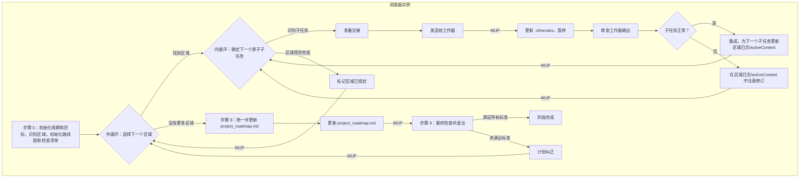

# **Cline 递归思维链系统 (CRCT) - 策略插件（调度器焦点）**

本插件为 CRCT 系统策略阶段的**调度器**角色提供详细指令和流程。它指导使用 `new_task` 工具促进的调度器/工作器模式，构建和维护全面的、依赖项感知的 `project_roadmap.md` 的迭代、详尽流程。

**核心概念（调度器视角）：**
- 运行此插件的主要实例充当**调度器**。它通过更新 `project_roadmap.md` 来编排定义周期目标的整体策略阶段。
- 调度器识别与周期目标相关的不同规划"区域"（模块、功能）。
- 对于每个区域，调度器使用 `<new_task>` 工具将详细规划（工作器步骤）委托给单独的、新的**工作器**实例（它们将使用 `strategy_worker_plugin.md`）。
- 调度器审查每个工作器的输出，更新整体进度，并为区域调度进一步的子任务，或移动到下一个区域，直到所有区域都为周期规划完成。
- 最后，调度器将周期的详细计划集成到主 `project_roadmap.md` 中并执行最终检查。

此模式确保为规划每个区域提供最大的上下文分离。在过渡到执行之前，必须定义所有用于规划的 `Strategy_*` 任务和包含路线图的所有 `Execution_*` 任务，以实现周期的目标工作。
本插件应与核心系统提示词结合使用。

**重要**
如果你已经读取了一个文件（例如，你正在更新的计划）并且自那以后没有编辑它，*不要*再次读取它。使用上下文中的版本。仅当*你*最近更改了内容时才加载文件的新版本。
*不要在一般响应中使用工具 XML 标签，因为它会无意中激活工具。*
*system_manifest 和其他 CRCT 系统文件不由*项目*追踪器跟踪*

**不要**用详细信息使 activeContext 混乱。使用适当的文档。

**进入和退出策略阶段（调度器角色）**

**进入策略阶段：**
1.  **`.clinerules` 检查（强制性第一步）**：读取 `.clinerules` 文件内容。
2.  **确定当前状态并承担调度器角色**：
    *   如果 `[LAST_ACTION_STATE]` 指示 `current_phase: "Strategy"`，则从 `next_action` 指示的操作恢复，参考 `activeContext.md`。你是调度器。
    *   如果 `[LAST_ACTION_STATE]` 指示 `next_phase: "Strategy"`，这表示从前一阶段过渡。承担**调度器**角色并从本插件的**第 II.A 节，步骤 0** 开始。
3.  **用户触发**：如果开始新会话并且 `.clinerules` 指示策略，则承担调度器角色。如果刚进入策略，从步骤 0 开始。

**退出策略阶段：**（由调度器执行）
1.  **完成标准（强制性检查）**：验证当前策略周期目标的所有以下内容都已满足：
    *   所有与周期目标相关的已识别区域/模块都已规划（`current_cycle_checklist.md` 中的状态为"[x] Area Planned"），并且它们各自的 HDTA 文档已完成。
    *   **已生成周期的所有 `Execution_*` 任务的全面、统一和排序列表，并集成到 `project_roadmap.md` 中**。
    *   为此策略周期规划的所有高优先级工作都已分解为原子任务指令（`*.md`），具有清晰的阶段前缀（`Strategy_*`、`Execution_*`）和显式的最小上下文链接。
    *   与计划工作相关的所有必要 HDTA 文档（系统清单、领域模块、实施计划、任务指令）都已创建或更新。没有与计划工作相关的占位符或不完整部分。
    *   `Execution_*` 任务已在其各自区域内排序和优先级，并且它们的最终统一序列已在更新 `project_roadmap.md` 期间针对区域间一致性进行了审查。*注意：不要为工作器分配执行任务*。
    *   所有 HDTA 文档都正确链接（任务来自计划，计划来自模块，模块来自清单）。
    *   所有为*此策略阶段*期间完成而识别和确定范围的 `Strategy_*` 任务（包括工作器为子组件规划或计划细化创建的任务）都已完成。
    *   `project_roadmap.md`（包含此周期的计划）反映了所有周期目标的已完成规划状态。
    *   `project_roadmap.md` 已使用此周期的计划更新，审查了连贯性，并准确反映了所有周期目标的统一路线图，包括执行阶段的显式执行序列。
2.  **`.clinerules` 更新（强制性 MUP 步骤）**：如果满足完成标准，**准确地**按如下方式更新 `.clinerules` `[LAST_ACTION_STATE]`：
    ```
    last_action: "Completed Strategy Phase: Unified Roadmap for All Cycle Goals"
    current_phase: "Strategy"
    next_action: "Phase Complete - User Action Required"
    next_phase: "Execution"
    ```
    此外，将深刻的、可重用的见解添加到 `[LEARNING_JOURNAL]` 中。
3.  **暂停以等待用户操作**：成功更新 `.clinerules` 后，说明完成并等待用户操作。

## I. 阶段目标和指导原则（调度器焦点）

**目标**：从调度器的角度来看，策略阶段的主要目标是**编排单个、全面的 `project_roadmap.md` 的构建（如果尚不存在）、细化和维护**。这是通过定义周期目标、识别相关"区域"（模块/功能）、将每个区域的详细规划委托给工作器实例，以及**最后，将这些计划统一到 `project_roadmap.md` 中的单个、排序的执行列表中以进入下一阶段**来实现的。
调度器审查工作器输出，确保将计划的工作集成到 `project_roadmap.md` 中，并在退出之前确认周期的所有 `Strategy_*` 规划任务都已完成。

**关键约束：最小上下文加载。** 主动管理加载到工作上下文中的内容。

**指导原则**：

<<<**关键**>>>
*在**任何**规划活动（调度器或工作器）之前，你**必须**首先评估相关项目工件的当前状态。这包括：*
    *   *读取正在规划或可能受影响的任何区域/模块/文件的实际代码。*
    *   *如果任何项目追踪器（`module_relationship_tracker.md`、`doc_tracker.md`、`*_module.md` 迷你追踪器）指示依赖项（通过 `show-dependencies` 或必要时直接追踪器审查以获取上下文），则**必须**读取该依赖文件（代码或文档）的相关部分，以了解依赖项的性质和含义。*
*未能执行此全面评估（包括读取依赖文件）将导致不完整或有缺陷的规划。*
*   通过 `show-dependencies`（来自项目追踪器）识别为依赖项的文件**必须**使用 `read_file` 读取其相关部分。

**（调度器聚焦原则）：**
1.  **调度器/工作器模型**：由调度器通过 `<new_task>` 将区域规划委托给工作器来编排策略阶段。工作器将使用 `strategy_worker_plugin.md`。
2.  **迭代的基于区域的调度**：将周期目标分解为"区域"；迭代调度每个区域的规划。
3.  **审查周期**：在接受区域计划或请求修订之前审查工作器输出。
4.  **统一和连贯的路线图**：在所有区域都规划完成后，将它们的计划集成到主 `project_roadmap.md` 中，解决区域间冲突，并**为周期创建一个单一的、排序的执行列表**。
5.  **整体进度跟踪**：使用 `current_cycle_checklist.md` 维护区域规划的高级状态。

**（调度器引用的整体系统原则）：**
15. **路线图作为主要输出**：所有活动都通过 HDTA 为构建/细化 `project_roadmap.md` 做出贡献。
16. **最小上下文交接**：调度器的 `<new_task>` 消息为工作器提供最少的指针。

## II. 调度器工作流程：编排细粒度路线图构建

本节详细说明了**调度器**实例的流程。

*   **调度器步骤 0：初始化策略周期、定义目标并加载核心项目计划。**

*   **操作 A（关键核心系统初始化和整体周期目标定义）**：
    *   1. **读取 `.clinerules`**：确认当前状态。
    *   2. **关键前提条件：评估当前项目状态**：审查 `progress.md`、`system_manifest.md`、`activeContext.md`。如果特定区域是目标，浏览它们现有的 HDTA 和代码。说明："初始项目状态评估完成。"
    *   3. **定义/确认整体周期目标**：制定目标。如果不清楚，使用 `ask_followup_question`。更新 `activeContext.md`。说明："确认整体周期目标... 记录在 `activeContext.md` 中。"

*   **操作 B（初始化/加载核心 HDTA 和项目路线图）**：
    *   1. **初始化/加载 `project_roadmap.md`（关键）**：检查 `project_roadmap.md`。如果是新的，从 `project_roadmap_template.md` 创建，使用 `system_manifest.md` 和依赖项可视化（`visualize-dependencies`）执行初始填充，并保存。如果存在，加载。说明创建/加载状态。
    *   2. **验证并加载 `system_manifest.md`**：检查 `system_manifest.md`。如果缺失，错误并停止。如果存在，加载。说明："加载了 `system_manifest.md`。"
    *   3. **初步识别相关领域模块**：根据周期目标和清单，列出相关的 `*_module.md` 文件。检查是否存在（不读取内容）。说明："初步识别了相关模块... 检查了存在性。"

*   **操作 C（识别当前周期的区域并初始化/加载周期特定追踪器）**：
    *   1. **从清单识别相关区域**：根据周期目标和清单，识别规划的"区域"。说明："识别了周期的区域：`[列表]`。"
    *   2. **处理 `hierarchical_task_checklist_*.md`**：搜索现有检查清单。如果找到且相关，`ask_followup_question` 以继续/合并/新建。创建/加载/更新 `current_cycle_checklist.md`。使用 C.1 中的区域填充，状态为 `[ ] Unplanned`。说明："活动周期检查清单设置为：`current_cycle_checklist.md`。已填充/更新。"
    *   3. **初始化 `hdta_review_progress_[session_id].md`**：从模板创建。说明："初始化了 HDTA 审查进度追踪器。"

*   **操作 D（初始化调度器区域规划日志并执行初始概述）**：
    *   1. **初始化调度器区域规划日志**：对于 C.1 中的每个区域，从模板创建 `[AreaName]_planning_log_[cycle_id].md`，设置 `next_atomic_planning_step: "Initial_Area_Assessment"`。将此文件存储在 `cline_docs/dispatch_logs/` 中。说明："初始化了调度器区域规划日志。"
    *   2. **初始概述和可视化检查**：简要审查区域间依赖项（`show-dependencies`）。检查/审查自动生成的图表。说明概述发现。

*   **操作 E（最终确定步骤 0 状态并进行 MUP）**：
    *   1. **说明**："调度器完成策略周期初始化（步骤 0）..."
    *   2. **更新 MUP**：执行调度器 MUP（第 V 节）。设置 `.clinerules` `next_action: "Orchestrate Area Planning"`。更新 `activeContext.md`。

*   **步骤 1：主编排循环。**

*   **指令**：迭代选择一个高级区域。在该区域内，识别并使用 `<new_task>` 将下一个所需的原子规划子任务调度给工作器实例，暂停，并在工作器完成后审查结果，然后再调度下一个任务。重复，直到区域的计划完成。然后，选择下一个区域。
*   **外循环开始（每个高级区域）：**
    *   **操作 A（选择下一个高级区域进行规划）**：
        *   读取 `current_cycle_checklist.md`。
        *   识别状态不等于"[x] Area Planned"的第一个区域。优先考虑标记为"[ ] Area Revision Required"的任何区域。
        *   **如果未找到**（所有区域都是"[x] Area Planned"）：所有规划完成。说明："调度器确认所有周期区域都已规划。继续最终路线图统一。"。更新 `.clinerules` `next_action: "Unify Cycle Plan and Update project_roadmap.md"`。**转到调度器步骤 8。**
        *   **如果找到区域**：让这成为 `[Current_Orchestration_Area_Name]`。
        *   更新 `activeContext.md`：设置 `current_orchestration_area: "[Current_Orchestration_Area_Name]"`。
        *   说明："调度器专注于区域：`[Current_Orchestration_Area_Name]`（状态：`[检查清单中的状态]`）。"
    *   **内循环开始（`[Current_Orchestration_Area_Name]` 内的每个原子规划子任务）：**
        *   **操作 B（确定 `[Current_Orchestration_Area_Name]` 的下一个原子规划子任务）**：
            1.  **评估 `[Current_Orchestration_Area_Name]` 的当前规划状态**：
                *   读取 `[Current_Orchestration_Area_Name]` 的调度器区域规划日志文件（位于 `cline_docs/dispatch_logs/`），以查找 `next_atomic_planning_step` 并审查此区域的规划进度。
                *   审查此区域的现有 HDTA 文件（`_module.md`、`implementation_plan_*.md` 文件、任务列表）。
                *   **如果规划日志指示下一步是"Initial_Area_Assessment"**：第一个子任务是评估现有文件。将 `atomic_sub_task_description` 设置为"对区域 `[Current_Orchestration_Area_Name]` 执行初始状态评估（读取现有模块/计划文件，在工作器输出文件中记录当前状态摘要）。"
                *   **否则（基于规划日志中记录的先前子任务完成）**：根据标准工作流程（初始评估 -> 依赖项分析 -> HDTA 结构（模块 -> 计划 -> 任务定义）-> 排序 -> 本地策略任务）确定*下一个逻辑的、细粒度的规划操作*。示例：
                    *   如果初始评估完成，下一步是"对 `[Current_Orchestration_Area_Name 的关键组件/文件]` 执行依赖项分析。"
                    *   如果需要 `_module.md` 大纲："创建/更新 `[Current_Orchestration_Area_Name]_module.md` 大纲。"
                    *   如果需要创建/更新特定的 `implementation_plan_*.md`："使用目标和高级步骤创建/更新 `implementation_plan_[Feature]_for_[Area].md`。"
                    *   如果计划部分需要任务分解："将 `implementation_plan_[Feature].md#SectionX` 分解为原子 `Execution_*` 任务文件。"
                    *   如果计划中的任务需要排序："在 `implementation_plan_[Feature].md` 中对任务进行排序。"
                    *   如果需要执行本地 `Strategy_*.md` 任务（例如细化计划细节）："执行 `Strategy_RefinePlanDetail_For_Feature.md`。"
            2.  **检查区域完成**：如果评估表明 `[Current_Orchestration_Area_Name]` 的所有必要规划子任务（模块、计划、任务定义、排序、本地策略任务）似乎已完成*并且它们的输出已被接受*：
                *   更新 `current_cycle_checklist.md`：将 `[Current_Orchestration_Area_Name]` 标记为"[x] Area Planned"。
                *   更新 `[Current_Orchestration_Area_Name]` 的调度器区域规划日志文件。将区域状态更新为"[x] Planned"。更新"最后更新"时间戳。
                *   更新 `activeContext.md`：注意"区域 `[Current_Orchestration_Area_Name]` 规划完成。" 清除 `current_orchestration_area`。
                *   说明："调度器：区域 `[Current_Orchestration_Area_Name]` 的规划现已完成。"
                *   **转到操作 A（外循环开始）** 以选择下一个高级区域。
            3.  让确定的下一个操作为 `[Atomic_Sub_Task_Description]`。
            4.  说明："调度器为区域 `[Current_Orchestration_Area_Name]` 识别了下一个原子规划子任务：`[Atomic_Sub_Task_Description]`。"
        *   **操作 C（为工作器准备交接内容 - 针对原子子任务）**：收集最少的指针并制作交接内容。此内容**必须精确定义仅单个 `[Atomic_Sub_Task_Description]`**。
            *   **包含的内容：**
                *   指令："承担工作器角色。"
                *   插件引用："读取 `strategy_worker_plugin.md`。按指示执行其第 I 节（工作器任务执行）中的特定操作。"
                *   整体区域上下文：`[Current_Orchestration_Area_Name]`。
                *   **特定子任务指令**：`[Atomic_Sub_Task_Description 的详细指令，必要时引用特定文件、部分或先前输出]`。例如："对于区域 `[Current_Orchestration_Area_Name]`，专注于文件 `path/to/specific_file.py`。使用 `show-dependencies` 执行依赖项分析。在 `activeContext.md` 的 `DepAnalysis_[specific_file_key]` 部分下记录发现（关键依赖项、含义）。" 或"基于 `implementation_plan_X.md#SectionY`，创建原子 `Execution_*.md` 任务文件。确保每个都有目标、最小上下文、步骤。保存到 `tasks/exec/`。从计划 X 链接。"
                *   **严格范围限制**："除了此特定子任务之外，不要执行任何其他规划步骤。"
                *   预期输出：`[要创建/更新的特定文件，或要填充的 activeContext.md 中的特定部分]`。
                *   MUP 提醒："工作器 MUP：保存输出，更新 `hdta_review_progress`，更新工作器输出文件。不更改 `.clinerules`。"
                *   完成信号："当此特定子任务完全完成时，使用当前接口指定的方法向调度器发出任务完成信号。"
                *   **上下文指针**：（最少且仅与子任务相关）
                    *   `checklist_path`：`current_cycle_checklist.md`
                    *   `active_context_path`：`activeContext.md`（用于整体目标，以及如果指定，工作器写入其输出）
                    *   *此子任务*直接需要的*特定*文件/图表的路径。
                    *   如果这是失败子任务的重新调度，来自调度器的相关 `revision_notes`。
                    *   强化工作器需要根据实际代码文件验证文档以确定*实际*状态。
            *   说明："调度器为工作器子任务准备了交接内容：`[Atomic_Sub_Task_Description]`，用于区域 `[Current_Orchestration_Area_Name]`。"
        *   **操作 D（使用 `<new_task>` 工具 - 遵循接口架构）**：
            *   **关键**：使用 `new_task` 工具。从操作 C 打包交接内容。
            *   **重要**：严格遵守当前接口的系统提示词/文档指定的 `new_task` 工具的 XML 结构和参数。
            *   执行工具调用。
            *   说明："调度器为子任务调用 `<new_task>`：`[Atomic_Sub_Task_Description]`，用于区域 `[Current_Orchestration_Area_Name]`。"
        *   **操作 E（更新调度器状态并暂停）**：
            *   更新 `[Current_Orchestration_Area_Name]` 的调度器区域规划日志文件（位于 `cline_docs/dispatch_logs/`）。向"原子规划子任务日志"表添加新行：`| [Atomic_Sub_Task_Directive] | [Worker Instance ID] | Dispatched | In Progress (Worker) | [Link to expected Worker Output file - TBD by Worker] |`。更新"最后更新"时间戳。
            *   更新 `activeContext.md`：设置 `current_orchestration_area: "[Current_Orchestration_Area_Name]"`。
            *   更新 `.clinerules` `[LAST_ACTION_STATE]`：
                ```
                last_action: "Dispatched sub-task '[Atomic_Sub_Task_Description]' for Area: [Current_Orchestration_Area_Name] to Worker."
                current_phase: "Strategy"
                next_action: "Review Worker Completion for Sub-Task: [Atomic_Sub_Task_Description], Area: [Current_Orchestration_Area_Name]"
                next_phase: "Strategy"
                ```
            *   说明："调度器为区域 `[Current_Orchestration_Area_Name]` 调度了子任务 `[Atomic_Sub_Task_Description]`。记录在区域规划文件中。暂停并等待工作器完成。"
            *   **暂停执行。**

        *   **（调度器在此处恢复）** **操作 F（审查原子子任务的工作器完成）**：（在工作器的 `<attempt_completion>` 后控制返回时触发）
            *   从 `.clinerules` `next_action` 或 `activeContext.md` 检索 `[Current_Orchestration_Area_Name]` 和 `[Atomic_Sub_Task_Description]`。
            *   说明："调度器恢复。收到子任务完成：`[Atomic_Sub_Task_Description]`，用于区域 `[Current_Orchestration_Area_Name]`。审查输出。"
            *   **识别输出**：主要输出是工作器子任务输出文件（位于 `cline_docs/dispatch_logs/`）。检查文件系统以查找此文件和任何其他指定的输出（例如，更新的 HDTA 文件）。
            *   **审查内容**：读取工作器子任务输出文件。验证工作器完成了*分配的特定子任务*，并在该文件中准确记录了其流程和输出。检查质量和对指令的遵守。它是否超出了其范围？
                *   **检查子任务**：显式检查工作器输出文件和工作器创建/修改的任何父任务指令文件，以查找任何列出的"子项"（即，从父任务链接的新创建的 `.md` 任务文件）。
                *   如果识别出子任务：
                    1.  在 `[Current_Orchestration_Area_Name]` 的调度器区域规划日志中注意它们。
                    2.  调度器负责确保将这些子任务添加到 `current_cycle_checklist.md`（可能嵌套在其父任务或相关实施计划下）。
                    3.  调度器还必须确保在步骤 8 中针对这些子任务适当考虑最终周期范围的统一和排序。
            *   说明："调度器对子任务 `[Atomic_Sub_Task_Description]` 输出的审查完成。评估：`[基于工作器输出文件内容的简要评估，包括如果识别出子任务的注释]`。"
            *   **操作 G（接受或请求子任务修订）**：
                *   **如果可接受**：
                    *   说明："调度器接受子任务的输出：`[Atomic_Sub_Task_Description]`。"
                    *   集成工作器的输出（例如，确认新文件，将工作器输出文件中的发现纳入区域规划日志）。
                    *   更新 `[Current_Orchestration_Area_Name]` 的调度器区域规划日志文件（位于 `cline_docs/dispatch_logs/`）。在"原子规划子任务日志"表中找到 `[Atomic_Sub_Task_Directive]` 的行。将状态更新为"[x] Completed"，并根据工作器输出文件更新结果摘要。确定并在规划日志中为此区域设置*新的* `next_atomic_planning_step`（或者如果所有子步骤似乎都完成了，则将区域状态标记为"Planned"）。更新"最后更新"时间戳。
                    *   执行调度器 MUP（第 V 节）。设置 `.clinerules` `next_action: "Orchestrate Area Planning"`。
                    *   说明："继续为区域 `[Current_Orchestration_Area_Name]` 识别下一个原子规划子任务。"
                    *   **转到操作 B（`[Current_Orchestration_Area_Name]` 的内循环开始）。**
                *   **如果需要修订**：
                    *   说明："调度器需要对子任务进行修订：`[Atomic_Sub_Task_Description]`。问题：`[列出关于子任务输出的特定的、可操作的问题]`。"
                    *   更新 `[Current_Orchestration_Area_Name]` 的调度器区域规划日志文件。在"原子规划子任务日志"表中找到 `[Atomic_Sub_Task_Directive]` 的行。将状态更新为"Revision Required"，并将结果摘要更新为注意需要修订。将详细的修订说明添加到"高级说明和修订要求"部分，引用特定的子任务。将规划日志中的 `next_atomic_planning_step` 保持指向*相同的子任务类型*，或者如果失败是根本性的，则指向前身。更新"最后更新"时间戳。
                    *   执行调度器 MUP（第 V 节）。设置 `.clinerules` `next_action: "Orchestrate Area Planning"`。
                    *   说明："为子任务注意了修订要求。继续重新调度。"
                    *   **转到操作 B（`[Current_Orchestration_Area_Name]` 的内循环开始）。**（循环将重新识别此子任务，操作 C 中的交接内容将包括来自规划日志的新修订说明）。

*   **（调度器）步骤 8：统一周期计划并更新 `project_roadmap.md`。**
*   **指令**：整合当前周期的单独规划区域路线图（由其 HDTA 文档表示），并将此周期的计划集成到主 `project_roadmap.md` 中。审查区域间一致性、依赖项冲突以及*周期对项目的贡献*的整体逻辑流程。
*   **操作 A（验证周期的所有区域都已规划）**：作为最终检查，读取 `current_cycle_checklist.md`（在步骤 0 中识别的此周期的活动检查清单）并确认与当前周期目标相关的所有区域都具有状态"[x] Planned"。如果没有，返回步骤 1（调度循环）以解决差异。说明："调度器确认 `current_cycle_checklist.md` 中所有必需的周期区域都标记为'[x] Planned'。继续统一和 `project_roadmap.md` 更新。"
*   **操作 B（加载周期计划并识别接口）**：
    *   对于 `current_cycle_checklist.md` 中的每个规划区域，使用 `read_file` 加载其主要 `implementation_plan_*.md` 文件。这些包含*此周期*每个区域的任务列表、序列和目标。
    *   可选地，加载 `[AreaName]_module.md` 文件，以获取与此周期更改相关的高级上下文。
    *   **识别接口任务**：扫描实施计划和*此周期任务*的任务指令（`Dependencies` 部分），以识别代表*此周期规划的不同区域*之间的接口或集成点的关键任务。注意这些任务及其依赖项。
    *   **最小化加载**：除非特定冲突或依赖项需要深入检查，否则避免从此周期重新加载所有单独的任务指令文件。
*   **操作 C（审查并解决周期计划连贯性的区域间问题）**：
    *   检查*此周期在不同区域规划的任务*之间的逻辑流程和依赖项。
    *   确保任务粒度和指令清晰度相当一致。
    *   识别并解决*此周期规划任务内*的任何冲突指令、时间问题或资源争用。这可能需要针对此周期的特定任务指令或实施计划进行有针对性的更新。
    *   如果需要，使用 `show-dependencies --key <key_of_interfacing_task_or_file>`。
    *   说明："审查了当前周期的区域间计划。`[未发现重大问题 / 识别出问题：{描述}，解决方案：{采取的行动}]`。"
    *   **参考图表**：审查相关的依赖项图表。
    *   **生成聚焦图表（如果需要）** 以处理*此周期范围内*复杂的区域间连接。
    *   **识别并解决冲突**（在周期计划内）。如果区域需要大量返工，请注意，在 `current_cycle_checklist.md` 中将区域标记为"[ ] Revision Required"，设置 `.clinerules` `next_action: "Orchestrate Area Planning"`，并循环回到步骤 1。
    *   说明："调度器审查了周期的区域间计划。`[问题/解决方案 / 未发现重大冲突]`。"
*   **操作 D（使用周期计划更新 `project_roadmap.md` - 关键）**：
    *   **操作**：`read_file` 主 `project_roadmap.md`（在步骤 0.B 中加载）。
    *   **目标**：将此周期规划工作的摘要集成到整体 `project_roadmap.md` 中，确保它反映了周期目标的当前、详细意图。
    *   **流程**：
        1.  确定在何处以及如何最好地集成此周期的信息。这可能涉及：
            *   如果此周期进一步详细说明 `project_roadmap.md` 中现有主要功能/模块的子部分，则在其下添加新的子部分。
            *   如果此周期引入了全新的主要功能，则在 `project_roadmap.md` 中创建新的顶级部分。
            *   根据此周期的详细规划，更新 `project_roadmap.md` 中的现有状态标记或时间表。
        2.  要集成的信息应包括：
            *   对当前周期的清晰引用（例如，使用 `current_cycle_checklist.md` 中的 `[cycle_id]`）。
            *   已解决的整体周期目标。
            *   此周期规划的所有区域的列表。
            *   对于每个区域，此周期的主要目标的简明摘要以及其 `Execution_*` 任务序列的高级概述（链接到其实施计划）。
            *   *此周期任务*的统一的、高级的执行序列或流程图（例如，Mermaid），显示区域间依赖项和周期的关键里程碑。
        3.  **使用 `apply_diff` 或 `write_to_file`（如果更改很广泛）更新 `project_roadmap.md`**。确保更新是逻辑集成，而不仅仅是追加，保持整体项目路线图的完整性。
    *   说明："使用当前策略周期的统一计划和详细贡献更新了主 `project_roadmap.md`。"
    *   为 `project_roadmap.md` 更新 `hdta_review_progress_[session_id].md`（状态：已更新）。
*   **操作 E（更新周期完成的检查清单）**：
    *   更新 `current_cycle_checklist.md`：添加一个条目，例如"[x] Cycle Plan Integrated into `project_roadmap.md`。"
    *   说明："主 `project_roadmap.md` 使用当前周期的计划更新。`current_cycle_checklist.md` 相应标记。继续最终阶段检查。"
    *   **更新 `.clinerules` `[LAST_ACTION_STATE]`**：`next_action: "Final Checks and Exit Strategy Phase"`。更新 `activeContext.md` 以注意步骤 8 的完成以及 `project_roadmap.md` 已更新。

*   **（调度器）步骤 8.5：对执行阶段任务列表进行排序。**
*   **指令**：将周期的所有计划工作整合到一个单一的、排序的执行列表中。将此统一计划集成到主 `project_roadmap.md` 中，为执行阶段创建权威交接。
*   **操作 A（验证周期的所有区域都已规划）**：作为最终检查，读取 `current_cycle_checklist.md` 并确认与当前周期目标相关的所有区域都具有状态"[x] Area Planned"。如果没有，返回步骤 1。说明："调度器确认所有必需的周期区域都标记为'[x] Planned'。继续统一和 `project_roadmap.md` 更新。"
*   **操作 B（收集周期的所有 `Execution_*` 任务）**：
    *   遍历 `current_cycle_checklist.md` 中的每个规划区域。
    *   对于每个区域，`read_file` 其 `implementation_plan_*.md` 文件。
    *   从每个计划的"任务分解"部分提取 `Execution_*.md` 任务文件的列表。
    *   编译整个周期的所有 `Execution_*.md` 任务文件路径的平面列表。
*   **操作 C（分析任务间依赖项并创建统一序列）**：
    *   **目标**：创建一个单一的、有序的 `Execution_*` 任务列表，该列表尊重区域内和区域之间的所有依赖项。
    *   **流程**：
        1.  从空的 `final_sequence` 列表开始。
        2.  对于编译列表中的每个任务，使用 `show-dependencies --key <key_for_task_or_its_main_target>` 来了解它依赖于什么。
        3.  使用拓扑排序方法或类似的依赖项感知方法对任务进行排序。一个简单的迭代方法：
            *   查找所有没有未完成依赖项的任务。将它们添加到 `final_sequence`。
            *   从"待办"列表中删除它们。
            *   重复，直到"待办"列表为空。
        4.  如果遇到循环依赖项，停止，记录冲突的任务，并计划纠正措施（例如，调度 `Strategy_` 任务以解决冲突）。这可能需要循环回到步骤 1。
    *   说明："创建了周期的统一任务序列，尊重区域间依赖项。任务总数：`[N]`。"
*   **操作 D（使用周期计划和统一执行序列更新 `project_roadmap.md` - 关键）**：
    *   **操作**：`read_file` 主 `project_roadmap.md`。
    *   **流程**：
        1.  找到或为当前周期创建一个主要部分（例如，`## Cycle [cycle_id] Plan`）。
        2.  在此部分下，添加周期目标和规划区域的摘要。
        3.  **关键**：添加一个标题为 `### Unified Execution Sequence` 的新子部分。
        4.  使用来自操作 C 的 `Execution_*` 任务文件的有序列表填充此子部分，格式为检查清单。这是直接交接给执行阶段。
            ```markdown
            ### Unified Execution Sequence

            - [ ] `path/to/tasks/area_B/Execution_Setup_Database.md`
            - [ ] `path/to/tasks/area_A/Execution_Implement_Core_Logic.md`
            - [ ] `path/to/tasks/area_A/Execution_Refine_Helper_Functions.md`
            - [ ] `path/to/tasks/area_B/Execution_Connect_API_to_DB.md`
            - [ ] `path/to/tasks/area_C/Execution_Build_UI_Component.md`
            ```
        5.  **使用 `apply_diff` 或 `write_to_file` 更新 `project_roadmap.md`**。
    *   说明："使用周期摘要和统一的、排序的执行任务列表更新了主 `project_roadmap.md`。"
    *   **更新 `.clinerules` `[LAST_ACTION_STATE]`**：`next_action: "Final Checks and Exit Strategy Phase"`。更新 `activeContext.md` 以注意步骤 8.5 的完成

*   **（调度器）步骤 9：最终检查并退出策略阶段。**
*   **指令**：作为调度器，验证满足退出*整个*策略阶段的所有条件，确保当前周期目标的路线图是完整的、一致的和可操作的。
*   **操作 A（执行完成标准检查）**：仔细审查本插件文档开头的"退出策略阶段"部分（第 I 节序言）中列出的**所有**要点。根据项目文件、HDTA 文档、检查清单和 `project_roadmap.md` 的当前状态验证每一个。特别注意：
    *   所有规划区域的完整性。
    *   `project_roadmap.md` 内容的存在性和完整性，反映此周期的计划以及执行阶段的排序列表。
    *   相关 HDTA 中没有占位符。
    *   所有 HDTA 层级之间的正确链接。
    *   完成*此整个阶段*期间识别的所有 `Strategy_*` 任务（包括工作器创建的任何任务，可能被遗漏）。
    *   `current_cycle_checklist.md` 的准确性。
*   **操作 B（决策和退出/更正）**：
    *   **如果满足所有标准**：
        1.  说明："调度器确认满足所有策略阶段完成标准。"
        2.  执行最终调度器 MUP（第 IV 节）：
            *   更新 `activeContext.md` 以注意阶段完成。
            *   将任何新颖的、可重用的见解添加到 `.clinerules` `[LEARNING_JOURNAL]` 中。
            *   **准确地**按照"退出策略阶段"部分（第 I 节序言）中指定的方式更新 `.clinerules` `[LAST_ACTION_STATE]`，其中包括：
            ```
            last_action: "Completed Strategy Phase: Unified Roadmap for All Cycle Goals"
            current_phase: "Strategy"
            next_action: "Phase Complete - User Action Required"
            next_phase: "Execution"
            ```
        3.  说明："策略阶段完成。为所有周期目标创建、验证和记录了统一路线图。满足所有完成标准。等待用户操作以继续执行。"
        4.  **暂停执行。** 等待用户触发下一阶段。
    *   **如果未满足任何标准**：
        1.  清楚地说明："策略阶段完成标准**未**完全满足。缺失/问题：`[列出特定的未满足标准和详细信息，例如，在 implementation_plan_X.md 中发现占位符，计划 Y 的任务链接不完整，Strategy_TaskZ 未完成，project_roadmap.md 需要基于冲突 Z 进行细化]`。"
        2.  确定所需的纠正措施。这可能涉及：
            *   重新访问步骤 8（统一）以修复 `project_roadmap.md` 或解决遗漏的冲突。
            *   循环回到步骤 1（调度循环）以调度特定区域 HDTA 的修订任务。
            *   如果足够简单，手动（作为调度器）完成遗漏的 `Strategy_*` 任务或修复链接问题。
        3.  更新 `activeContext.md`，详细说明已识别的问题和解决它们的计划/下一步。
        4.  执行调度器 MUP（第 IV 节）。更新 `.clinerules` `[LAST_ACTION_STATE]` 以反映当前的未完成状态（例如，`last_action: "Dispatcher: Strategy Phase Final Check Failed - [Specific Issue Summary]."`）并将 `next_action` 设置为所需的纠正步骤（例如，`"Unify Cycle Plan and Update project_roadmap.md"`、`"Orchestrate Area Planning"` 或特定操作，如 `"Complete Final Linking"`）。
        5.  说明："在退出策略阶段之前需要纠正措施。继续执行 `[Corrective Step]`。"
        6.  根据确定的纠正步骤**继续执行**。

## V. 强制性更新协议 (MUP) 添加（策略插件 - 调度器焦点）
（这是原始组合插件的第 V.A 节，第 513-583 行，将 `hierarchical_task_checklist_[cycle_id].md` 更改为 `current_cycle_checklist.md`，并在适当的地方将 `roadmap_summary` 更改为 `project_roadmap.md`。）

*   **（调度器步骤 0 后 - 初始化）：** 保存/更新 `hdta_review_progress` 和 `current_cycle_checklist.md`。更新 `activeContext.md`。`.clinerules` `last_action: "Dispatcher: Completed Strategy Cycle Initialization (Step 0).", next_action: "Orchestrate Area Planning"`。
*   **（调度器步骤 1.E 后 - 调度原子子任务）：** `.clinerules` `last_action: "Dispatcher: Dispatched sub-task...", next_action: "Review Worker Completion..."`。
*   **（调度器步骤 1.G 后 - 审查工作器输出）：** 更新 `current_cycle_checklist.md`。更新区域规划日志。更新 `activeContext.md`。`.clinerules` `last_action: "Dispatcher: Reviewed Worker...", next_action: "Orchestrate Area Planning"`。
*   **（调度器步骤 1.A 后 - 区域规划完成）：** 更新 `current_cycle_checklist.md`。更新 `activeContext.md`。`.clinerules` `last_action: "Dispatcher: Completed all planning for Area...", next_action: "Orchestrate Area Planning"`。
*   **（调度器步骤 8 后 - 统一）：** 确保 `project_roadmap.md` 已保存。更新 `hdta_review_progress`。更新 `current_cycle_checklist.md`。`.clinerules` `last_action: "Dispatcher: Completed Roadmap Unification (Step 8).", next_action: "Final Checks and Exit Strategy Phase"`。
*   **（调度器步骤 9 后 - 最终检查）：** 如果退出：更新 `activeContext.md`、学习日志、`.clinerules` 以进入执行。如果不退出：为纠正步骤更新 `activeContext.md`、`.clinerules`。

## VI. 快速参考（调度器焦点）
（这是从原始插件的第 VI 节定制的，第 599-639 行，专注于调度器项目并更新了文件名。）

**主要目标**：通过定义周期目标、识别区域、将区域规划委托给工作器、审查输出，以及**将所有工作统一到 `project_roadmap.md` 内的排序执行列表中**，来编排 `project_roadmap.md` 的构建/细化。

**调度器工作流程大纲：**
*   **步骤 0：初始化策略周期和整体目标**：定义周期目标。识别区域。初始化 `project_roadmap.md`、`current_cycle_checklist.md`。输出：目标、区域、追踪器。下一个操作：`Orchestrate Area Planning`。
*   **步骤 1：主编排循环**：外循环（每个区域）：选择区域。内循环（每个子任务）：确定子任务。准备交接。通过 `<new_task>` 发送给工作器。暂停。审查工作器。接受/拒绝。如果区域完成，在检查清单中标记。输出：为区域构建的 HDTA。
*   **步骤 8：统一周期计划并更新 `project_roadmap.md`**：（在所有区域规划完成后）。整合区域计划。审查区域间依赖项。更新 `project_roadmap.md`。输出：更新的 `project_roadmap.md`。下一个操作：`Final Checks...`。
*   **步骤 9：最终检查并退出**：验证完成标准。如果正常：为执行执行 MUP。暂停。如果不正常：计划纠正，为纠正步骤执行 MUP。输出：已验证的路线图，更新的 `.clinerules`。

**关键追踪器和文件（调度器视角）：**
*   `current_cycle_checklist.md`：跟踪周期的高级区域规划状态。
*   `activeContext.md`：整体周期目标、当前编排区域、子任务交接详细信息、修订说明。
*   `hdta_review_progress_[session_id].md`：跟踪调度器对 `project_roadmap.md` 的审查。
*   `.clinerules`：由调度器管理的 `[LAST_ACTION_STATE]`。
*   `project_roadmap.md`：主要的项目范围路线图，在步骤 0 中初始化，在步骤 8 中更新。
*   `cline_docs/dispatch_logs/`：包含调度器区域规划日志和工作器子任务输出日志（由调度器读取）。
*   HDTA 文件（由工作器创建/更新，由调度器审查）。

## VII. 流程图（调度器焦点）
（这是从原始插件的第 VII 节改编的，第 670-720 行，专注于调度器实例子图并使用更新的文件名。）

*注意：从调度器的角度来看，这个迭代的策略阶段专注于通过管理周期目标和工作器委托来编排详细和可操作的项目路线图的创建，确保主 `project_roadmap.md` 始终更新。*
