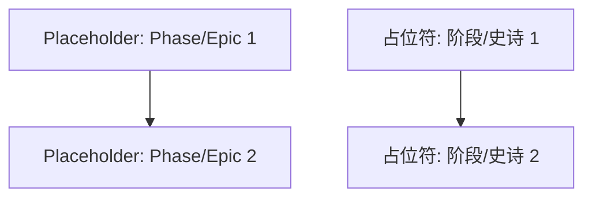

# Project Roadmap: [Project Name - To be filled by LLM from system_manifest.md if possible, or placeholder]

# 项目路线图: [项目名称 - 如果可能,由 LLM 从 system_manifest.md 填充,或占位符]

**Last Updated**: [YYYY-MM-DD] <!-- To be updated each time the roadmap is modified -->
**最后更新**: [YYYY-MM-DD] <!-- 每次修改路线图时更新 -->

## 1. Overall Project Vision & Goals

## 1. 整体项目愿景与目标

<!-- Briefly derived from system_manifest.md - high-level purpose. To be populated during initial creation if roadmap is new. -->
<!-- 简要源自 system_manifest.md - 高层级目的。如果路线图是新的,则在初始创建时填充。 -->

*   {Placeholder: Project Goal 1} / {占位符: 项目目标 1}
*   {Placeholder: Project Goal 2} / {占位符: 项目目标 2}

## 2. Major Project Phases / Epics

## 2. 主要项目阶段 / 史诗

<!--
This section should outline the main phases or large-scale epics of the project.
For each phase/epic, provide a brief description, its current status, and links to more detailed planning documents if they exist.
Initially populated based on system_manifest.md and dependency analysis if roadmap is new.
The Dispatcher will update this section based on completed strategy cycles.

本节应概述项目的主要阶段或大规模史诗。
对于每个阶段/史诗,提供简要描述、其当前状态,以及指向更详细规划文档的链接 (如果存在)。
如果路线图是新的,则最初基于 system_manifest.md 和依赖分析填充。
Dispatcher 将根据已完成的策略周期更新此部分。
-->

### Phase/Epic Example: [Name of Phase/Epic]

### 阶段/史诗示例: [阶段/史诗名称]

*   **Description**: {Brief description} / **描述**: {简要描述}
*   **Status**: {Not Started | Initial Planning (Cycle ID) | In Progress (Cycle ID) | Partially Completed (Cycle ID) | Completed (Cycle ID)} / **状态**: {未开始 | 初始规划 (周期 ID) | 进行中 (周期 ID) | 部分完成 (周期 ID) | 已完成 (周期 ID)}
*   **Key Objectives**: / **关键目标**:
    *   {Objective 1} / {目标 1}
    *   {Objective 2} / {目标 2}
*   **Primary HDTA Links**: / **主要 HDTA 链接**:
    *   (Link to relevant `_module.md` or high-level `implementation_plan_*.md` if applicable) / (链接到相关的 `_module.md` 或高层级 `implementation_plan_*.md` (如适用))
*   **Notes/Key Deliverables for this Phase/Epic**: / **此阶段/史诗的笔记/关键交付物**:
    *   ...

---
*   *(Add more Phases/Epics as defined by the overall project scope)* / *(根据整体项目范围添加更多阶段/史诗)*
---

## 3. High-Level Inter-Phase/Epic Dependencies

## 3. 高层级阶段间/史诗间依赖关系

<!-- Optional: Use Mermaid or a list to show major dependencies between the phases/epics if helpful. Can be populated from initial dependency visualization. -->
<!-- 可选: 使用 Mermaid 或列表显示阶段/史诗之间的主要依赖关系 (如有帮助)。可以从初始依赖可视化填充。 -->

## 4. Key Project-Wide Milestones

## 4. 关键项目范围里程碑

<!-- List major, overarching project milestones. Initially populated if evident from high-level docs/dependencies. Include target/actual completion. -->
<!-- 列出主要的、覆盖整个项目的里程碑。如果从高层级文档/依赖关系中明显,则最初填充。包括目标/实际完成情况。 -->

*   **Milestone Example**: {Description} - Status: {Planned / In Progress / Achieved [Date/Cycle ID]} / **里程碑示例**: {描述} - 状态: {已规划 / 进行中 / 已实现 [日期/周期 ID]}

## 5. Overall Project Notes / Strategic Considerations

## 5. 整体项目笔记 / 战略考虑

<!-- High-level notes relevant to the entire project's execution or long-term strategy. -->
<!-- 与整个项目执行或长期战略相关的高层级笔记。 -->

*   {Placeholder: Note 1} / {占位符: 笔记 1}

<!--
Instructions for Strategy Phase (Dispatcher Step 8 - Updating this Roadmap):
- When a strategy cycle completes planning for specific areas:
  1. Identify which Phase/Epic(s) in this roadmap the cycle's work contributes to.
  2. Update the 'Status' of the relevant Phase/Epic(s) (e.g., "In Progress (Cycle [CycleID])", "Partially Completed (Cycle [CycleID])").
  3. Add/update 'Key Objectives' or 'Notes/Key Deliverables' within the Phase/Epic section to summarize the cycle's planned contribution.
  4. Add links under 'Primary HDTA Links' to the newly created/updated Implementation Plans from that cycle.
  5. If the cycle planned out a new major Phase/Epic not yet listed, add it to section 2.
  6. Update 'Key Project-Wide Milestones' if the cycle's work impacts them.
  7. Update the 'Last Updated' date at the top of this document.

Strategy - 策略阶段的说明 (Dispatcher 步骤 8 - 更新此路线图):
- 当策略周期完成特定区域的规划时:
  1. 识别此路线图中的哪个阶段/史诗包含该周期工作的贡献。
  2. 更新相关阶段/史诗的"状态" (例如,"进行中 (周期 [CycleID])"、"部分完成 (周期 [CycleID])")。
  3. 在阶段/史诗部分添加/更新"关键目标"或"笔记/关键交付物",以总结该周期的计划贡献。
  4. 在"主要 HDTA 链接"下添加该周期新创建/更新的实施计划的链接。
  5. 如果该周期规划了一个新的主要阶段/史诗且尚未列出,则将其添加到第 2 部分。
  6. 如果该周期的工作影响"关键项目范围里程碑",则更新它们。
  7. 更新此文档顶部的"最后更新"日期。
-->
