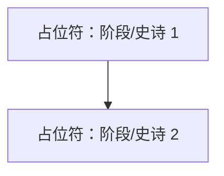

# 项目路线图：[项目名称 - 如可能从 system_manifest.md 由 LLM 填充，或占位符]

**最后更新**：[YYYY-MM-DD] <!-- 每次修改路线图时更新 -->

## 1. 整体项目愿景和目标
<!-- 简要源自 system_manifest.md - 高层级目的。如果路线图是新的，在初始创建期间填充。-->
*   {占位符：项目目标 1}
*   {占位符：项目目标 2}

## 2. 主要项目阶段 / 史诗
<!--
本节应概述项目的主要阶段或大规模史诗。
对于每个阶段/史诗，提供简要描述、其当前状态，以及链接到更详细的规划文档（如果存在）。
如果路线图是新的，最初基于 system_manifest.md 和依赖关系分析填充。
Dispatcher 将根据已完成的策略周期更新本节。
-->

### 阶段/史诗示例：[阶段/史诗名称]
*   **描述**：{简要描述}
*   **状态**：{未开始 | 初步规划（周期 ID）| 进行中（周期 ID）| 部分完成（周期 ID）| 已完成（周期 ID）}
*   **关键目标**：
    *   {目标 1}
    *   {目标 2}
*   **主要 HDTA 链接**：
    *   （链接到相关的 `_module.md` 或高层级 `implementation_plan_*.md`，如适用）
*   **此阶段/史诗的备注/关键交付成果**：
    *   ...

---
*   *（根据整体项目范围定义的内容添加更多阶段/史诗）*
---

## 3. 高层级阶段/史诗间依赖关系
<!-- 可选：使用 Mermaid 或列表显示阶段/史诗之间的主要依赖关系（如果有帮助）。可以从初始依赖关系可视化中填充。-->

## 4. 关键项目级里程碑
<!-- 列出重要的、总体项目里程碑。如果从高层级文档/依赖关系中明显，则最初填充。包括目标/实际完成。-->
*   **里程碑示例**：{描述} - 状态：{已规划 / 进行中 / 已达成 [日期/周期 ID]}

## 5. 整体项目备注 / 战略考虑
<!-- 与整个项目执行或长期战略相关的高层级备注。-->
*   {占位符：备注 1}

<!--
策略阶段说明（Dispatcher 步骤 8 - 更新此路线图）：
- 当策略周期完成特定领域的规划时：
  1. 识别此路线图中周期工作所贡献的阶段/史诗。
  2. 更新相关阶段/史诗的"状态"（例如，"进行中（周期 [CycleID]）"、"部分完成（周期 [CycleID]）"）。
  3. 在阶段/史诗部分内添加/更新"关键目标"或"备注/关键交付成果"以总结周期的计划贡献。
  4. 在"主要 HDTA 链接"下添加链接到该周期新创建/更新的实现计划。
  5. 如果周期规划了尚未列出的新主要阶段/史诗，将其添加到第 2 节。
  6. 如果周期的工作影响了它们，更新"关键项目级里程碑"。
  7. 更新本文档顶部的"最后更新"日期。
-->
