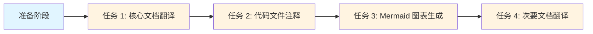

# Quickstart Guide: 项目代码与文档多语言支持

**Feature**: 项目代码与文档多语言支持 | **Date**: 2025-12-29
**Version**: 1.0

## 概述 | Overview

本指南为"项目代码与文档多语言支持"功能的任务执行提供必要的上下文和执行要点，包括工作流程、提示词模板和质量标准。

---

## 工作流程概览 | Workflow Overview



---

## 阶段 1: 核心文档翻译 (P0) | Phase 1: Core Documents (P0)

**目标文件**: README.md, CLAUDE.md, 主要技术文档

**执行要点**:
1. 阅读原始文档内容
2. 使用提示词模板进行翻译（见下文"提示词模板"部分）
3. 人工审查：检查翻译准确性、术语一致性、格式正确性
4. 验证：Markdown 语法正确，代码块未被修改

**质量标准**:
- 采用段落交替格式（原文段落后紧跟翻译）
- 技术术语首次出现时使用双语格式
- 代码块保持不变，可添加中文说明
- 翻译覆盖率 ≥ 95%

---

## 阶段 2: 代码文件注释 (P0-P1) | Phase 2: Code Annotation (P0-P1)

**目标文件**: add_detailed_comments.py, report_generator.py, 其他 Python 文件

**执行要点**:
1. 阅读原始代码逻辑
2. 使用提示词模板添加注释（见下文"提示词模板"部分）
3. 人工审查：验证注释准确性、确保未修改代码逻辑
4. 验证：代码可正常运行（如适用）

**质量标准**:
- 遵循 Google Python Style Guide 和 PEP 257
- 每个函数有完整 docstring（功能描述、Args、Returns）
- 关键代码行有中文注释，解释"为什么"
- 保留已有英文注释
- 注释覆盖率 ≥ 95%

---

## 阶段 3: Mermaid 图表生成 (P1-P2) | Phase 3: Mermaid Diagrams (P1-P2)

**图表类型**: 项目整体架构 (层级 1), 模块结构图 (层级 2), 文件流程图 (层级 3)

**执行要点**:
1. 分析项目结构或代码流程
2. 使用提示词模板生成图表（见下文"提示词模板"部分）
3. 人工审查：验证 Mermaid 语法、确认关系准确
4. 验证：使用 Mermaid Live Editor 预览

**质量标准**:
- 遵循分形思想（多层视图，每层都完整）
- 使用中英双语标签
- 箭头和关系准确反映实际结构
- Mermaid 语法正确

---

## 阶段 4: 次要文档翻译 (P2-P3) | Phase 4: Secondary Documents (P2-P3)

**目标文件**: cline_docs/, CRCT_Documentation/, prompts/, templates/

**执行要点**: 使用与阶段 1 相同的工作流程和质量标准

---

## 质量检查清单 | Quality Checklist

### Markdown 文档
- [ ] 所有非代码内容都有中文翻译
- [ ] 段落交替格式一致
- [ ] 技术术语使用一致
- [ ] Markdown 语法正确，无渲染错误
- [ ] 代码块未被修改

### 代码注释
- [ ] 所有函数有完整的 docstring
- [ ] 包含功能描述、Args、Returns
- [ ] 行内注释解释"为什么"
- [ ] 注释覆盖率 ≥ 95%
- [ ] 代码逻辑未被修改

### Mermaid 图表
- [ ] Mermaid 语法正确
- [ ] 图表在渲染器中正确显示
- [ ] 节点和标签清晰可读
- [ ] 箭头和关系准确

---

## 提示词模板 | Prompt Templates

### Markdown 翻译模板

```
请为以下 Markdown 文档添加中文翻译。

要求:
- 采用段落交替格式 (原文段落后紧跟翻译)
- 保持 Markdown 格式和结构不变
- 代码块不翻译,但可在下方添加中文说明
- 技术术语首次出现时使用双语格式
- 使用自然流畅的中文,避免直译

文档内容:
[粘贴内容]
```

### 代码注释模板

```
请为以下 Python 代码添加详细的中文注释。

要求:
- 遵循 Google Python Style Guide
- 为每个函数添加完整的 docstring
- 为关键代码行添加行内注释
- 保留已有注释,在其下方添加中文翻译
- 不修改代码逻辑

代码内容:
[粘贴代码]
```

### Mermaid 图表生成模板

```
请为以下项目结构生成 Mermaid 架构图。

要求:
- 使用 graph 或 flowchart 类型
- 展示项目的主要组成部分
- 使用中英双语标签
- 箭头表示依赖或包含关系
- 图表简洁清晰

项目结构:
[粘贴项目结构信息]
```

---

## 最佳实践 | Best Practices

### 1. 渐进式工作
- 一次专注于一个文件
- 完成一个文件后提交，保持小的、原子性的更改
- 使用清晰的提交信息

### 2. 质量优先
- 人工审查所有 AI 生成的内容
- 不追求速度，注重准确性
- 保持技术术语和风格的一致性

### 3. 版本控制
- 频繁提交，每个文件一个提交
- 使用有意义的提交信息
- 定期推送到远程仓库

### 4. 文档同步
- 在文档中标注"最后更新"时间
- 代码修改时同步更新注释
- 定期审查和更新过时的翻译

---

## 常见问题 | FAQ

### Q1: 如何处理技术术语的翻译?

**A**: 参考研究文档中的技术术语翻译对照表。首次出现时使用双语格式（如 "Chain-of-Thought (思维链)"），后续可直接使用中文或保留英文。

### Q2: 翻译时可以修改原文吗?

**A**: 不可以。原文必须保持不变，仅在其后添加翻译。如需修正原文错误，应单独提交一个修复。

### Q3: 如何确保代码注释不破坏代码功能?

**A**:
1. 仅添加注释，不修改代码逻辑
2. 添加注释后运行测试套件验证
3. 使用版本控制，出错时可回退

### Q4: Mermaid 图表应该在哪个层级生成?

**A**: 遵循分形思想：
- **层级 1**: 项目整体架构（展示主要组成部分）
- **层级 2**: 模块结构图（展示模块间关系）
- **层级 3**: 文件流程图（展示执行流程）

每个层级都是一个完整的、独立的视图。

### Q5: 如何处理非常大的文件?

**A**:
1. 将文件拆分为更小的部分
2. 分批次处理，每次处理一个部分
3. 使用版本控制跟踪每个部分的进度

---

## 资源链接 | Resources

- **功能规范**: `specs/001-code-translation-annotation/spec.md`
- **研究文档**: `specs/001-code-translation-annotation/research.md`
- **翻译契约**: `specs/001-code-translation-annotation/contracts/translation-contract.md`
- **注释契约**: `specs/001-code-translation-annotation/contracts/annotation-contract.md`

---

**文档版本**: 1.0 | **最后更新**: 2025-12-29
