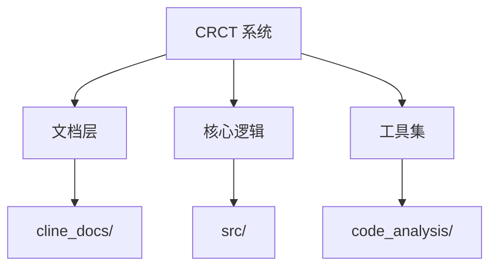
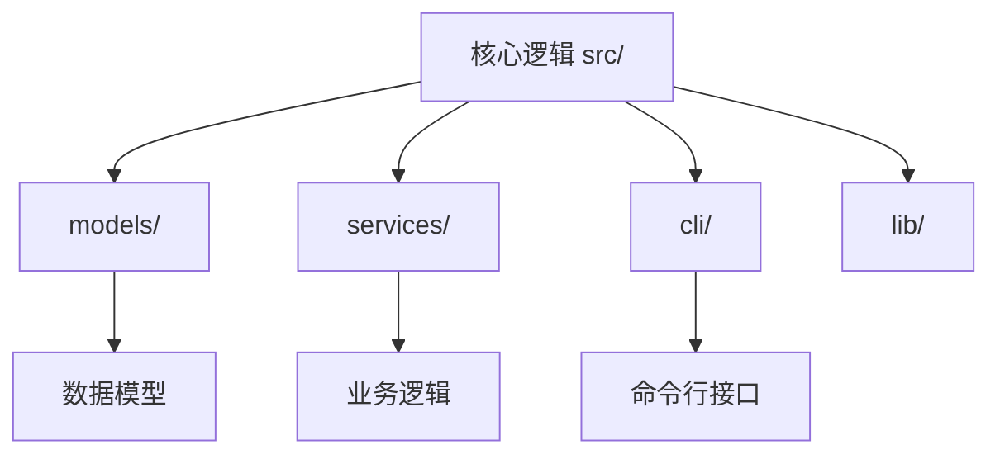
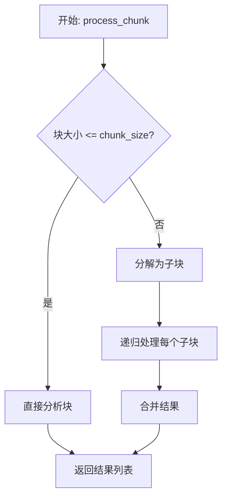

# Research: 项目代码与文档多语言支持

**Feature**: 项目代码与文档多语言支持 | **Date**: 2025-12-29
**Status**: 完成

## 概述 | Overview

本文档记录了为实施"项目代码与文档多语言支持"功能所进行的研究和决策,包括技术选择、最佳实践和实施方法。

---

## 研究主题 1: Markdown 文档双语翻译方法

### 研究问题
如何为项目的所有 Markdown 文档生成高质量的中英双语版本?

### 决策
**选择**: 段落交替格式 (Paragraph Alternating Format)

**描述**:
- 原文段落后紧跟对应的翻译段落
- 使用清晰的分隔符或格式标记区分原文和译文
- 保持文档结构完整,不改变原有的标题层级和组织方式

**示例**:
```markdown
## Project Overview

This project implements a CRCT (Cline Recursive Chain-of-Thought) system.

## 项目概述 | Project Overview

本项目实现了一个 CRCT (Cline 递归思维链) 系统。
```

### 基本原理 | Rationale
1. **可读性强**: 读者可以选择阅读原文或译文,两者位置相邻便于对照
2. **维护友好**: 更新时可以同时更新原文和译文,保持同步
3. **兼容性好**: 不破坏 Markdown 原有格式,所有渲染器都能正常显示
4. **版本控制友好**: Git diff 可以清晰显示原文和译文的变更

### 考虑的替代方案 | Alternatives Considered
1. **双语并列显示** (并排格式)
   - 拒绝原因: 在移动设备和小屏幕上显示效果差,格式复杂
   - 适用场景: 仅适用于宽屏显示的在线文档平台

2. **独立文件** (如 README.zh-CN.md)
   - 拒绝原因: 容易导致内容不同步,增加维护负担
   - 适用场景: 当原文和译文差异较大或需要独立维护时

3. **语言切换功能** (使用 JavaScript 切换)
   - 拒绝原因: 依赖客户端脚本,纯 Markdown 渲染器无法使用
   - 适用场景: 仅适用于支持自定义脚本的网站

---

## 研究主题 2: 代码注释最佳实践

### 研究问题
如何为代码添加高质量的中文注释,遵循哪些最佳实践?

### 决策
**选择**: 遵循 Python PEP 257 和 Google 风格的中文注释规范

**描述**:
1. **函数注释** (Docstrings):
   - 使用 Google 风格的 docstring 格式
   - 包含功能描述、参数说明、返回值、异常 (如适用)
   - 对复杂的算法添加"为什么"的解释

2. **行内注释**:
   - 在关键逻辑行上方或右侧添加注释
   - 解释"为什么"而不仅仅是"是什么"
   - 对不明显的设计选择添加说明

3. **已有注释处理**:
   - 保留原文注释
   - 在其下方或旁边添加中文翻译
   - 使用清晰的格式区分 (如 `# English: ... / 中文: ...`)

**示例**:
```python
def process_chunk(chunk: str) -> List[str]:
    """
    处理文本块并生成思维链步骤。

    这个函数通过递归分解来处理大型文本块,
    确保每个步骤都在模型的上下文窗口大小内。

    Args:
        chunk: 要处理的文本块

    Returns:
        思维链步骤列表,每个步骤包含推理过程

    Raises:
        ValueError: 如果文本块为空或格式无效
    """
    # 递归终止条件: 如果块足够小,直接处理
    # Recursive termination: if chunk is small enough, process directly
    if len(chunk) <= self.chunk_size:
        return [self._analyze(chunk)]

    # 否则,分解为更小的块并递归处理
    # Otherwise, split into smaller chunks and process recursively
    sub_chunks = self._split_chunk(chunk)
    results = []
    for sub in sub_chunks:
        results.extend(self.process_chunk(sub))
    return results
```

### 基本原理 | Rationale
1. **标准化**: 遵循广泛认可的 PEP 257 规范,提高代码可读性
2. **工具支持**: Google 风格被 Sphinx、pydoc 等工具原生支持
3. **详细但不冗余**: 专注于解释"为什么"而非重复显而易见的代码
4. **双语友好**: 保留原文注释并添加中文,方便不同语言背景的开发者

### 考虑的替代方案 | Alternatives Considered
1. **仅中文注释** (删除原文)
   - 拒绝原因: 丢失原始上下文,不利于国际协作
   - 适用场景: 当项目完全面向中文用户时

2. **类型注释替代文档字符串** (仅使用类型提示)
   - 拒绝原因: 无法提供足够的上下文和"为什么"的解释
   - 适用场景: 仅适用于非常简单的函数

---

## 研究主题 3: Mermaid 图表分形设计

### 研究问题
如何设计多层次的 Mermaid 图表,既能展示高层次架构,又能显示详细实现细节?

### 决策
**选择**: 分形思想的多层视图 (Fractal Multi-Level Views)

**描述**:
1. **层级完整性**: 每个层级都是一个完整的、独立的视图,不依赖其他层级
2. **抽象程度不同**: 不同层级的区别仅在于抽象程度,而非信息截断
3. **自相似性**: 高层级中的"节点"在低层级中展开为详细的子图
4. **导航链接**: 在图表中添加链接,允许读者在不同层级之间跳转

**层级示例**:

**层级 1: 项目整体架构** (Project Architecture)


**层级 2: 核心逻辑模块结构** (Core Logic Modules)


**层级 3: 具体文件内部流程** (File Internal Flow)


### 基本原理 | Rationale
1. **灵活导航**: 读者可以根据需要选择合适的抽象层级
2. **完整性保证**: 每个层级都提供完整信息,避免信息碎片化
3. **认知友好**: 符合人类从宏观到微观的认知过程
4. **可维护性**: 模块化的图表使得局部更新不影响整体

### 考虑的替代方案 | Alternatives Considered
1. **单一复杂图表** (包含所有细节)
   - 拒绝原因: 图表过于复杂,难以阅读和维护
   - 适用场景: 仅适用于非常小的项目

2. **简化高层图表** (高层图不显示低层细节)
   - 拒绝原因: 读者需要在不同层级之间切换才能理解完整流程
   - 适用场景: 当项目层级非常独立时

---

## 研究主题 4: 文件排除和优先级策略

### 研究问题
哪些文件应该被排除在翻译和注释之外?如何确定处理优先级?

### 决策
**选择**: 基于文件类型和重要性的排除策略,基于用户价值的优先级策略

**排除规则**:
1. **自动生成的目录**: `node_modules/`, `.venv/`, `__pycache__/`, `dist/`, `build/`
2. **二进制文件**: `.png`, `.jpg`, `.pdf`, `.exe`, `.so`, `.dylib`
3. **配置文件**: `.json`, `.yaml`, `.toml`, `.ini` (除非包含需要翻译的用户可见内容)
4. **第三方依赖**: 外部库和框架代码 (如 `site-packages/`)
5. **临时文件**: `.tmp`, `.bak`, `.swp`

**优先级策略**:
1. **P0 - 最高优先级**:
   - README.md
   - 主要技术文档 (如 CLAUDE.md、PROJECT_DOCUMENTATION_*.md)
   - 核心代码文件 (如 `add_detailed_comments.py`, `report_generator.py`)

2. **P1 - 高优先级**:
   - `cline_docs/` 下的主要文档 (activeContext, userProfile, changelog)
   - `CRCT_Documentation/` 下的核心文档
   - 项目根目录的关键 Python 文件

3. **P2 - 中优先级**:
   - `cline_docs/prompts/` 和 `cline_docs/templates/`
   - 次要的 Markdown 文档
   - 工具脚本和配置文件

4. **P3 - 低优先级**:
   - 归档文档 (Archive 目录)
   - 备份文件 (backups 目录)
   - 示例代码和测试文件

### 基本原理 | Rationale
1. **避免冗余工作**: 自动生成和二进制文件不需要翻译或注释
2. **聚焦核心价值**: 优先处理用户最常访问的文件
3. **渐进式交付**: 高优先级任务完成后即可提供价值
4. **可维护性**: 避免处理频繁变化的自动生成文件

---

## 技术术语翻译对照表

为了确保术语一致性,建立以下翻译对照表:

| 英文术语 | 中文翻译 | 备注 |
|---------|---------|------|
| Chain-of-Thought | 思维链 | CoT 推理方法 |
| Recursive | 递归 | 递归调用或分解 |
| Chunk | 文本块 | 数据分块 |
| Context Window | 上下文窗口 | 模型的最大输入长度 |
| Inference | 推理 | 模型推理过程 |
| Token | 词元 | 文本的最小单位 |
| Embedding | 嵌入 | 向量表示 |
| Transformer | Transformer | 模型架构 (通常保留原文) |
| Fine-tuning | 微调 | 模型训练方法 |
| Prompt Engineering | 提示词工程 | 优化提示词的技术 |

---

## 实施检查清单

### Phase 0: 准备
- [x] 确定技术上下文和项目结构
- [x] 研究 Markdown 双语翻译方法
- [x] 研究代码注释最佳实践
- [x] 研究 Mermaid 图表设计方法
- [x] 确定文件排除和优先级策略

### Phase 1: 文档翻译
- [ ] 翻译 README.md 和核心文档 (P0)
- [ ] 翻译 cline_docs/ 主要文档 (P1)
- [ ] 翻译 CRCT_Documentation/ (P1)
- [ ] 翻译次要文档 (P2-P3)

### Phase 2: 代码注释
- [ ] 为核心 Python 文件添加注释 (P0)
- [ ] 为工具脚本添加注释 (P1)
- [ ] 验证注释准确性和完整性

### Phase 3: Mermaid 图表
- [ ] 生成项目整体架构图
- [ ] 生成主要模块结构图
- [ ] 生成关键文件流程图
- [ ] 验证图表 Mermaid 语法

---

## 参考资源

- [PEP 257 -- Docstring Conventions](https://peps.python.org/pep-0257/)
- [Google Python Style Guide](https://google.github.io/styleguide/pyguide.html)
- [Mermaid 官方文档](https://mermaid.js.org/intro/)
- [Markdown 规范](https://commonmark.org/)
- [Claude AI 文档](https://docs.anthropic.com/)

---

**文档版本**: 1.0 | **最后更新**: 2025-12-29
